# Chapter 1: Introduction to Software Architecture and Mermaid


## The importance of software architecture diagrams


Chapter 2: The Importance of Software Architecture Diagrams

Section 2.1: Understanding the Significance of Software Architecture Diagrams
Software architecture diagrams play a crucial role in the development and maintenance of software systems. In this chapter, we will explore the importance of software architecture diagrams and how they benefit software developers and stakeholders.

Section 2.2: Communicating Design Intent
Software architecture diagrams serve as a visual representation of the design intent behind a software system. By using diagrams, developers can effectively communicate and convey complex architectural concepts to team members, stakeholders, and clients. Diagrams provide a common language that aids in understanding and aligning everyone's expectations regarding the system's structure and behavior.

Section 2.3: Enabling Collaboration and Decision Making
Architecture diagrams facilitate collaboration among team members by providing a shared understanding of the system's architecture. They enable developers to discuss, analyze, and make informed decisions about design choices, such as component interactions, data flows, and system boundaries. Diagrams serve as a visual aid during discussions, making it easier for teams to align their architectural vision and reach consensus on important design decisions.

Section 2.4: Supporting Documentation and Maintenance
Software architecture diagrams act as valuable documentation artifacts that capture the system's high-level structure and key design elements. They help in documenting architectural decisions, dependencies, and interactions, making it easier for developers to maintain and evolve the system over time. Diagrams serve as a reference point for understanding the system's architecture and aid in troubleshooting, refactoring, and future enhancements.

Section 2.5: Identifying Risks and Dependencies
Visualizing software architecture through diagrams enables developers to identify potential risks, bottlenecks, and dependencies early in the design process. By visualizing the system's components, interfaces, and data flows, developers can assess the impact of changes, evaluate scalability and performance constraints, and mitigate potential risks before they manifest as problems during development or deployment.

Section 2.6: Enhancing System Understanding and Onboarding
Software architecture diagrams provide a high-level overview of the system's structure, helping new team members onboard quickly. New developers can grasp the system's architecture, understand component responsibilities, and comprehend the overall system flow by studying the diagrams. These diagrams serve as a visual aid for knowledge transfer and help developers navigate and explore the system with a holistic understanding.

Section 2.7: Evolution and Evolutionary Architecture
Architecture diagrams are not static artifacts; they evolve alongside the system. As the system undergoes changes, updates, and new feature additions, architecture diagrams need to be updated to reflect the current state accurately. Embracing the concept of evolutionary architecture, where the architecture grows and adapts with the system, helps maintain the accuracy and relevance of the diagrams throughout the software development lifecycle.

In the upcoming chapters, we will delve into the practical aspects of creating software architecture diagrams using Mermaid. By understanding the importance of software architecture diagrams and leveraging the power of Mermaid, you will be equipped with the knowledge and tools to create clear, concise, and effective architectural visualizations.

## Overview of Mermaid and its benefits


Chapter 3: Overview of Mermaid and Its Benefits

Section 3.1: Introducing Mermaid
Mermaid is an open-source tool that allows developers to create diagrams using a simple and intuitive text-based syntax. With Mermaid, you can generate various types of diagrams, including flowcharts, sequence diagrams, class diagrams, and more. In this chapter, we will explore the features and benefits of using Mermaid for visualizing software architecture.

Section 3.2: Text-Based Diagram Creation
One of the key advantages of Mermaid is its text-based syntax. Instead of using a graphical user interface or specialized diagramming software, developers can create diagrams using plain text. This approach offers several benefits, such as ease of version control, collaboration, and integration with documentation and code repositories.

Section 3.3: Multiple Diagram Types
Mermaid supports a wide range of diagram types, making it a versatile tool for software architecture visualization. Some of the commonly used diagram types include flowcharts, sequence diagrams, class diagrams, state diagrams, and Gantt charts. The availability of multiple diagram types allows developers to choose the most suitable representation for different aspects of their software architecture.

Section 3.4: Markdown-Like Syntax
Mermaid utilizes a Markdown-like syntax for creating diagrams, making it familiar and accessible to developers. The syntax is intuitive and easy to learn, enabling developers to quickly create and modify diagrams without the need for complex graphical editors. This simplicity encourages developers to include diagrams as part of their regular documentation and communication practices.

Section 3.5: Platform and Language Agnostic
Mermaid is platform and language agnostic, meaning it can be used with any programming language or platform that supports JavaScript. Whether you're developing a web application, a mobile app, or even working with backend systems, you can integrate Mermaid into your development workflow. This flexibility allows developers to leverage Mermaid regardless of their preferred technology stack.

Section 3.6: Integration with Documentation and Presentations
Mermaid diagrams can be seamlessly integrated into various documentation formats, including Markdown, HTML, and PDF. This integration enables developers to embed diagrams directly within their technical documentation, making it easier for readers to understand the architectural concepts being discussed. Additionally, Mermaid diagrams can be exported as images or interactive SVGs for use in presentations or other external platforms.

Section 3.7: Extensibility and Customization
Mermaid provides options for customization and extension, allowing developers to tailor the appearance and behavior of their diagrams. Whether it's changing the colors, fonts, or styles of diagram elements or adding custom themes and templates, Mermaid offers flexibility to match the visual aesthetics and branding requirements of your software architecture diagrams.

Section 3.8: Collaboration and Sharing
Mermaid simplifies collaboration by enabling developers to share their diagrams as text files. This approach promotes version control, code review, and collaborative editing of diagrams using common tools like Git. Developers can work together to improve the diagrams, iterate on architectural designs, and incorporate feedback from team members, stakeholders, and clients.

In the next chapter, we will dive into the practical aspects of using Mermaid to create software architecture diagrams. By leveraging the benefits of Mermaid, you will be able to effectively communicate, document, and visualize your software architecture in a concise and visually appealing manner.

## How to install and set up Mermaid


Chapter 4: Installing and Setting Up Mermaid

Section 4.1: Installation Requirements
Before we can start using Mermaid, we need to ensure that our development environment meets the necessary requirements. Mermaid requires Node.js and npm (Node Package Manager) to be installed on your machine. Follow the steps below to install Node.js and npm:

1. Visit the official Node.js website (https://nodejs.org) and download the latest stable version of Node.js for your operating system.
2. Run the installer and follow the on-screen instructions to complete the installation.
3. Once installed, open a terminal or command prompt and verify that Node.js and npm are correctly installed by running the following commands:

```shell
node --version
npm --version
```

If the version numbers are displayed, it means Node.js and npm are successfully installed.

Section 4.2: Creating a Project
Now that we have Node.js and npm installed, let's create a new project directory and set it up to work with Mermaid:

1. Open a terminal or command prompt and navigate to the desired location where you want to create your project.
2. Run the following commands to create a new project directory and initialize it with npm:

```shell
mkdir mermaid-project
cd mermaid-project
npm init -y
```

The above commands create a new directory named "mermaid-project," navigate into the project directory, and initialize a new npm project with default settings.

Section 4.3: Installing Mermaid
With our project set up, we can now install Mermaid as a dependency:

1. In the terminal or command prompt, run the following command to install Mermaid:

```shell
npm install mermaid
```

This command installs Mermaid and its dependencies into your project's "node_modules" directory.

Section 4.4: Setting Up a Basic HTML File
To visualize Mermaid diagrams in a web browser, we need to create a basic HTML file:

1. Create a new file named "index.html" in your project directory.
2. Open the "index.html" file in a text editor and add the following HTML boilerplate code:

```html
<!DOCTYPE html>
<html>
  <head>
    <title>Mermaid Diagrams</title>
    <!-- Add the Mermaid library script -->
    <script src="node_modules/mermaid/dist/mermaid.min.js"></script>
  </head>
  <body>
    <!-- Add a container element for the diagram -->
    <div id="diagram"></div>

    <!-- Add your script to render the diagram -->
    <script src="index.js"></script>
  </body>
</html>
```

In the above code, we include the Mermaid library script using the relative path to the installed package. We also create a container div element with the id "diagram" to hold our diagram, and we reference an "index.js" file that we'll create next.

Section 4.5: Rendering a Mermaid Diagram
Now, let's create a JavaScript file to render a basic Mermaid diagram:

1. Create a new file named "index.js" in your project directory.
2. Open the "index.js" file in a text editor and add the following code:

```javascript
// Import the Mermaid library
import * as mermaid from 'mermaid';

// Define your Mermaid diagram code
const diagramCode = `
graph LR;
  A[Client] --> B[Server];
  B --> C[Database];
`;

// Initialize Mermaid and render the diagram
mermaid.initialize({ startOnLoad: true });
mermaid.render('diagram', diagramCode);
```

In the code above, we import the Mermaid library, define the

## Creating simple Mermaid diagrams


Chapter 5: Creating Simple Mermaid Diagrams

Section 5.1: Flowcharts
Flowcharts are a common type of diagram used to represent the flow of control or data within a system. Let's create a simple flowchart diagram using Mermaid:

```typescript
import * as mermaid from 'mermaid';

const diagramCode = `
graph LR;
    A[Start] --> B{Is condition true?};
    B -- Yes --> C[Process 1];
    B -- No --> D[Process 2];
    C --> E[End];
    D --> E;
`;

mermaid.initialize({ startOnLoad: true });
mermaid.render('diagram', diagramCode);
```

In the above code, we define a flowchart diagram using Mermaid's syntax. Each node is represented by a letter inside square brackets. Arrows indicate the flow of control or data between nodes. The diagram is then rendered in the HTML file with the id "diagram".

Section 5.2: Sequence Diagrams
Sequence diagrams are useful for illustrating the interactions between components or actors in a system. Let's create a simple sequence diagram using Mermaid:

```typescript
import * as mermaid from 'mermaid';

const diagramCode = `
sequenceDiagram
    participant A as Component A
    participant B as Component B
    A->>B: Request
    B-->>A: Response
`;

mermaid.initialize({ startOnLoad: true });
mermaid.render('diagram', diagramCode);
```

In the above code, we define a sequence diagram using Mermaid's syntax. Each participant is represented by a letter followed by "as" and a name. The arrows indicate the flow of messages between participants. The diagram is then rendered in the HTML file with the id "diagram".

Section 5.3: Class Diagrams
Class diagrams represent the structure and relationships between classes in an object-oriented system. Let's create a simple class diagram using Mermaid:

```typescript
import * as mermaid from 'mermaid';

const diagramCode = `
classDiagram
    class Car {
        make: string
        model: string
        start()
        stop()
    }

    class Engine {
        power: number
        start()
        stop()
    }

    Car --> Engine
`;

mermaid.initialize({ startOnLoad: true });
mermaid.render('diagram', diagramCode);
```

In the above code, we define a class diagram using Mermaid's syntax. Each class is represented using the "class" keyword, followed by the class name and its properties and methods. The arrows indicate relationships between classes. The diagram is then rendered in the HTML file with the id "diagram".

Section 5.4: State Diagrams
State diagrams are useful for modeling the behavior of objects or systems as they transition between different states. Let's create a simple state diagram using Mermaid:

```typescript
import * as mermaid from 'mermaid';

const diagramCode = `
stateDiagram
    [*] --> State1
    State1 --> [*]
`;

mermaid.initialize({ startOnLoad: true });
mermaid.render('diagram', diagramCode);
```

In the above code, we define a state diagram using Mermaid's syntax. The `[*]` notation represents the initial state, and arrows indicate state transitions. The diagram is then rendered in the HTML file with the id "diagram".

By leveraging the simplicity and flexibility of Mermaid, you can create a wide variety of diagrams to visualize different aspects of your software architecture. Experiment with different diagram types and their syntax to effectively communicate and document your system's structure and behavior.

## Using Mermaid to create more complex diagrams


Chapter 6: Using Mermaid to Create More Complex Diagrams

Section 6.1: Subgraphs
Subgraphs allow you to group related nodes together within a larger diagram. This is particularly useful when you want to visually organize components or subsystems. Let's create a complex diagram with subgraphs using Mermaid:

```typescript
import * as mermaid from 'mermaid';

const diagramCode = `
graph LR;

subgraph Component A
    A1 --> A2
    A1 --> A3
    A3 --> A4
end

subgraph Component B
    B1 --> B2
    B1 --> B3
end

subgraph Component C
    C1 --> C2
    C1 --> C3
end

A2 --> B2
A3 --> C2
B3 --> C3
`;

mermaid.initialize({ startOnLoad: true });
mermaid.render('diagram', diagramCode);
```

In the above code, we define a graph with three subgraphs representing components A, B, and C. Nodes within each subgraph are connected using arrows. We also establish connections between nodes in different subgraphs. The diagram is then rendered in the HTML file with the id "diagram".

Section 6.2: Conditional Flows
Sometimes, you may need to represent conditional flows within your diagrams to illustrate different paths based on specific conditions. Let's create a complex diagram with conditional flows using Mermaid:

```typescript
import * as mermaid from 'mermaid';

const diagramCode = `
graph LR;

Start --> A{Condition 1}

A -- Yes --> B{Condition 2}
A -- No --> C{Condition 3}

B -- Yes --> D1[Result 1]
B -- No --> D2[Result 2]

C -- Yes --> D3[Result 3]
C -- No --> D4[Result 4]

D1 --> End
D2 --> End
D3 --> End
D4 --> End

End
`;

mermaid.initialize({ startOnLoad: true });
mermaid.render('diagram', diagramCode);
```

In the above code, we define a graph with conditional flows using the `{}` syntax. Each condition is represented as a diamond-shaped node. The arrows indicate the different paths based on the conditions. The results are represented as rectangular nodes, and the diagram concludes with the "End" node. The diagram is then rendered in the HTML file with the id "diagram".

Section 6.3: Combining Diagram Types
Mermaid allows you to combine multiple diagram types within a single visualization, enabling you to represent different aspects of your software architecture simultaneously. Let's create a complex diagram combining different types using Mermaid:

```typescript
import * as mermaid from 'mermaid';

const diagramCode = `
graph LR;

subgraph Component A
    A1 --> A2
    A1 --> A3
    A3 --> A4
end

subgraph Component B
    B1 --> B2
    B1 --> B3
end

classDiagram
    class Car {
        make: string
        model: string
        start()
        stop()
    }

    class Engine {
        power: number
        start()
        stop()
    }

    Car --> Engine

sequenceDiagram
    participant A as Component A
    participant B as Component B
    A->>B: Request
    B-->>A: Response
`;

mermaid.initialize({ startOnLoad: true });
mermaid.render('diagram', diagramCode);
```

In the above code, we define a graph with two subgraphs representing components A and B. We then define a class diagram and a sequence diagram using their respective

## Mermaid extensions


Chapter 7: Mermaid Extensions

Section 7.1: Overview of Mermaid Extensions
Mermaid provides a modular architecture that allows for the incorporation of extensions. These extensions expand the capabilities of Mermaid and provide additional functionality for creating and customizing diagrams. Let's explore some popular Mermaid extensions and how they can enhance your diagramming experience.

Section 7.2: Mermaid API Extender
The Mermaid API Extender extension enables you to extend Mermaid's functionality by adding custom functions and hooks. This extension allows you to define custom rendering functions, modify diagram code before rendering, and hook into various stages of the rendering process. With the API Extender, you can create complex and interactive diagrams tailored to your specific requirements.

Section 7.3: Mermaid Gantt
The Mermaid Gantt extension extends Mermaid's capabilities to include Gantt charts. Gantt charts are useful for visualizing project schedules, tasks, and dependencies over time. With the Mermaid Gantt extension, you can create dynamic and interactive Gantt charts, specify start and end dates, define task relationships, and customize the appearance of your charts.

Section 7.4: Mermaid Live Editor
The Mermaid Live Editor is a web-based editor that provides a real-time preview of your Mermaid diagrams. It allows you to experiment with the syntax, adjust settings, and instantly see the rendered diagrams. The Live Editor provides a convenient and interactive environment for creating and fine-tuning your Mermaid diagrams without the need for manual refreshes or separate preview windows.

Section 7.5: Mermaid Themes
Mermaid Themes extension allows you to apply custom styles and themes to your diagrams. It provides a collection of predefined themes, such as default, forest, dark, and neutral, to change the appearance of your diagrams with a single line of code. You can also create your own custom themes by modifying colors, fonts, and other visual elements, enabling you to match the diagrams with your project's branding or personal preferences.

Section 7.6: Mermaid CLI
The Mermaid CLI (Command Line Interface) extension allows you to generate diagrams from the command line. It provides a simple way to convert Mermaid code into various output formats, such as PNG, SVG, PDF, or HTML. The CLI extension is useful when you need to automate diagram generation or integrate Mermaid into your build process.

Section 7.7: Other Extensions
Apart from the aforementioned extensions, the Mermaid ecosystem offers a range of additional extensions developed by the community. These extensions cover various areas, including custom shapes, export options, integration with other tools, and more. You can explore the official Mermaid documentation and community resources to discover and leverage these extensions to further enhance your diagramming experience.

By leveraging the power of Mermaid extensions, you can unlock advanced features, customize the appearance and behavior of your diagrams, and streamline your diagram creation workflow. Whether you need to create Gantt charts, apply custom styles, or extend Mermaid's capabilities, the extensions provide valuable tools to cater to your specific diagramming needs.

## Mermaid best practices


Chapter 8: Mermaid Best Practices

Section 8.1: Use Clear and Descriptive Node Labels
When creating diagrams with Mermaid, it's essential to use clear and descriptive labels for your nodes. Choose meaningful names that accurately represent the components, processes, or entities being depicted. This ensures that your diagrams are easily understandable and effectively communicate the intended information to the viewers.

Section 8.2: Organize and Group Related Nodes
To enhance the clarity and readability of your diagrams, organize and group related nodes together. Use subgraphs or clusters to visually represent components, subsystems, or logical groupings. This helps to establish the relationships and dependencies between different parts of your system, making it easier for viewers to comprehend the overall structure.

Section 8.3: Use Consistent Formatting and Styling
Maintain consistency in the formatting and styling of your diagrams to create a cohesive visual representation. Consistent alignment, spacing, font sizes, and colors improve the overall readability and aesthetics of your diagrams. Utilize the available Mermaid styling options or apply custom CSS to ensure a consistent look and feel across your diagrams.

Section 8.4: Break Down Complex Diagrams
Avoid creating overly complex diagrams that overwhelm viewers. If a diagram becomes too crowded or difficult to understand, consider breaking it down into smaller, more manageable parts. You can use different diagrams or zoomed-in sections to focus on specific aspects while providing links or references for viewers to navigate between them.

Section 8.5: Document Your Diagrams
Accompany your diagrams with appropriate documentation to provide additional context and explanations. Include a legend or key that explains the meaning of symbols, shapes, or colors used in the diagrams. Additionally, add captions, annotations, or comments where necessary to clarify specific elements or highlight important details.

Section 8.6: Version Control Your Diagrams
Just like code, it's crucial to version control your Mermaid diagrams. Utilize a version control system such as Git to track changes, collaborate with others, and maintain a history of revisions. Storing your diagrams alongside your codebase ensures that they are easily accessible and synchronized with the corresponding software artifacts.

Section 8.7: Test and Validate Your Diagrams
Before sharing or publishing your diagrams, test and validate them to ensure accuracy and correctness. Double-check the connections, relationships, and flows depicted in your diagrams to avoid any misleading or incorrect representations. Use the Mermaid Live Editor or other validation tools to catch any syntax errors or rendering issues.

Section 8.8: Keep Diagrams Up to Date
As your software architecture evolves, make sure to update your diagrams to reflect the current state of your system. Outdated diagrams can lead to confusion and misinterpretation. Regularly review and update your diagrams to align with the latest changes, additions, or refactorings in your software.

By following these best practices, you can create clear, concise, and effective diagrams with Mermaid. Applying consistent formatting, organizing related nodes, and providing proper documentation will significantly improve the readability and comprehension of your diagrams, allowing you to effectively communicate your software architecture to stakeholders and collaborators.


# Chapter 2: Getting Started with Mermaid


## Basic syntax for creating diagrams


Chapter 4: Basic Syntax for Creating Diagrams

Section 4.1: Nodes and Connections
Nodes and connections form the foundation of Mermaid diagrams. Nodes represent entities or components, while connections depict the relationships or flows between them. Let's explore the basic syntax for creating nodes and connections:

To define a node, use the following syntax:
```
nodeId[Node Label]
```
For example:
```
A[Component A]
```

To create a connection between two nodes, use the following syntax:
```
node1 --> node2
```
For example:
```
A --> B
```
This creates a unidirectional connection from node A to node B.

Section 4.2: Subgraphs and Clusters
Subgraphs and clusters allow you to group related nodes together within a larger diagram. They provide visual organization and help establish hierarchical relationships. Let's explore the syntax for creating subgraphs and clusters:

To define a subgraph, use the following syntax:
```
subgraph SubgraphLabel
    // Nodes and connections within the subgraph
end
```
For example:
```
subgraph ComponentA
    A1[Subcomponent 1]
    A2[Subcomponent 2]
end
```
This creates a subgraph labeled "ComponentA" containing nodes A1 and A2.

Clusters are similar to subgraphs but have a visual distinction. To create a cluster, use the same syntax as a subgraph but prepend "cluster_" to the label:
```
subgraph cluster_ClusterLabel
    // Nodes and connections within the cluster
end
```
For example:
```
subgraph cluster_Database
    DB1[Database 1]
    DB2[Database 2]
end
```
This creates a cluster labeled "Database" containing nodes DB1 and DB2.

Section 4.3: Styling and Formatting
Mermaid allows you to customize the styling and formatting of your diagrams, enhancing their visual appeal and readability. Let's explore some basic styling options:

To define the style of a node, use the following syntax:
```
nodeId[Node Label]:::styleName
```
For example:
```
A[Component A]:::box
```
This applies the "box" style to node A.

To define the style of a connection, use the following syntax:
```
node1 --> node2:::styleName
```
For example:
```
A --> B:::dotted
```
This applies the "dotted" style to the connection between nodes A and B.

Mermaid provides various built-in styles, including "box", "rounded", "circle", "dotted", and more. Additionally, you can define custom styles using CSS.

Section 4.4: Additional Syntax
Mermaid offers additional syntax elements to create more advanced and expressive diagrams. Here are a few examples:

- To create a note or comment within a diagram, use the following syntax:
```
note over nodeId: Note text
```
For example:
```
note over A: This is a note about Component A
```
This adds a note above node A with the specified text.

- To add a class or stereotype to a node, use the following syntax:
```
nodeId:classLabel
```
For example:
```
A:Component
```
This adds the class label "Component" to node A.

- To include text inside a node, use the following syntax:
```
nodeId["Text inside node"]
```
For example:
```
A["Node with text"]
```
This places the specified text inside node A.

By combining these basic syntax elements and exploring more advanced features, you can create diverse and expressive diagrams using Mer

## Mermaid uses a simple, text-based syntax to create diagrams.


Chapter 4: Mermaid's Simple, Text-based Syntax

Mermaid utilizes a simple, text-based syntax that allows you to create diagrams without the need for complex graphical tools or editors. This syntax provides a convenient way to describe the structure and relationships of components within your software architecture. Let's explore the key elements of Mermaid's text-based syntax:

Section 4.1: Nodes
Nodes represent the entities or components in your diagram. You can define nodes using the following syntax:
```
nodeId[Node Label]
```
Here, `nodeId` is a unique identifier for the node, and `Node Label` is the text that represents the node. For example:
```
A[Component A]
```
This creates a node with the identifier "A" and the label "Component A".

Section 4.2: Connections
Connections represent the relationships or flows between nodes. You can define connections using the following syntax:
```
node1 --> node2
```
Here, `node1` and `node2` are the identifiers of the nodes being connected. For example:
```
A --> B
```
This creates a unidirectional connection from node A to node B.

Section 4.3: Subgraphs
Subgraphs allow you to group related nodes together within a larger diagram. You can define subgraphs using the following syntax:
```
subgraph SubgraphLabel
    // Nodes and connections within the subgraph
end
```
Here, `SubgraphLabel` is a descriptive label for the subgraph. For example:
```
subgraph ComponentA
    A1[Subcomponent 1]
    A2[Subcomponent 2]
end
```
This creates a subgraph labeled "ComponentA" that contains nodes A1 and A2.

Section 4.4: Styling
Mermaid provides options for styling and formatting your diagrams. You can apply styles to nodes and connections using the following syntax:
```
nodeId:::styleName
```
or
```
node1 --> node2:::styleName
```
Here, `styleName` refers to the predefined styles available in Mermaid. For example:
```
A:::box
A --> B:::dotted
```
This applies the "box" style to node A and the "dotted" style to the connection between nodes A and B.

Mermaid's text-based syntax allows you to quickly and intuitively create diagrams by describing the nodes, connections, and relationships in a clear and concise manner. By mastering this syntax, you can effectively represent your software architecture visually and communicate complex concepts to stakeholders and team members.

## The syntax is based on the grammar of the programming language JavaScript.


Chapter 5: Mermaid's Syntax and JavaScript Grammar

Mermaid's syntax is indeed based on the grammar of the programming language JavaScript. This design choice makes it easier for developers familiar with JavaScript to quickly grasp and use Mermaid for creating diagrams. Let's explore how Mermaid's syntax aligns with JavaScript grammar:

Section 5.1: Basic Syntax
In Mermaid, the basic syntax for defining nodes and connections resembles JavaScript variable assignments. For example:
```
nodeId[Node Label]
```
This syntax is reminiscent of assigning a value to a variable in JavaScript:
```
const nodeId = 'Node Label';
```
Similarly, the connection syntax in Mermaid:
```
node1 --> node2
```
resembles the arrow notation used in JavaScript functions and arrow functions:
```
const node1 = () => {
  // ...
};

const node2 = () => {
  // ...
};

node1 --> node2;
```

Section 5.2: Subgraphs and Clusters
The syntax for creating subgraphs and clusters in Mermaid aligns with JavaScript's block statement syntax. For example:
```
subgraph SubgraphLabel
    // Nodes and connections within the subgraph
end
```
This block-like structure with the `subgraph` keyword resembles the syntax of a JavaScript block statement:
```
{
  // Statements within the block
}
```
By utilizing this familiar syntax, developers can intuitively define subgraphs and clusters in Mermaid diagrams.

Section 5.3: Styling and Formatting
The styling syntax in Mermaid is similar to JavaScript object notation. For instance:
```
nodeId:::styleName
```
This triple colon notation (`:::`) is reminiscent of accessing properties of an object in JavaScript:
```
const nodeId = {
  styleName: true,
};
```
This familiarity with JavaScript object notation makes it easier to understand and apply styles to nodes and connections in Mermaid diagrams.

Section 5.4: Integration with JavaScript
Mermaid can also be integrated into JavaScript code to dynamically generate or update diagrams. By leveraging Mermaid's JavaScript API, you can programmatically manipulate diagrams, handle user interactions, or generate diagrams based on data. This seamless integration allows developers to combine the power of JavaScript with Mermaid's diagramming capabilities.

The similarity between Mermaid's syntax and JavaScript grammar makes it convenient for developers to adopt and work with Mermaid. It facilitates a smooth transition for JavaScript developers who want to create visual representations of software architecture or other diagrams using Mermaid.

## The syntax is easy to learn and use, even for beginners.


Chapter 6: Mermaid's Beginner-Friendly Syntax

Mermaid's syntax is designed to be beginner-friendly, making it easy for users, including beginners, to learn and use. Whether you have prior programming experience or not, Mermaid provides a straightforward and intuitive way to create diagrams. Let's explore why Mermaid's syntax is beginner-friendly:

Section 6.1: Text-Based and Readable
Mermaid's syntax is text-based, which means you can create diagrams using simple text editors or integrated development environments (IDEs). This approach eliminates the need for complex graphical tools or editors, making it accessible to beginners who might not be familiar with specialized diagramming software. The syntax is also designed to be human-readable, allowing users to understand and modify diagrams easily.

Section 6.2: Minimalistic and Intuitive
Mermaid's syntax follows a minimalistic approach, focusing on essential elements and clear representations. The syntax uses straightforward constructs like nodes, connections, and subgraphs to represent components, relationships, and groupings in a diagram. This simplicity makes it easier for beginners to grasp and remember the syntax rules, enabling them to create diagrams without being overwhelmed by unnecessary complexity.

Section 6.3: Familiarity with JavaScript-like Syntax
Mermaid's syntax draws inspiration from the grammar of the widely-used programming language JavaScript. This choice leverages the familiarity many beginners have with JavaScript or similar programming languages. Users with JavaScript experience will find the syntax comfortable and intuitive. Even those without JavaScript knowledge can quickly learn and understand the syntax due to its simplicity and resemblance to JavaScript constructs.

Section 6.4: Instant Visual Feedback
Mermaid provides instant visual feedback, allowing beginners to see the results of their syntax as they create or modify diagrams. This immediate feedback loop helps beginners understand how their textual descriptions translate into visual representations. By observing the diagram's real-time updates, users can easily identify any syntax errors or inconsistencies, facilitating a smoother learning experience.

Section 6.5: Rich Documentation and Resources
Mermaid offers comprehensive documentation and resources to support beginners in learning and using the syntax effectively. The official Mermaid documentation provides clear explanations, syntax examples, and usage guidelines. Additionally, the Mermaid community actively shares tutorials, blog posts, and video tutorials that cater to beginners, offering step-by-step instructions and practical use cases.

Overall, Mermaid's beginner-friendly syntax, along with its textual, minimalistic, and intuitive nature, ensures that users, regardless of their experience level, can quickly grasp and utilize the syntax to create diagrams. With the availability of resources and the immediate visual feedback provided by Mermaid, beginners can gain confidence and proficiency in diagram creation, empowering them to effectively communicate their software architecture or other concepts through visual representations.

## Overview of the different diagram types and their uses


Chapter 7: Overview of Different Diagram Types and Their Uses

Diagrams play a crucial role in visualizing various aspects of software architecture and systems. Mermaid offers support for multiple diagram types, each serving a specific purpose. Understanding the different diagram types and their uses can help you effectively communicate different aspects of your software systems. Let's explore some of the key diagram types:

Section 7.1: Flowcharts
Flowcharts are graphical representations of a series of steps or actions within a process. They illustrate the flow of control, decision points, and outcomes. Flowcharts are widely used for process modeling, algorithm design, and business process visualization. With Mermaid, you can create flowcharts using standard flowchart symbols and connectors to represent the logical flow of a process.

Section 7.2: Sequence Diagrams
Sequence diagrams depict interactions between objects or components in a system over time. They illustrate the order of message exchanges and the resulting behavior. Sequence diagrams are particularly useful for understanding the dynamic behavior of systems, capturing the flow of control between different components, and identifying potential issues or bottlenecks. Mermaid supports the creation of sequence diagrams, allowing you to represent the interactions between objects or components using lifelines and arrows.

Section 7.3: Class Diagrams
Class diagrams provide a structural view of a system by representing classes, their attributes, relationships, and methods. They depict the static structure of a system and help in understanding the relationships between different classes and their dependencies. Class diagrams are commonly used for object-oriented analysis and design, documenting system architecture, and facilitating communication between development teams. Mermaid enables the creation of class diagrams, allowing you to define classes, their attributes, and relationships.

Section 7.4: State Diagrams
State diagrams, also known as state machines or finite-state machines, model the behavior of a system or a component with distinct states and state transitions. They illustrate how the system or component responds to events and changes its internal state. State diagrams are valuable for modeling complex systems with different states and transitions, capturing the behavior of interactive systems, and identifying edge cases. Mermaid supports the creation of state diagrams, enabling you to represent states, events, and transitions using appropriate symbols and arrows.

Section 7.5: Gantt Charts
Gantt charts are used for project management and scheduling. They visually represent the tasks, their durations, and the dependencies between them. Gantt charts are effective in tracking project progress, managing resource allocation, and visualizing project timelines. Mermaid allows you to create Gantt charts by specifying the tasks, their durations, and dependencies, enabling you to visualize and manage project schedules.

Section 7.6: Entity-Relationship Diagrams
Entity-Relationship (ER) diagrams model the relationships between entities in a database system. They illustrate the structure of a database, the entities, their attributes, and the relationships between them. ER diagrams are valuable for database design, data modeling, and understanding the logical structure of a system's data. With Mermaid, you can create entity-relationship diagrams by defining entities, attributes, and the relationships between them.

These are just a few examples of the diagram types supported by Mermaid. Depending on your specific needs, you can choose the appropriate diagram type to represent different aspects of your software architecture, system behavior, data modeling, or project management. Mermaid's flexibility and versatility allow you to effectively communicate and visualize complex concepts, facilitating better understanding and collaboration within development teams.

## Flowcharts with an example of a mermaid chart


Chapter 8: Flowcharts: Visualizing Process Flows

Flowcharts are an effective way to visually represent the flow of a process, decision points, and outcomes. They help in understanding the logical sequence of steps and identifying potential bottlenecks or inefficiencies. Mermaid provides support for creating flowcharts, making it easy to represent process flows in a clear and intuitive manner. Let's explore an example of a flowchart using Mermaid's syntax:

Section 8.1: Example Flowchart - Order Processing

Consider an example of an order processing system, where we need to represent the steps involved in processing an order. Let's create a flowchart using Mermaid to illustrate this process:

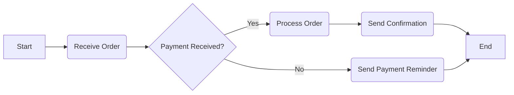

In this example, the flowchart begins with a node labeled "Start" (A). The flow of the process continues to the next step, which is represented by the node labeled "Receive Order" (B). From there, the flow splits into a decision point (C) represented by curly braces. The decision point asks the question, "Payment Received?".

If the answer is "Yes," the flow proceeds to the "Process Order" step (D), followed by the "Send Confirmation" step (F). Finally, the flow reaches the end node labeled "End" (G).

If the answer at the decision point is "No," the flow diverts to the "Send Payment Reminder" step (E) before joining the flow back to the "End" node (G).

This flowchart visually represents the steps involved in the order processing system, with decision points and different paths based on the payment status. The use of arrows and nodes in the flowchart helps to clearly depict the process flow.

By utilizing Mermaid's syntax, you can create flowcharts to represent various processes, workflows, or decision-making sequences within your software systems. Flowcharts provide a valuable visualization tool to improve understanding, identify inefficiencies, and communicate complex processes effectively.

## UML diagrams with an example of a mermaid chart


Chapter 9: UML Diagrams: Modeling Software Systems

Unified Modeling Language (UML) diagrams are widely used for modeling and visualizing software systems. UML provides a standardized set of diagrams to represent different aspects of a system's structure, behavior, and interactions. Mermaid offers support for creating UML diagrams, allowing you to effectively communicate and document your software systems. Let's explore an example of a UML diagram using Mermaid's syntax:

Section 9.1: Example UML Class Diagram - Library System

Let's consider an example of a library system and create a UML class diagram using Mermaid to represent the classes, their relationships, and attributes:

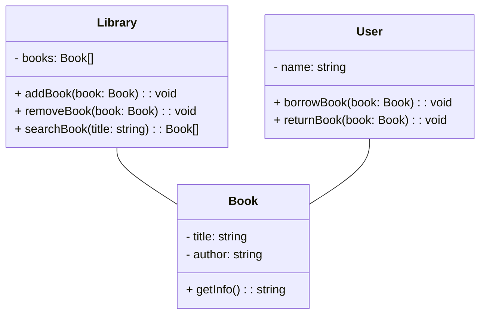

In this example, we define three classes: `Library`, `Book`, and `User`. The `Library` class has a private attribute called `books`, representing an array of `Book` objects. It also has public methods for adding a book, removing a book, and searching for a book based on the title.

The `Book` class has private attributes `title` and `author`, representing the title and author of the book, respectively. It also has a public method `getInfo()` that returns information about the book.

The `User` class represents a library user and has a private attribute `name`. It has public methods for borrowing a book and returning a book.

The relationships between the classes are represented by the arrows connecting them. In this example, the `Library` class has an association with the `Book` class, indicating that a library can have multiple books. Similarly, the `User` class has an association with the `Book` class, representing that a user can borrow and return multiple books.

This UML class diagram visually represents the structure and relationships between the classes in the library system. The use of classes, attributes, methods, and associations provides a clear understanding of the system's entities and their interactions.

By utilizing Mermaid's syntax, you can create various UML diagrams, including class diagrams, sequence diagrams, activity diagrams, and more, to model and visualize different aspects of your software systems. UML diagrams offer a powerful means of communication, analysis, and design, facilitating collaboration among developers and stakeholders.

## ER diagrams with an example of a mermaid chart


Chapter 10: Entity-Relationship (ER) Diagrams: Modeling Data Relationships

Entity-Relationship (ER) diagrams are commonly used for data modeling and representing the relationships between entities in a database system. ER diagrams help visualize the structure of a database, the entities, their attributes, and the relationships between them. Mermaid provides support for creating ER diagrams, allowing you to effectively represent and communicate data relationships. Let's explore an example of an ER diagram using Mermaid's syntax:

Section 10.1: Example ER Diagram - Online Store

Consider an example of an online store and create an ER diagram using Mermaid to represent the entities, attributes, and relationships:

```mermaid
erDiagram
  CUSTOMER {
    id int
    name varchar
    email varchar
  }

  ORDER {
    id int
    order_date datetime
    total_amount decimal
  }

  PRODUCT {
    id int
    name varchar
    price decimal
  }

  ORDER -- CUSTOMER : "placed by"
  ORDER -- PRODUCT : "contains"
```

In this example, we define three entities: `CUSTOMER`, `ORDER`, and `PRODUCT`. The `CUSTOMER` entity has attributes `id`, `name`, and `email`, representing the customer's unique identifier, name, and email address.

The `ORDER` entity has attributes `id`, `order_date`, and `total_amount`, representing the order's unique identifier, date of the order, and the total amount of the order.

The `PRODUCT` entity has attributes `id`, `name`, and `price`, representing the product's unique identifier, name, and price.

The relationships between the entities are represented by the arrows connecting them. In this example, the `ORDER` entity has two relationships: "placed by" with the `CUSTOMER` entity, indicating that an order is placed by a customer, and "contains" with the `PRODUCT` entity, indicating that an order contains multiple products.

This ER diagram visually represents the entities, attributes, and relationships in the online store database. It helps in understanding the structure of the database and the associations between different entities.

By utilizing Mermaid's syntax, you can create ER diagrams to represent the relationships between entities in your database systems. ER diagrams provide a clear and concise representation of data models, facilitating effective database design, documentation, and communication among stakeholders and development teams.

## Gantt charts with an example of a mermaid chart


Chapter 11: Gantt Charts: Managing Project Schedules

Gantt charts are widely used for project management to visually represent project schedules, tasks, and dependencies. Gantt charts provide a timeline view of project activities, their durations, and the relationships between them. Mermaid supports the creation of Gantt charts, making it convenient to visualize and manage project schedules. Let's explore an example of a Gantt chart using Mermaid's syntax:

Section 11.1: Example Gantt Chart - Website Development Project

Consider an example of a website development project and create a Gantt chart using Mermaid to represent the project tasks, their durations, and dependencies:

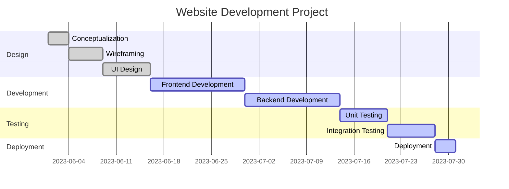

In this example, we have divided the website development project into several sections: Design, Development, Testing, and Deployment. Each section contains specific tasks related to that phase.

Under the Design section, we have tasks such as Conceptualization, Wireframing, and UI Design. These tasks are represented by horizontal bars with their corresponding start dates, durations, and task IDs.

Similarly, we have tasks under the Development, Testing, and Deployment sections, each with their own start dates, durations, and task IDs.

The Gantt chart allows us to visualize the project timeline, the overlapping tasks, and the dependencies between them. We can easily identify the critical path and ensure that tasks are scheduled in the correct order.

By utilizing Mermaid's Gantt chart syntax, you can create visually appealing and informative Gantt charts to manage project schedules effectively. Gantt charts provide a comprehensive overview of project timelines, task durations, and dependencies, facilitating better project planning, tracking, and resource management.

## Mind maps with an example of a mermaid chart


Chapter 12: Mind Maps: Organizing and Visualizing Ideas

Mind maps are a powerful tool for organizing and visualizing ideas, concepts, and relationships. They allow you to capture thoughts, make connections, and present information in a structured and hierarchical manner. While Mermaid is primarily focused on creating flowcharts and diagrams, it doesn't provide native support for mind maps. However, you can still leverage Mermaid's syntax creatively to create a mind map-like structure. Let's explore an example of a mind map-inspired chart using Mermaid's syntax:

Section 12.1: Example Mind Map Chart - Project Management

Consider an example of a mind map to organize project management concepts and create a similar structure using Mermaid's syntax:

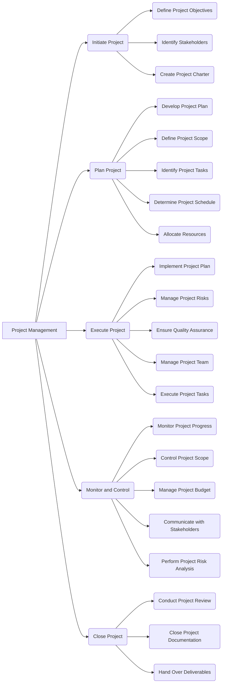

In this example, we create a hierarchical structure where the main node, "Project Management," serves as the central concept. From there, we have branches that represent different phases or activities in project management, such as "Initiate Project," "Plan Project," "Execute Project," "Monitor and Control," and "Close Project."

Each branch further expands into sub-branches, representing specific tasks or actions related to that phase. For example, under "Initiate Project," we have sub-branches like "Define Project Objectives," "Identify Stakeholders," and "Create Project Charter."

By using Mermaid's graph syntax, we can create a visual representation that resembles a mind map, allowing us to organize and present information in a hierarchical and interconnected manner.

Although Mermaid doesn't provide dedicated mind map functionality, its versatility enables us to adapt its syntax creatively to create mind map-like structures for organizing ideas and concepts.

## Each diagram type has its own specific purpose and use.


That's correct! Each diagram type serves a specific purpose and is used to represent different aspects of a system or concept. Here's a brief overview of some common diagram types and their purposes:

1. Flowcharts: Flowcharts are used to depict the flow of a process or workflow, showing the sequence of steps, decision points, and outcomes.

2. UML Diagrams: Unified Modeling Language (UML) diagrams are used for software modeling and represent various aspects of a system, such as class structure (class diagrams), interactions between objects (sequence diagrams), behavior (activity diagrams), and more.

3. ER Diagrams: Entity-Relationship (ER) diagrams are used to model and visualize the relationships between entities in a database system, representing entities, attributes, and the associations between them.

4. Gantt Charts: Gantt charts are used for project management and scheduling, displaying tasks, durations, and dependencies in a timeline format.

5. Mind Maps: Mind maps are visual tools for organizing thoughts, ideas, and concepts in a hierarchical and interconnected manner, facilitating brainstorming, planning, and knowledge representation.

Each diagram type has its own set of symbols, conventions, and rules that allow them to effectively represent specific information and convey meaningful insights. By selecting the appropriate diagram type for a given scenario, you can enhance communication, analysis, and understanding of the subject matter.

## For example, flowcharts are used to visualize the flow of control in a software system.


That's correct! Flowcharts are commonly used to visualize the flow of control or the sequence of steps in a software system or any other process. They provide a clear and structured representation of how control passes through different components, modules, or decision points in a system.

Flowcharts use various symbols and connectors to depict different elements such as actions, decisions, loops, and terminal points. By connecting these symbols and defining their relationships, flowcharts illustrate the logical flow of control within a system.

Flowcharts can be used to:

1. Document and understand existing systems: Flowcharts help in visualizing and documenting the current flow of control in a software system, enabling developers and stakeholders to gain a better understanding of the system's behavior.

2. Design new systems or processes: Flowcharts aid in designing and planning new software systems or processes by mapping out the desired flow of control and identifying potential bottlenecks or issues.

3. Analyze and optimize workflows: Flowcharts assist in analyzing existing workflows or business processes, identifying areas for improvement, and optimizing the flow of control to enhance efficiency and productivity.

4. Communicate and collaborate: Flowcharts serve as a visual communication tool, allowing developers, stakeholders, and team members to discuss, review, and align on the flow of control within a system.

By using flowcharts, software developers can gain a comprehensive overview of the control flow, identify potential logic errors or inefficiencies, and ensure the desired functionality and behavior of the software system.

## UML diagrams are used to model the structure and behavior of software systems.


Absolutely! UML (Unified Modeling Language) diagrams are widely used in software engineering to model and represent the structure, behavior, and relationships of software systems. UML provides a standardized notation for creating visual representations of software systems, making it easier to communicate and understand their design and architecture.

UML diagrams are used to:

1. Class Diagrams: Class diagrams depict the structure of a system by representing classes, their attributes, methods, and relationships. They show the static relationships between classes and help visualize the overall architecture of the system.

2. Sequence Diagrams: Sequence diagrams illustrate the interactions and order of messages exchanged between objects or components over time. They showcase the dynamic behavior of the system, especially during a specific use case or scenario.

3. Activity Diagrams: Activity diagrams model the workflow or flow of activities within a system. They represent the steps, decisions, and control flow involved in a process or algorithm, making them useful for business process modeling and system behavior analysis.

4. Use Case Diagrams: Use case diagrams capture the interactions between actors (users, systems, or external entities) and the system, representing the system's functionality from a user's perspective. They help identify and define the different use cases of the system.

5. State Machine Diagrams: State machine diagrams model the different states and transitions that an object or system can undergo in response to events. They are particularly useful for modeling complex systems with multiple states and behaviors.

These are just a few examples of the UML diagram types commonly used in software engineering. UML diagrams provide a standardized and visual way to represent different aspects of software systems, aiding in design, analysis, communication, and documentation throughout the software development lifecycle.

## Best practices for creating effective diagrams


When creating diagrams, it's important to follow certain best practices to ensure they are effective and convey information accurately. Here are some best practices for creating effective diagrams:

1. Keep it simple and clear: Simplify the diagram by removing unnecessary details and focusing on the key elements. Use clear and concise labels, symbols, and connectors to convey information effectively.

2. Use consistent notation: Follow a consistent notation or style throughout the diagram to maintain clarity and readability. Ensure that symbols, shapes, and colors have consistent meanings across the diagram.

3. Organize and align elements: Arrange the elements in a logical and organized manner. Use alignment and spacing techniques to create a neat and visually appealing diagram. Group related elements together to show their relationships.

4. Provide appropriate levels of detail: Determine the level of detail required for your audience and purpose. Include enough information to convey the main ideas without overwhelming the diagram with excessive details.

5. Use colors and visual cues wisely: Colors can help differentiate elements and add visual appeal, but use them sparingly and purposefully. Avoid using colors that may cause confusion or distract from the main message.

6. Add annotations and explanatory text: Use annotations, comments, or explanatory text to provide additional context or clarification where needed. Clearly label elements and provide descriptions or legends when necessary.

7. Test readability and understandability: Review your diagram to ensure it is easily readable and understandable by your target audience. Put yourself in the shoes of someone unfamiliar with the subject matter and assess if the diagram effectively conveys the intended information.

8. Update and maintain diagrams: As your system or project evolves, make sure to update the diagrams accordingly. Keep them in sync with the actual implementation to maintain their relevance and usefulness.

9. Seek feedback and iterate: Share your diagrams with colleagues or stakeholders and gather feedback. Iteratively improve your diagrams based on the feedback received, aiming for clarity, accuracy, and comprehensibility.

Remember, the primary goal of a diagram is to convey information in a clear and understandable manner. By following these best practices, you can create diagrams that effectively communicate ideas, aid understanding, and support decision-making processes.


# Chapter 3: Creating Flowcharts and Sequence Diagrams


## How to create flowcharts and sequence diagrams with Mermaid


Chapter 13: Creating Flowcharts and Sequence Diagrams with Mermaid

In this chapter, we will explore how to create flowcharts and sequence diagrams using Mermaid. Mermaid provides a straightforward syntax for creating these types of diagrams. Let's dive into the details:

Section 13.1: Creating Flowcharts with Mermaid

To create a flowchart with Mermaid, follow these steps:

1. Define the flowchart using the `graph` keyword.
2. Use nodes and connectors to represent the flow of control.
3. Specify the start and end points of the flowchart using special keywords like `start` and `end`.
4. Use other keywords like `if`, `else`, and `operation` to define decision points and operations within the flowchart.

Here's an example of a simple flowchart created using Mermaid:

```mermaid
graph LR
  start --> A
  A --> B
  A --> C
  B --> D
  C --> D
  D --> end
```

In this example, `start` represents the start point, `end` represents the end point, and `A`, `B`, `C`, and `D` are the nodes representing different steps or actions in the flowchart. The arrows indicate the flow of control from one node to another.

Section 13.2: Creating Sequence Diagrams with Mermaid

To create a sequence diagram with Mermaid, follow these steps:

1. Define the sequence diagram using the `sequenceDiagram` keyword.
2. Use the `participant` keyword to define the participants (objects or actors) in the diagram.
3. Specify the sequence of interactions using arrow notation (`->`) between participants.
4. Use additional syntax for control flow, such as `alt`, `opt`, `loop`, and `par`, to represent conditional or looping behavior.

Here's an example of a simple sequence diagram created using Mermaid:

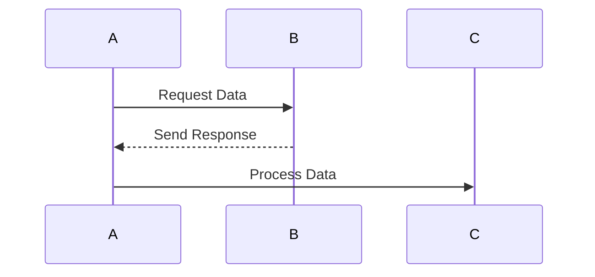

In this example, `A`, `B`, and `C` represent the participants (objects or actors) involved in the sequence diagram. The arrows between participants indicate the flow of messages or interactions between them.

By utilizing Mermaid's syntax for flowcharts and sequence diagrams, you can create visually appealing and informative diagrams to represent the flow of control and sequence of interactions in your software systems.

Remember to refer to the Mermaid documentation for more details on the syntax and advanced features for creating flowcharts and sequence diagrams.

## Flowcharts are used to visualize the flow of control in a software system.


Absolutely! Flowcharts are commonly used to visualize the flow of control in a software system. They provide a graphical representation of the logical steps and decision points involved in the execution of a process or algorithm. By using different symbols and connectors, flowcharts illustrate how control passes from one action to another, allowing software developers to understand and analyze the control flow within a system.

Flowcharts are particularly helpful in the following scenarios:

1. Algorithmic representation: Flowcharts are used to represent the flow of control in algorithms or procedures. They showcase the sequence of steps, conditions, and loops involved in executing a specific task.

2. Program logic visualization: Flowcharts help visualize the control flow and decision-making process within a program or software module. They depict how different parts of the code are connected and how the program behaves under different conditions.

3. System behavior analysis: Flowcharts aid in analyzing the behavior of a software system by visually mapping out the paths and decision points. They assist in identifying potential bottlenecks, inefficiencies, or logical errors within the system.

4. Communication and documentation: Flowcharts serve as a communication tool, allowing developers, stakeholders, and team members to understand and discuss the control flow of a software system. They also act as documentation, helping in the maintenance and future development of the software.

By creating flowcharts, software developers can gain insights into the control flow of a software system, identify potential issues, and ensure the desired functionality and behavior. Flowcharts provide a visual representation that simplifies the understanding of complex control structures, making them an essential tool in software development and analysis.

## Sequence diagrams are used to show the interactions between objects in a software system.


Absolutely! Sequence diagrams are widely used in software engineering to visualize the interactions and messages exchanged between objects or components within a software system. They focus on capturing the chronological order of these interactions, showing the sequence of events as they occur during a particular scenario or use case.

Sequence diagrams are particularly helpful in the following scenarios:

1. Object interaction modeling: Sequence diagrams provide a clear representation of how objects collaborate and communicate with each other to accomplish a specific task or scenario. They illustrate the flow of messages between objects, including method calls, responses, and signals.

2. System behavior understanding: Sequence diagrams help in understanding the dynamic behavior of a software system by highlighting the order and timing of interactions between objects. They provide insights into how objects collaborate and contribute to the overall system behavior.

3. Identifying dependencies and collaborations: Sequence diagrams reveal the dependencies and collaborations between different objects or components in a system. They help in identifying which objects are involved in specific interactions and how they contribute to the overall functionality.

4. Design and development: Sequence diagrams serve as a valuable tool during the design and development phases of a software project. They aid in the identification of object interactions, the definition of interfaces, and the validation of system behavior against requirements.

By creating sequence diagrams, software developers can effectively analyze and design the interactions between objects, ensuring that the system behaves as intended and that the desired functionality is achieved. Sequence diagrams offer a visual representation that enhances communication, collaboration, and understanding among stakeholders involved in the software development process.

## Mermaid can be used to create both flowcharts and sequence diagrams using a simple, text-based syntax.


That's correct! Mermaid is a versatile tool that allows you to create both flowcharts and sequence diagrams using a simple, text-based syntax. With Mermaid, you can generate these diagrams without relying on complex graphical editors or specialized software. The text-based approach makes it easy to create and modify diagrams directly in your preferred text editor or integrated development environment (IDE).

Here's an example of how you can use Mermaid to create a flowchart and a sequence diagram:

1. Flowchart Example:

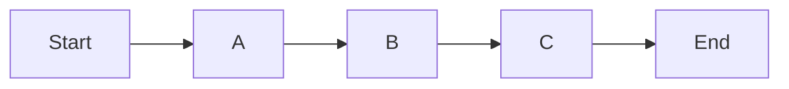

In this example, the `graph LR` statement defines the flowchart, and the arrows (`-->`) represent the flow of control from one step to another. The nodes, such as `Start`, `A`, `B`, `C`, and `End`, represent different stages or actions in the flowchart.

2. Sequence Diagram Example:

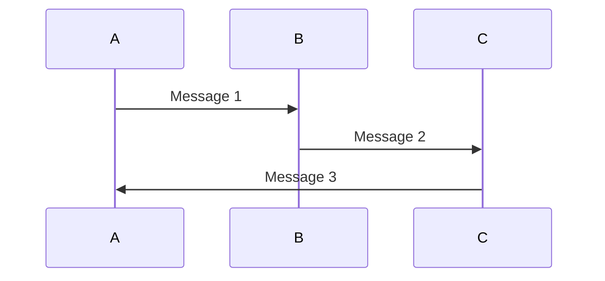

In this example, the `sequenceDiagram` statement initiates the sequence diagram. The `participant` keyword is used to define the participants (objects or actors) involved in the interactions. The arrows (`->>`) represent the flow of messages between participants, indicating the sequence of interactions.

By leveraging Mermaid's text-based syntax, you can easily create, edit, and share flowcharts and sequence diagrams as part of your software development process. The simplicity and flexibility of Mermaid make it a popular choice for generating diagrams in various technical documentation, presentations, and communication channels.

## The syntax is based on the grammar of the programming language JavaScript.


Yes, you're correct! The syntax of Mermaid is indeed based on the grammar of the JavaScript programming language. Mermaid utilizes a simplified syntax inspired by JavaScript to define and create diagrams. This makes it familiar and accessible to those with programming experience, especially JavaScript developers.

While Mermaid itself is not JavaScript, its syntax borrows elements from JavaScript to provide a concise and expressive way to describe diagrams. By leveraging JavaScript-like syntax, Mermaid allows users to define and manipulate diagrams using a syntax that feels intuitive and familiar to developers.

For example, in Mermaid, you can define variables, use if-else statements, loops, and other control flow constructs similar to JavaScript. This similarity makes it easier for developers to understand and work with Mermaid diagrams, leveraging their existing knowledge of JavaScript concepts.

However, it's important to note that Mermaid diagrams are not executed as JavaScript code. Mermaid simply interprets the provided syntax and generates the corresponding graphical representation of the diagram.

So, if you have experience with JavaScript or have a basic understanding of its syntax, you'll find it straightforward to work with Mermaid and create diagrams using its JavaScript-inspired syntax.

## The syntax is easy to learn and use, even for beginners.


Absolutely! One of the advantages of Mermaid is its easy-to-learn and user-friendly syntax, which makes it accessible even for beginners. Whether you have prior programming experience or not, Mermaid's syntax is designed to be intuitive and straightforward.

Here are a few reasons why Mermaid's syntax is considered easy to learn and use:

1. Text-based representation: Mermaid diagrams are created using a text-based syntax, which means you don't need to deal with complex graphical editors or drag-and-drop interfaces. You can simply write the diagram description in a text file or within your code editor.

2. Simple and intuitive keywords: Mermaid provides a set of keywords and symbols that are easy to understand and remember. Keywords such as `graph`, `sequenceDiagram`, `participant`, `-->`, and `->>` are used to define the structure and elements of the diagrams. The syntax is designed to mimic the natural flow of a diagram, making it easier to visualize and express your ideas.

3. Minimal setup and configuration: Mermaid can be easily integrated into various environments, such as web pages, markdown files, or code documentation. It has minimal dependencies and doesn't require extensive setup or configuration. Once you have the Mermaid library or plugin installed, you can start creating diagrams right away.

4. Visual representation: Mermaid's syntax allows you to focus on the logical structure and flow of your diagrams without getting caught up in the intricacies of graphical details. The resulting diagrams are automatically generated, providing a visual representation of your text-based description.

5. Rich documentation and examples: Mermaid offers comprehensive documentation and a wide range of examples that cover various diagram types and scenarios. The documentation includes clear explanations, syntax guidelines, and live editor previews, making it easier for beginners to grasp the syntax and learn through practical examples.

Whether you're a beginner or an experienced developer, Mermaid's user-friendly syntax enables you to quickly create diagrams without a steep learning curve. Its simplicity and accessibility make it an excellent choice for communicating ideas, documenting systems, and visualizing software architectures.

## Examples of different types of flowcharts and sequence diagrams


Certainly! Here are examples of different types of flowcharts and sequence diagrams to provide you with a better understanding:

1. Flowchart Examples:
   a. Basic Flowchart:
   ```mermaid
   graph LR
       Start --> A
       A --> B
       B --> C
       C --> End
   ```
   This simple flowchart demonstrates the sequential flow of control from the "Start" point to the "End" point, passing through steps A, B, and C.

   b. Decision Flowchart:
   ```mermaid
   graph TB
       Start --> Condition
       Condition -- Yes --> A
       Condition -- No --> B
       A --> End
       B --> End
   ```
   This decision flowchart depicts a condition and two possible paths based on the condition's outcome. If the condition is "Yes," it follows path A; otherwise, it follows path B, ultimately leading to the "End" point.

2. Sequence Diagram Examples:
   a. Simple Sequence Diagram:
   ```mermaid
   sequenceDiagram
       participant A
       participant B
       A->>B: Request
       B->>A: Response
   ```
   In this basic sequence diagram, participant A initiates a request to participant B, who responds with a message.

   b. Looping Sequence Diagram:
   ```mermaid
   sequenceDiagram
       participant A
       participant B
       loop Every 1 second
           A->>B: Request
           B->>A: Response
       end
   ```
   This sequence diagram showcases a looping interaction between participant A and participant B, with a request and response happening every second.

   These examples provide a glimpse of the various types of flowcharts and sequence diagrams that can be created using Mermaid. Remember, Mermaid offers flexibility and versatility, allowing you to create diagrams that cater to your specific needs and scenarios. Feel free to explore further and experiment with different constructs and diagram types based on the Mermaid syntax and guidelines.

## There are many different types of flowcharts and sequence diagrams.


Indeed! Flowcharts and sequence diagrams come in various types, each serving a specific purpose in visualizing different aspects of a system. Here's an overview of some commonly used types:

Types of Flowcharts:
1. Process Flowchart: Represents the step-by-step flow of activities or processes in a system.
2. Workflow Diagram: Illustrates the flow of tasks, actions, and decisions in a business or organizational workflow.
3. Data Flow Diagram (DFD): Visualizes the flow of data within a system, including inputs, processes, outputs, and data storage.
4. Swimlane Flowchart: Shows the flow of activities across different departments, roles, or entities involved in a process.
5. Decision Tree: Represents a hierarchical structure of decisions and their potential outcomes.

Types of Sequence Diagrams:
1. Basic Sequence Diagram: Shows the chronological order of interactions between objects or participants.
2. Lifeline Sequence Diagram: Focuses on the lifespan of objects, emphasizing the creation, destruction, and duration of objects' existence.
3. Collaboration Diagram: Highlights the structural relationships and interactions among objects, providing a holistic view of the system.
4. Interaction Overview Diagram: Combines elements of both activity diagrams and sequence diagrams to depict high-level interactions and decision points.
5. Timing Diagram: Illustrates the timing constraints and behavior of objects or messages over a specific period.

These are just a few examples of the many types of flowcharts and sequence diagrams available. Each type has its own purpose and is suited for specific scenarios and requirements. Depending on your needs, you can choose the appropriate diagram type to effectively communicate and visualize the desired information.

Mermaid provides a flexible syntax that allows you to create various types of flowcharts and sequence diagrams, enabling you to select the most suitable diagram type to represent your system's structure, behavior, or control flow.

## Decision flowcharts


Decision flowcharts, also known as decision trees, are a type of flowchart that represent a series of decisions and their possible outcomes. They are used to illustrate the logical flow and decision-making process in a system or a set of rules. Decision flowcharts are particularly useful when there are multiple decision points and different paths based on specific conditions or criteria.

Here's an example of a decision flowchart created with Mermaid:

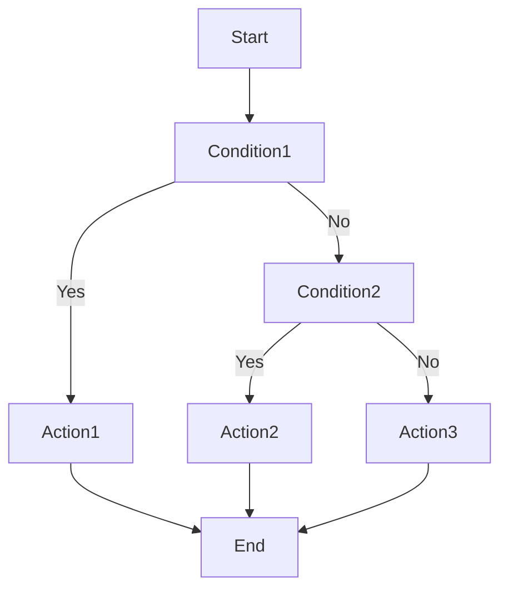

In this example, the flowchart starts with the "Start" node, followed by the first condition, "Condition1". If the condition is true (Yes), it leads to "Action1". If the condition is false (No), the flow goes to the next condition, "Condition2". Again, based on the outcome of "Condition2", the flow proceeds to either "Action2" or "Action3". Finally, each action leads to the "End" node, indicating the completion of the flow.

Decision flowcharts allow you to visualize complex decision structures, clearly illustrating the different paths and outcomes based on various conditions. They are commonly used in business processes, rule-based systems, and algorithmic representations. By using decision flowcharts, you can easily understand and communicate the logical flow of decisions and their consequences within a system or process.

## Process flowcharts


Process flowcharts, also known as process maps or workflow diagrams, are a type of flowchart that visually represents the sequence of steps and activities involved in a process or workflow. They provide a structured view of how tasks, actions, and decisions are performed within a system or an organizational process.

Here's an example of a process flowchart created with Mermaid:

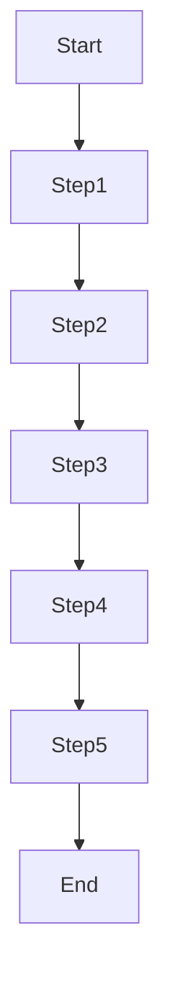

In this example, the flowchart starts with the "Start" node and then progresses through a series of steps, labeled as "Step1," "Step2," and so on, until reaching the final step, "Step5." Each step represents a specific task or action within the process, and the arrows indicate the flow of the process from one step to the next. The flowchart concludes with the "End" node, representing the completion of the process.

Process flowcharts are widely used in process documentation, business analysis, and process improvement initiatives. They help in visualizing and understanding the entire workflow, identifying bottlenecks, and optimizing process efficiency. By using process flowcharts, you can gain insights into how tasks are interconnected and how information or resources flow through the process, enabling better communication, analysis, and decision-making.

Remember that process flowcharts can become more complex as the process becomes more intricate, involving decision points, parallel flows, and loops. Mermaid provides various constructs and symbols to represent such elements, allowing you to create detailed and comprehensive process flowcharts to depict your specific workflow or process.

## Data flow diagrams


Data flow diagrams (DFDs) are a graphical representation of the flow of data within a system. They illustrate how data moves from one process to another, how it is stored, transformed, and utilized in a system or business process. DFDs are commonly used to analyze, document, and communicate the structure and flow of data in information systems.

Here's an example of a data flow diagram created with Mermaid:

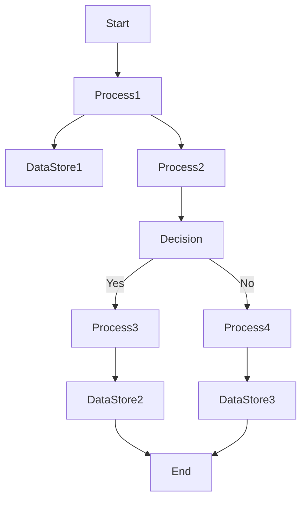

In this example, the DFD starts with the "Start" node and proceeds to "Process1," which performs some data processing. "Process1" then sends data to "DataStore1" for storage and also passes data to "Process2." "Process2" leads to a decision point, "Decision," where based on the outcome (Yes or No), the flow proceeds to either "Process3" or "Process4." "Process3" further stores data in "DataStore2," while "Process4" stores data in "DataStore3." Finally, both data stores flow to the "End" node, representing the completion of data flow.

DFDs are effective in capturing the data dependencies, transformations, and interactions within a system or process. They help in understanding the information flow, identifying potential data bottlenecks or inefficiencies, and designing or optimizing data processes. DFDs can be used during system analysis, software development, and business process modeling to ensure efficient data handling and effective system design.

Mermaid provides the necessary syntax and constructs to create comprehensive DFDs, including data stores, processes, external entities, and data flows. By leveraging Mermaid's syntax, you can represent complex data flows and relationships, enabling clear and concise communication of data-related aspects in your systems.

## Object interaction diagrams


Object interaction diagrams, also known as sequence diagrams or collaboration diagrams, depict the interactions and communication between objects in a system. They illustrate how objects collaborate and exchange messages to fulfill a particular functionality or scenario. Object interaction diagrams are commonly used in software development and system analysis to visualize the dynamic behavior of a system.

Here's an example of an object interaction diagram created with Mermaid:

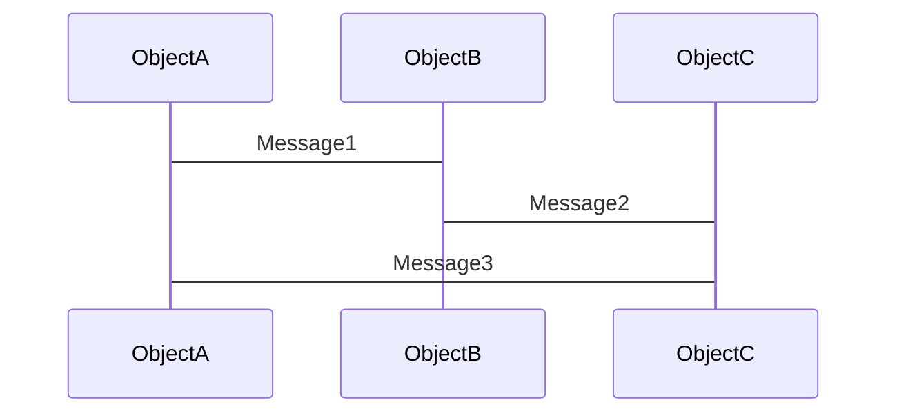

In this example, three objects, ObjectA, ObjectB, and ObjectC, are represented as participants in the sequence diagram. The arrows denote the flow of messages between the objects. ObjectA sends Message1 to ObjectB, which then forwards Message2 to ObjectC. Finally, ObjectC responds by sending Message3 back to ObjectA.

Object interaction diagrams provide a visual representation of the dynamic interactions between objects, enabling the understanding of object collaborations, message passing, and the order of events within a system. They are particularly useful for designing and documenting the behavior of software systems, especially in scenarios where multiple objects or components interact and exchange information.

Mermaid's syntax allows you to create complex object interaction diagrams by defining participants, messages, and the chronological order of interactions. You can include lifelines, control structures like loops and conditions, and various other constructs to represent the behavior and flow of objects in your system.

By utilizing Mermaid's object interaction diagram syntax, you can effectively communicate and analyze the interactions and communication patterns among objects, facilitating system design, analysis, and implementation.

## Message sequence charts


Message sequence charts, also known as MSCs or sequence diagrams, illustrate the interactions and sequencing of messages exchanged between system components or objects. They provide a visual representation of the chronological order of messages, along with their parameters and associated timing constraints. MSCs are widely used in system design, protocol specification, and communication modeling.

Here's an example of a message sequence chart created with Mermaid:

```mermaid
msc
    A,B,C;

    A->B: Message1
    B->C: Message2
    C->B: Message3
    B->A: Message4;
```

In this example, three components or participants, A, B, and C, are defined at the top of the MSC. The arrows depict the flow of messages between the components. Component A initiates Message1 to component B, which then sends Message2 to component C. Component C responds with Message3 to component B, followed by component B sending Message4 back to component A.

Message sequence charts provide a concise and structured representation of message exchanges, enabling the analysis of message flows, dependencies, and timing constraints. They help in understanding the dynamic behavior and communication patterns within a system or protocol.

Mermaid's MSC syntax allows you to create detailed and expressive message sequence charts. You can define participants, specify message exchanges, include timing constraints, and represent concurrent or parallel message flows. With the flexibility of Mermaid, you can effectively model complex communication scenarios and capture the essential interactions between system components or objects.

By utilizing Mermaid's syntax for message sequence charts, you can visually depict and communicate the message-based interactions, sequence of events, and the order of message exchanges in your system or protocol specifications.

## Tips for optimizing flowchart and sequence diagram design


Optimizing the design of flowcharts and sequence diagrams can greatly enhance their clarity and effectiveness in conveying information. Here are some tips to optimize the design of your diagrams:

1. Keep it simple: Simplify your diagrams by focusing on the most important elements and eliminating unnecessary details. Use clear and concise labels for nodes, processes, and messages to ensure easy understanding.

2. Use consistent symbols and notation: Maintain consistency in the symbols and notation you use throughout your diagrams. This helps users quickly recognize and understand the meaning of different elements in the diagram.

3. Organize and align elements: Arrange the elements in a logical and organized manner. Align nodes, processes, and messages to create a clean and structured layout. Use spacing and grouping techniques to visually separate related components.

4. Use meaningful names: Choose descriptive names for nodes, processes, objects, or participants in your diagrams. This makes it easier for readers to understand the purpose and role of each element in the system.

5. Add annotations and comments: Use annotations and comments to provide additional explanations or clarifications for specific parts of the diagram. This helps readers grasp the intended meaning and context of the diagram.

6. Use colors and shapes effectively: Utilize colors and shapes to visually distinguish different types of elements or to highlight important parts of the diagram. However, avoid excessive use of colors that may cause confusion or distract from the main message.

7. Break complex diagrams into smaller parts: If your diagram becomes too complex or crowded, consider breaking it down into smaller, more manageable parts. Use sub-diagrams or layers to represent different levels of detail.

8. Validate and revise: Review your diagrams carefully for accuracy and completeness. Ensure that the logical flow, relationships, and interactions accurately reflect the intended system or process. Make revisions as needed to improve clarity and correctness.

9. Seek feedback: Share your diagrams with colleagues or stakeholders and seek their feedback. Incorporate their suggestions and insights to enhance the diagram's quality and effectiveness.

10. Practice consistency and standardization: Establish and follow a consistent set of diagramming conventions and standards within your team or organization. This promotes uniformity and improves the ease of understanding across various diagrams.

By applying these optimization techniques, you can create flowcharts and sequence diagrams that are visually appealing, easy to understand, and effectively communicate the intended information to your audience.


# Chapter 4: Creating Class and Object Diagrams


## How to create class and object diagrams with Mermaid


Mermaid provides syntax for creating class and object diagrams, which are commonly used to represent the structure and relationships between classes and objects in object-oriented systems. Here's how you can create class and object diagrams using Mermaid:

1. Class Diagrams:
Class diagrams illustrate the structure of classes in a system, including their attributes, methods, and relationships with other classes. Here's an example of creating a simple class diagram with Mermaid:

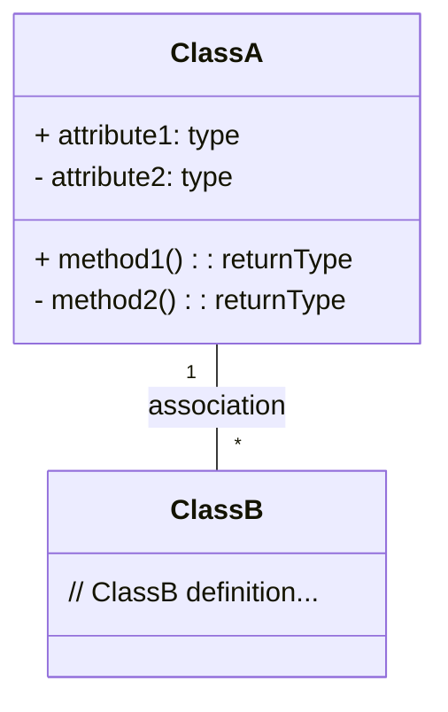

In this example, we define two classes, `ClassA` and `ClassB`, using the `class` keyword. Inside each class, we specify attributes and methods using the `+` and `-` symbols to indicate their visibility. The `+` denotes public, while `-` denotes private. Associations between classes are represented by connecting them with an arrow and adding a label to describe the association type.

2. Object Diagrams:
Object diagrams show instances of classes and their relationships at a specific point in time. Here's an example of creating an object diagram with Mermaid:

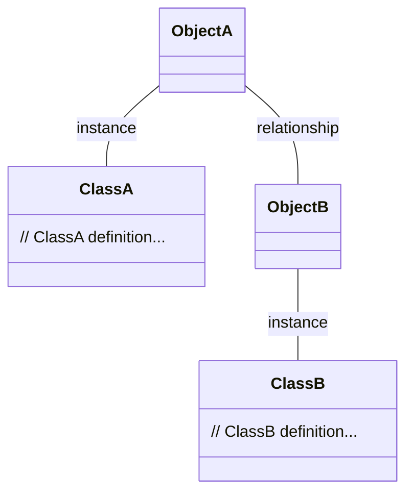

In this example, we define two classes, `ClassA` and `ClassB`, as before. To represent objects, we use the `--` operator followed by the class name and a label to indicate the instance relationship. Relationships between objects are represented similarly.

By utilizing Mermaid's class diagram and object diagram syntax, you can create visual representations of class structures, attributes, methods, and relationships. Remember to adapt the example to fit your specific system or object-oriented design.

## Class diagrams are used to model the structure of a software system.


Yes, that's correct. Class diagrams are used to model the static structure of a software system. They provide a visual representation of the classes, their attributes, methods, and relationships within the system.

Class diagrams are widely used in object-oriented software development to design, analyze, and document the structure of a system. They help in understanding the organization of classes, their properties, and the relationships between them. Class diagrams depict the blueprint of the system, illustrating how classes are connected and how they collaborate to fulfill the system's functionality.

By using class diagrams, software developers can:

1. Visualize class relationships: Class diagrams show the associations, aggregations, compositions, and inheritances between classes. These relationships provide insights into how classes interact and collaborate within the system.

2. Model class attributes and methods: Class diagrams allow developers to define and represent the attributes (data) and methods (functions) of each class. This helps in understanding the responsibilities and behavior associated with each class.

3. Analyze system architecture: Class diagrams help in analyzing the overall architecture of the system by depicting the high-level class structure and dependencies. They enable developers to identify potential design flaws, bottlenecks, or areas that need improvement.

4. Support system documentation: Class diagrams serve as valuable documentation artifacts, providing an overview of the system's structure for future reference, maintenance, and knowledge transfer. They can be used by developers, architects, and other stakeholders to understand the system's design.

When creating class diagrams with Mermaid, you can leverage the syntax and constructs provided to represent classes, attributes, methods, and their relationships accurately. By utilizing Mermaid's class diagram features, you can effectively model the structure of your software system, enabling better communication, design, and development.

## Object diagrams are used to model the state of a software system at a specific point in time.


Yes, that's correct. Object diagrams are used to model the state of a software system at a specific point in time. They provide a visual representation of instances (objects) of classes and the relationships between them, capturing the current state of the system.

Object diagrams are particularly useful for understanding the runtime behavior and relationships between objects in a system. They depict the actual instances of classes and their associations, showing how objects interact and collaborate to fulfill a specific scenario or functionality.

Object diagrams allow developers to:

1. Visualize object instances: Object diagrams show the specific instances (objects) of classes in the system at a given moment. This helps in understanding the concrete objects that exist and their relationships with each other.

2. Illustrate object relationships: Object diagrams depict the associations, aggregations, and compositions between objects. They showcase how objects interact and communicate with each other during runtime.

3. Capture system snapshots: Object diagrams serve as snapshots of the system state at a specific point in time. They help in analyzing the behavior and relationships between objects during a particular scenario or execution.

4. Debug and troubleshoot: Object diagrams can be used for debugging and troubleshooting purposes. They allow developers to analyze the state of objects and their interactions, helping in identifying potential issues or inconsistencies.

5. Document object instances: Object diagrams provide a documentation artifact that showcases the specific objects and their relationships within the system. They serve as a reference for future maintenance, analysis, and understanding of the system's runtime behavior.

When creating object diagrams with Mermaid, you can utilize the syntax and constructs provided to represent objects, their relationships, and the system state accurately. By using Mermaid's object diagram features, you can effectively model the state of your software system, enabling better understanding, analysis, and troubleshooting.

## Mermaid can be used to create both class and object diagrams using a simple, text-based syntax.


Yes, that's correct. Mermaid provides a simple, text-based syntax that can be used to create both class diagrams and object diagrams. The syntax is designed to be easy to learn and use, even for beginners. Here's an example of how you can create class and object diagrams using Mermaid:

1. Class Diagrams:

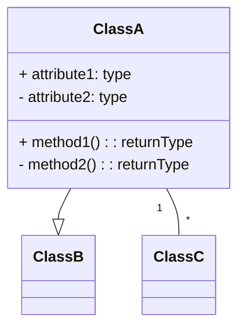

In this example, we define a class `ClassA` with its attributes (`attribute1` and `attribute2`) and methods (`method1()` and `method2()`). We also show relationships between classes using arrows and labels. The `--|>` arrow represents inheritance or generalization, while `"1" -- "*"` represents association.

2. Object Diagrams:


In this example, we define two classes, `ClassA` and `ClassB`, as before. To represent objects, we use the `--` operator followed by the object name and a label to indicate the instance relationship. Relationships between objects are represented similarly.

By utilizing Mermaid's syntax for class and object diagrams, you can create visual representations of the structure, attributes, methods, and relationships of your software system. The text-based nature of Mermaid's syntax makes it convenient for quickly creating and modifying diagrams without relying on graphical tools.

## The syntax is based on the grammar of the programming language JavaScript.


Yes, that's correct. The syntax used in Mermaid is based on the grammar of the JavaScript programming language. Mermaid leverages JavaScript-like syntax to define and create diagrams in a text-based format.

By using JavaScript-like syntax, Mermaid allows developers and users to write diagrams using familiar language constructs and conventions. This makes it easier for those with JavaScript programming experience to quickly grasp and utilize Mermaid for creating diagrams.

The JavaScript-inspired syntax of Mermaid enables you to define elements, relationships, and other diagram components using a concise and intuitive format. It leverages common programming concepts like variables, functions, and operators to express diagram structures effectively.

Whether you're familiar with JavaScript or not, Mermaid's syntax is designed to be accessible and easy to understand. It provides a straightforward and approachable way to create diagrams without the need for complex graphical editors or tools.

So, if you have some experience with JavaScript, you'll find it easier to get started with Mermaid and leverage its syntax to create various types of diagrams for your software architecture and documentation needs.

## The syntax is easy to learn and use, even for beginners.


Yes, that's correct. The syntax of Mermaid is designed to be easy to learn and use, making it accessible for beginners who may not have extensive experience with diagramming tools or programming languages.

Mermaid's syntax follows a simple and intuitive structure, allowing users to create diagrams using a text-based approach. It uses a combination of keywords, symbols, and indentation to represent different elements and relationships within a diagram.

Here are a few reasons why Mermaid's syntax is beginner-friendly:

1. Readability: The syntax is designed to be human-readable, with a clear and straightforward structure. This makes it easier for beginners to understand and interpret the diagrams created using Mermaid.

2. Minimalistic: Mermaid's syntax focuses on simplicity and conciseness. It avoids unnecessary complexity or excessive verbosity, which can help beginners grasp the basics quickly.

3. Self-explanatory keywords: Mermaid uses intuitive keywords for different diagram elements, such as `classDiagram`, `sequenceDiagram`, `participant`, `->`, `-->`, etc. These keywords provide clear indications of the diagram type and the relationships between elements.

4. Familiarity with programming concepts: While not strictly necessary, having some familiarity with basic programming concepts can help beginners understand Mermaid's syntax more easily. The resemblance to JavaScript syntax can be an advantage for those who have worked with JavaScript or similar languages before.

5. Online resources and examples: Mermaid has extensive documentation and a supportive community, providing beginners with ample resources to learn and understand the syntax. The availability of numerous examples and tutorials makes it easier for newcomers to get started.

By leveraging Mermaid's user-friendly syntax, beginners can quickly create various types of diagrams, including flowcharts, sequence diagrams, class diagrams, and more. With practice and exposure to the syntax, beginners can gain proficiency in using Mermaid to effectively communicate and visualize software architecture and system behavior.

## Overview of UML notation and its uses


Unified Modeling Language (UML) is a standardized notation used to model and visualize software systems. UML provides a set of graphical notations that represent different aspects of a system's structure, behavior, and interactions. Here's an overview of some common UML notations and their uses:

1. Class Diagrams:
Class diagrams depict the static structure of a system, including classes, their attributes, methods, relationships, and constraints. They are used to model the organization of classes and their associations, aggregations, compositions, and inheritances.

2. Object Diagrams:
Object diagrams show instances of classes and their relationships at a specific point in time. They capture the current state of objects and their associations, providing a snapshot of the system's runtime behavior.

3. Use Case Diagrams:
Use case diagrams represent the functional requirements of a system from the user's perspective. They illustrate the interactions between actors (users or external systems) and the system, highlighting the use cases or functionalities that the system provides.

4. Sequence Diagrams:
Sequence diagrams describe the interactions and message flows between objects over a specific period. They show the sequence of messages exchanged between objects, along with their lifelines, to depict the dynamic behavior and collaboration of objects.

5. Activity Diagrams:
Activity diagrams represent the workflow or process flow of a system or a specific use case. They depict the steps, actions, decisions, and concurrency of activities within a system, providing a visual representation of the system's behavior.

6. State Machine Diagrams:
State machine diagrams model the different states and state transitions of an object or a system. They capture the behavior and state changes based on events, conditions, and actions, helping to represent complex behavior and state-dependent logic.

7. Component Diagrams:
Component diagrams illustrate the physical components and their dependencies within a system. They show the modular structure of the system, including components, interfaces, dependencies, and connections.

8. Deployment Diagrams:
Deployment diagrams depict the hardware and software infrastructure needed to run a system. They show the physical nodes, servers, devices, and their interconnections, along with the deployment of software components onto these nodes.

UML notation provides a standardized way to communicate and document software systems. By utilizing different UML diagrams, software developers and architects can model the structure, behavior, and interactions of a system, facilitating better understanding, analysis, and design.

## UML (Unified Modeling Language) is a standard notation for modeling software systems.


Yes, that's correct. UML (Unified Modeling Language) is a standardized notation for modeling and visualizing software systems. It provides a common language and set of graphical notations that enable software developers, architects, and stakeholders to communicate and document system designs and requirements effectively.

UML is widely used in software engineering and development processes. It helps in capturing, analyzing, and representing various aspects of a software system, including its structure, behavior, interactions, and requirements.

Some key points about UML:

1. Standardization: UML is an industry-standard notation developed by the Object Management Group (OMG). It provides a consistent and widely accepted set of symbols, diagrams, and conventions for modeling software systems.

2. Diagrams: UML includes a variety of diagram types, each serving a specific purpose. These diagrams represent different aspects of the system, such as structure (class diagrams, object diagrams), behavior (sequence diagrams, state machine diagrams), and interactions (use case diagrams, communication diagrams).

3. Modeling Concepts: UML encompasses a rich set of modeling concepts that can be used to represent entities, relationships, behavior, and constraints in a software system. These concepts include classes, objects, associations, inheritance, interfaces, states, activities, and more.

4. Communication and Documentation: UML provides a standardized way to communicate and document system designs and requirements. It allows stakeholders to visually understand and discuss system components, relationships, and behavior, leading to better collaboration and shared understanding.

5. Tool Support: Various software tools and modeling environments support UML, offering features to create, edit, and analyze UML diagrams. These tools often provide automated validation, code generation, and reverse engineering capabilities to enhance the software development process.

By using UML notation, software professionals can effectively capture and communicate system designs, requirements, and architecture. UML promotes clarity, consistency, and standardization in software modeling, making it a valuable tool in software engineering practices.

## UML class diagrams are used to model the structure of a software system.


Yes, that's correct. UML class diagrams are used to model the structure of a software system. They provide a visual representation of the classes, their attributes, methods, relationships, and constraints within the system.

Here are some key aspects and uses of UML class diagrams:

1. Class Representation: Class diagrams allow you to represent classes and their properties. Each class is typically depicted as a rectangle with three compartments: the top compartment contains the class name, the middle compartment lists the class attributes, and the bottom compartment shows the class methods.

2. Relationships between Classes: Class diagrams illustrate the relationships between classes. These relationships include associations, aggregations, compositions, generalizations (inheritance), and dependencies. By representing these relationships, class diagrams help in understanding how classes are connected and how they collaborate in the system.

3. Attributes and Methods: Class diagrams capture the attributes (properties, data members) and methods (operations, member functions) of each class. Attributes describe the data held by an object of that class, while methods represent the behavior or operations that can be performed by the class.

4. Inheritance and Generalization: Class diagrams depict inheritance and generalization relationships between classes. Inheritance represents an "is-a" relationship, where a subclass inherits properties and behaviors from its superclass. Generalization is denoted by an arrow with an open triangle.

5. Associations and Relationships: Class diagrams show associations between classes, representing how instances of one class are connected to instances of another class. Associations can be one-to-one, one-to-many, or many-to-many, and they help in understanding the relationships and collaborations between classes.

6. Multiplicity and Cardinality: Class diagrams specify the multiplicity and cardinality of associations, indicating how many instances of one class are related to instances of another class. Multiplicity can be expressed as a specific number, a range, or as "*" for unlimited instances.

7. Constraints and Stereotypes: Class diagrams support the use of constraints and stereotypes to provide additional information and annotations. Constraints specify rules or conditions that must be satisfied, while stereotypes allow you to extend the UML notation to represent specific concepts or patterns.

UML class diagrams serve as a visual representation of the static structure of a software system, helping in understanding the organization, relationships, and attributes of classes within the system. They provide a high-level overview of the system's architecture and serve as a valuable tool for communication, design, and documentation in software development.

## UML object diagrams are used to model the state of a software system at a specific point in time.


Yes, that's correct. UML object diagrams are used to model the state of a software system at a specific point in time. They provide a snapshot of the system's runtime behavior by representing the instances of classes and their relationships.

Here are some key aspects and uses of UML object diagrams:

1. Object Representation: Object diagrams allow you to represent specific instances or objects of classes in the system. Each object is typically depicted as a rectangle with the object name and its class name within the rectangle.

2. Object State: Object diagrams capture the state of objects at a particular moment in time. The state includes the current values of object attributes and the relationships it has with other objects.

3. Relationships between Objects: Object diagrams illustrate the relationships and associations between objects. These relationships mirror the associations defined in the corresponding class diagram and provide a concrete representation of the connections between instances.

4. Object Interactions: Object diagrams show how objects interact with each other at a specific point in time. They can depict the messages exchanged between objects or the method calls made by one object to another.

5. Snapshot of System State: Object diagrams serve as a snapshot of the system's state, allowing you to examine and analyze the objects and their relationships at a given moment. This can be helpful in understanding the behavior and interactions between objects in complex scenarios.

6. Testing and Debugging: Object diagrams can be useful during software testing and debugging. They help in visualizing the state of objects and their relationships, aiding in identifying issues or verifying the correctness of system behavior.

7. Documentation and Communication: Object diagrams provide a visual representation of the system's state, making them valuable for documentation and communication purposes. They help in conveying the current state of objects and their relationships to stakeholders, developers, and other team members.

UML object diagrams complement class diagrams by providing a concrete view of the system's runtime behavior. They help in understanding the state and interactions between objects, making them useful for analysis, design, testing, and documentation in software development.

## UML is a powerful tool for communicating the design of a software system to stakeholders.


Absolutely, UML (Unified Modeling Language) is a powerful tool for communicating the design of a software system to stakeholders. UML provides a standardized and visual representation of various aspects of a software system, enabling effective communication and understanding among different stakeholders, including developers, architects, project managers, and clients.

Here are some reasons why UML is valuable for communicating software system designs:

1. Visual Representation: UML diagrams offer a graphical representation of the system's structure, behavior, and interactions. This visual format makes it easier for stakeholders to comprehend complex concepts, relationships, and flows within the system.

2. Common Language: UML serves as a common language that bridges the communication gap between technical and non-technical stakeholders. It provides a standardized set of symbols, notations, and diagrams that allow stakeholders from diverse backgrounds to understand and discuss the system design.

3. Abstraction and Simplification: UML diagrams allow stakeholders to focus on high-level concepts and abstract the complexity of the system. They provide a simplified representation that highlights the key elements and relationships, facilitating effective communication without overwhelming stakeholders with unnecessary details.

4. Clarity and Precision: UML diagrams provide a clear and precise representation of the system's design elements, such as classes, relationships, and behaviors. They offer a structured and organized view that enhances the understanding of system components and their interactions.

5. Visualization of System Behavior: UML diagrams, such as sequence diagrams and activity diagrams, visualize the dynamic behavior of the system. They illustrate how different components, objects, or actors interact and collaborate, helping stakeholders to grasp the system's flow and logic.

6. Requirements Validation: UML diagrams, such as use case diagrams, help in validating and refining system requirements. They provide a visual representation of user interactions and system functionalities, enabling stakeholders to review, clarify, and confirm the intended system behavior.

7. Documentation and Maintenance: UML diagrams serve as documentation artifacts that capture the system design. They provide a reference point for future maintenance, enhancements, or discussions related to the system, ensuring that the design intent is preserved and shared among stakeholders.

By using UML diagrams as a communication tool, stakeholders can effectively exchange ideas, validate requirements, and align their understanding of the software system's design. UML's standardized notation and visual representation make it an invaluable resource for fostering collaboration, decision-making, and consensus-building among project stakeholders.

## Best practices for designing class and object diagrams


When designing class and object diagrams using UML, it's important to follow certain best practices to ensure clarity, accuracy, and effectiveness in communicating the system's structure and behavior. Here are some best practices for designing class and object diagrams:

1. Keep it Simple: Strive for simplicity and avoid overcomplicating the diagrams. Focus on the essential elements and relationships that are critical to understanding the system's structure and behavior.

2. Use Consistent Naming Conventions: Follow consistent and meaningful naming conventions for classes, attributes, methods, and relationships. Clear and descriptive names enhance readability and understanding.

3. Organize Class Diagrams: Organize the classes in a logical and intuitive manner, grouping related classes and placing them in appropriate packages or namespaces. This helps stakeholders easily identify the relationships and dependencies between classes.

4. Show Relevant Attributes and Methods: Include only relevant attributes and methods in class diagrams. Avoid overwhelming the diagrams with excessive details that may distract from the main design concepts.

5. Clearly Depict Relationships: Use appropriate symbols and notation to depict relationships between classes. Clearly indicate the type of relationship (e.g., association, inheritance, aggregation) and specify cardinality, multiplicity, and role names as needed.

6. Use Stereotypes and Constraints: Utilize UML stereotypes and constraints to add additional information or annotations to classes and relationships. Stereotypes can represent design patterns or specific concepts, while constraints specify additional rules or conditions.

7. Show Object Snapshots in Object Diagrams: When creating object diagrams, provide snapshots of objects and their relationships at specific points in time. Clearly label the objects and represent their current attribute values and relationships.

8. Use Layered Approach for Complex Systems: For complex systems, consider using a layered approach where you create multiple levels of class diagrams, each focusing on a specific aspect or layer of the system. This helps manage complexity and improves readability.

9. Keep Diagrams Updated: Maintain the diagrams throughout the software development lifecycle, ensuring they reflect the latest design decisions and changes in the system. Regularly review and update the diagrams to keep them accurate and aligned with the evolving design.

10. Document Assumptions and Constraints: Document any assumptions or constraints related to the class and object diagrams. This helps stakeholders understand the design decisions and any limitations or considerations that need to be taken into account.

Remember, the goal of class and object diagrams is to communicate the system's design effectively. By adhering to these best practices, you can create clear, concise, and informative diagrams that facilitate understanding, collaboration, and decision-making among project stakeholders.

## There are a number of best practices that can be followed when designing class and object diagrams.


Indeed, there are several best practices to keep in mind when designing class and object diagrams. These practices help ensure that the diagrams accurately represent the system's structure and behavior and effectively communicate the design to stakeholders. Here are some important best practices to consider:

1. Identify and Represent Key Classes: Identify the most important classes in the system and include them in the class diagram. Focus on classes that play significant roles or have crucial relationships and interactions within the system.

2. Use Clear and Consistent Notation: Follow a consistent notation style throughout the diagram. Use standardized UML symbols and conventions to represent classes, attributes, methods, relationships, and other elements. This consistency enhances readability and understanding.

3. Keep Diagrams Concise: Avoid overcrowding the diagram with excessive details. Include only essential classes, attributes, and relationships that are relevant to understanding the system's design. Remove any unnecessary complexity or clutter.

4. Use Proper Abstraction: Use appropriate levels of abstraction in your diagrams. Abstract classes and interfaces should be included when necessary to capture high-level concepts and relationships. However, avoid excessive levels of abstraction that may hinder understanding.

5. Clearly Label Relationships: Provide clear and meaningful labels for relationships between classes. Use appropriate multiplicity indicators, role names, and cardinality to specify the nature and cardinality of associations, aggregations, and other relationships.

6. Show Relevant Attributes and Methods: Include attributes and methods in classes that are crucial to understanding the class's responsibilities and behavior. Avoid including every attribute or method, especially if they are not essential to the design or can cause clutter in the diagram.

7. Validate Relationships and Multiplicity: Ensure that the relationships and multiplicity specified in the diagram accurately reflect the intended design. Validate that the relationships are correctly represented and aligned with the system's requirements and constraints.

8. Keep Object Diagrams Focused: When creating object diagrams, focus on specific scenarios or snapshots of the system's state. Include only the necessary objects and their relationships to depict the specific situation or interaction being represented.

9. Review and Refine: Regularly review and refine your class and object diagrams as the design evolves. Seek feedback from stakeholders, developers, and domain experts to ensure accuracy, clarity, and completeness of the diagrams.

10. Document Assumptions and Constraints: Document any assumptions or constraints related to the design that are not explicitly represented in the diagrams. This helps stakeholders understand the design decisions and any limitations or considerations.

By following these best practices, you can create class and object diagrams that effectively capture the system's design and facilitate communication among stakeholders. Remember to adapt these practices based on the specific context and requirements of your software project.


# Chapter 5: Creating Component and Deployment Diagrams


## How to create component and deployment diagrams with Mermaid


Creating component and deployment diagrams with Mermaid follows a similar approach to other diagram types. Here's an overview of how to create component and deployment diagrams using Mermaid's text-based syntax:

Component Diagram:

To create a component diagram, you can use the following Mermaid code structure:

```
graph TD
  A[Component A] --> B[Component B]
  A --> C[Component C]
  B --> D[Component D]
```

In this example, `A`, `B`, `C`, and `D` represent the components, and the arrows (`-->`) represent the relationships or dependencies between the components.

You can further customize the appearance of the components and add additional information as needed. For instance, you can define shapes, colors, or labels for the components using Mermaid's syntax options.

Deployment Diagram:

To create a deployment diagram, you can use the following Mermaid code structure:

```
graph TD
  A[Node A] --> B[Node B]
  A --> C[Node C]
  B --> D[Node D]
```

In this example, `A`, `B`, `C`, and `D` represent the nodes or deployment targets, such as servers, devices, or containers. The arrows (`-->`) represent the connections or relationships between the nodes.

Similarly, you can customize the appearance of the nodes and add more details to the diagram. You may want to include additional information about the software components deployed on each node or specify communication protocols and channels.

Remember to refer to Mermaid's documentation for more advanced customization options and syntax details specific to component and deployment diagrams. You can explore different shapes, styles, labels, and grouping features to enhance the clarity and comprehensibility of your diagrams.

Note: Mermaid is primarily focused on certain types of diagrams, such as flowcharts and sequence diagrams. While it can be used to create component and deployment diagrams, the support for advanced features and customization options may be limited compared to dedicated modeling tools specifically designed for UML diagrams.

## Component diagrams are used to show the components of a software system and their relationships.


Correct! Component diagrams in UML are used to illustrate the various components of a software system and their relationships. They provide a high-level view of the system's architecture, emphasizing the modular structure and dependencies between components.

Component diagrams are beneficial for understanding the organization and composition of a software system. They help in visualizing how the different components interact and collaborate to fulfill system functionalities. Here are some key aspects to consider when designing component diagrams:

1. Components: Represent the major building blocks of the system. Components can be classes, modules, libraries, subsystems, or other software artifacts that encapsulate specific functionality.

2. Relationships: Show the relationships between components. Common types of relationships include dependency, association, aggregation, and composition. These relationships illustrate how components depend on or interact with one another.

3. Interfaces: Specify the interfaces exposed by components. Interfaces define the contract or API through which components interact with each other. They represent the methods, operations, and services provided or required by the components.

4. Dependencies: Indicate dependencies between components. Dependencies represent the need for one component to access or use another component's functionality or resources. They can be depicted with arrows pointing from the dependent component to the component it depends on.

5. Grouping and Packages: Organize related components into groups or packages to enhance readability and manage complexity. Grouping components with similar functionality or those that belong to the same module or subsystem improves the understanding of the system's structure.

6. Stereotypes and Annotations: Utilize UML stereotypes and annotations to provide additional information or clarify specific aspects of the components. Stereotypes can represent design patterns or specific roles played by the components, while annotations can include explanatory notes or constraints.

By designing well-structured component diagrams, you can effectively communicate the architecture of a software system, identify potential areas of improvement or refactoring, and aid in the understanding of the system's modular design. It enables stakeholders to gain insights into the relationships and dependencies among components, facilitating collaboration, and decision-making during the software development lifecycle.

## Deployment diagrams are used to show the physical deployment of a software system.


Absolutely! Deployment diagrams in UML are used to depict the physical deployment or distribution of software components and their relationships to hardware or target environments. They provide a visual representation of how the software system is deployed on various hardware nodes or execution environments.

Deployment diagrams are particularly useful for understanding the system's deployment architecture, infrastructure requirements, and the mapping of software components to physical resources. Here are some key aspects to consider when designing deployment diagrams:

1. Nodes: Represent the hardware or execution environments on which the software components are deployed. Nodes can include servers, physical machines, virtual machines, containers, or any other computing resource.

2. Components: Illustrate the software components deployed on the nodes. Components can be represented by their respective icons or labels, indicating the modules, services, or subsystems of the software system.

3. Relationships: Show the relationships and connections between nodes and components. These relationships can represent the deployment of components on specific nodes, communication paths, dependencies, or any other relevant associations.

4. Artifacts: Depict the physical or digital artifacts associated with the software components, such as executable files, libraries, configuration files, or databases. Artifacts provide additional details about the implementation and deployment of the components.

5. Communication Paths: Represent the communication channels or networks between nodes. These paths illustrate how nodes communicate and exchange data or messages. They can be depicted using arrows or lines connecting the nodes.

6. Deployment Constraints: Specify any constraints or deployment requirements associated with nodes or components. These constraints may include hardware specifications, operating system dependencies, runtime environments, or any other necessary conditions for successful deployment.

7. Stereotypes and Annotations: Utilize UML stereotypes and annotations to provide additional information or clarify specific aspects of the deployment. Stereotypes can represent deployment patterns, security considerations, or specific roles played by the nodes or components. Annotations can include explanatory notes or deployment-related constraints.

By creating well-designed deployment diagrams, you can effectively communicate the physical deployment architecture of a software system, identify resource allocation, scalability considerations, and dependencies between components and hardware nodes. Deployment diagrams help stakeholders understand the system's runtime environment and facilitate planning, configuration, and maintenance of the software system.

## Mermaid can be used to create both component and deployment diagrams using a simple, text-based syntax.


Yes, that's correct! Mermaid provides a simple and text-based syntax that can be used to create both component and deployment diagrams. By using Mermaid, you can generate these diagrams programmatically or directly write them in a text editor.

To create a component diagram with Mermaid, you can use the following syntax structure:

```
graph TD
  A[Component A] --> B[Component B]
  A --> C[Component C]
  B --> D[Component D]
```

In this example, `A`, `B`, `C`, and `D` represent the components, and the arrows (`-->`) indicate the relationships or dependencies between the components.

For creating a deployment diagram with Mermaid, you can use a similar syntax structure:

```
graph TD
  A[Node A] --> B[Node B]
  A --> C[Node C]
  B --> D[Node D]
```

In this example, `A`, `B`, `C`, and `D` represent the nodes or execution environments, such as servers, machines, or containers. The arrows (`-->`) depict the connections or relationships between the nodes.

Mermaid provides additional customization options for styling and labeling components, nodes, relationships, and other elements of the diagrams. You can refer to Mermaid's documentation for more advanced features and syntax options to tailor the diagrams to your specific needs.

It's worth noting that while Mermaid can be used for creating component and deployment diagrams, its primary focus is on certain diagram types like flowcharts and sequence diagrams. If you require more advanced features or dedicated support for UML diagrams, you may consider using specialized UML modeling tools.

## Component tree diagrams


Component tree diagrams, also known as component hierarchy diagrams, are used to illustrate the hierarchical structure of components within a software system. These diagrams provide a visual representation of how components are organized and nested, showing the parent-child relationships between components.

While Mermaid does not have a specific syntax for component tree diagrams, you can leverage its flowchart syntax to create a similar representation. Here's an example of how you can create a component tree diagram using Mermaid:

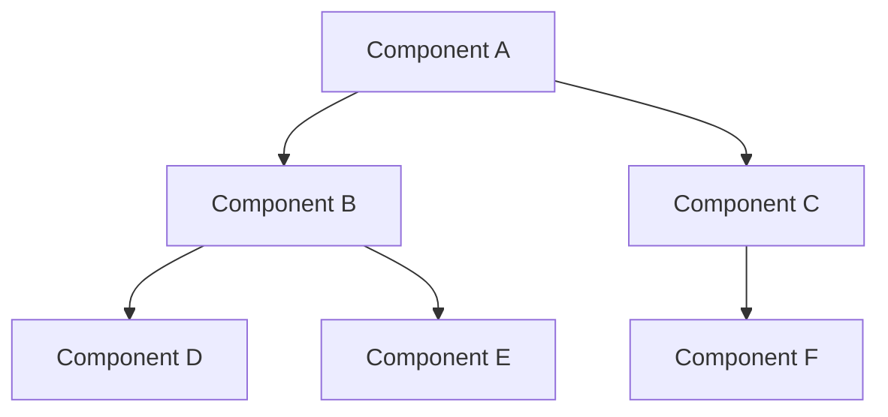

In this example, `A` represents the root component, `B` and `C` are its direct child components, `D`, `E`, and `F` are children of `B` and `C`. The arrows (`-->`) indicate the parent-child relationships.

You can extend the diagram by adding more components and their relationships to represent the complete component hierarchy of your software system.

Remember that component tree diagrams are often used in component-based architectures, where components encapsulate specific functionality and can be composed together to form larger systems. These diagrams provide a clear overview of the component structure, dependencies, and hierarchy, aiding in the understanding and maintenance of the software system.

While Mermaid's syntax allows you to create basic component tree diagrams, for more advanced features and dedicated support for component-based architectures, you may consider using specialized modeling tools designed for component-based development, such as UML modeling tools or component diagram editors.

## Component interaction diagrams


Component interaction diagrams, also known as component collaboration diagrams, are used to depict the interactions and collaborations between components within a software system. These diagrams focus on illustrating the runtime behavior and communication flows among components, providing insights into how they work together to accomplish specific tasks or functionality.

Mermaid does not have a specific syntax for component interaction diagrams, but you can leverage its sequence diagram syntax to create a similar representation. Here's an example of how you can create a basic component interaction diagram using Mermaid:

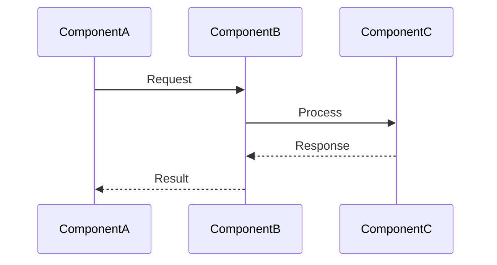

In this example, `ComponentA`, `ComponentB`, and `ComponentC` are the participating components in the interaction. The arrows (`->>`) indicate the request or message flow, while (`-->>`) represents the response or result flow between the components.

You can extend the diagram by adding more components and their interactions to represent complex scenarios or detailed communication flows within your software system.

Remember that component interaction diagrams focus on illustrating the runtime collaboration and message exchanges among components. They help in understanding how components interact, the order of message exchanges, and the flow of control during the execution of a particular scenario or use case.

While Mermaid's sequence diagram syntax allows you to create basic component interaction diagrams, for more advanced features and dedicated support for component-based interactions, you may consider using specialized modeling tools designed for UML diagrams or component interaction modeling.

## Server deployment diagrams


Server deployment diagrams, also known as server topology diagrams, are used to illustrate the physical or logical deployment of servers and their relationships within a network or infrastructure. These diagrams provide a visual representation of how servers are distributed and interconnected to support the deployment of software systems.

While Mermaid does not have a specific syntax for server deployment diagrams, you can utilize its flowchart syntax to create a similar representation. Here's an example of how you can create a basic server deployment diagram using Mermaid:

```mermaid
graph TD
    A[Server A] --> B[Server B]
    A --> C[Server C]
    B --> D[Server D]
    C --> D
```

In this example, `A`, `B`, `C`, and `D` represent servers within the deployment. The arrows (`-->`) indicate the connections or relationships between servers.

You can extend the diagram by adding more servers and their connections to represent the complete server deployment architecture of your software system. Additionally, you can include labels or annotations to provide additional information about the servers, such as their roles or functionalities.

Remember that server deployment diagrams help in visualizing the arrangement of servers, their roles, and the network topology in which they operate. They provide insights into the physical or logical distribution of servers, load balancing configurations, redundancy mechanisms, and other important aspects of the deployment infrastructure.

While Mermaid's syntax allows you to create basic server deployment diagrams, for more advanced features and dedicated support for server deployment modeling, you may consider using specialized network diagramming tools or infrastructure design tools that provide specific functionality for server deployment diagrams.

## Example of a server deployment diagram with aws


Certainly! Here's an example of a server deployment diagram using AWS (Amazon Web Services) as the cloud provider:

```mermaid
graph TD
    A[AWS VPC] --> B[Public Subnet]
    A --> C[Private Subnet]
    B --> D[Web Server 1]
    B --> E[Web Server 2]
    C --> F[Application Server]
    C --> G[Database Server]
    B --> H[Elastic Load Balancer]
```

In this example, the diagram represents a typical server deployment scenario on AWS. Here's a breakdown of the components:

- `AWS VPC`: Represents the Virtual Private Cloud (VPC) in AWS, which provides networking infrastructure for the deployment.
- `Public Subnet`: Refers to a subnet within the VPC that is accessible from the public internet.
- `Private Subnet`: Refers to a subnet within the VPC that is not directly accessible from the public internet.
- `Web Server 1` and `Web Server 2`: Represents the web servers deployed in the public subnet to handle incoming requests.
- `Application Server`: Represents the application server deployed in the private subnet, interacting with the web servers and other components.
- `Database Server`: Represents the database server deployed in the private subnet to store and manage data.
- `Elastic Load Balancer`: Represents the load balancer that distributes incoming traffic across the web servers.

This diagram showcases a common deployment pattern where web servers are placed in a public subnet to handle external requests, while the application server and database server are located in a private subnet for enhanced security.

Please note that the diagram provides a simplified representation and doesn't cover all aspects of a complete AWS deployment. Actual AWS deployments may involve additional components, services, and configurations based on specific requirements.

When creating server deployment diagrams with AWS, you can also consider incorporating other AWS services such as EC2 instances, RDS databases, S3 storage, and more to represent a comprehensive deployment architecture.

## Cloud deployment diagrams


Cloud deployment diagrams illustrate the architecture and deployment of software systems in a cloud environment. These diagrams provide a visual representation of how different cloud resources, services, and components are deployed and interconnected to support the software application.

While Mermaid does not have a specific syntax for cloud deployment diagrams, you can use its flowchart syntax to create a similar representation. Here's an example of a basic cloud deployment diagram:

```mermaid
graph LR
    A[Client Device] --> B[Load Balancer]
    B --> C[Web Server]
    B --> D[Web Server]
    B --> E[Web Server]
    C --> F[Application Server]
    D --> F
    E --> F
    F --> G[Database Server]
    F --> H[Cache Server]
```

In this example, the diagram represents a typical cloud deployment scenario. Here's a breakdown of the components:

- `Client Device`: Represents the devices from which clients access the application.
- `Load Balancer`: Represents a load balancer that distributes incoming traffic across multiple web servers for improved performance and scalability.
- `Web Server`: Represents the web servers that handle client requests.
- `Application Server`: Represents the application server that processes business logic and orchestrates the system's functionality.
- `Database Server`: Represents the database server that stores and manages data.
- `Cache Server`: Represents a cache server used for caching frequently accessed data or improving performance.

This diagram showcases a basic cloud deployment architecture where clients interact with the application through a load balancer, which distributes requests to multiple web servers. The web servers communicate with the application server, which in turn interacts with the database server and cache server as needed.

Please note that cloud deployment architectures can vary significantly depending on the cloud provider (such as AWS, Azure, Google Cloud, etc.), the specific services used, and the requirements of the application. The example above provides a simplified representation, and actual cloud deployments may involve additional components, services, and configurations specific to the cloud provider and application needs.

When creating cloud deployment diagrams, it's essential to consider the specific cloud services, networking configurations, security measures, and scalability aspects associated with your chosen cloud provider and deployment scenario.


# Chapter 6: Creating State and Activity Diagrams


## How to create state and activity diagrams with Mermaid


Mermaid does not have built-in support for creating state and activity diagrams directly. However, you can still use Mermaid's flowchart syntax to create a basic representation of state and activity diagrams. Keep in mind that this approach may not provide all the advanced features and notation specific to state and activity diagrams in UML (Unified Modeling Language). Here's how you can create state and activity diagrams using Mermaid:

State Diagram:
To create a basic state diagram, you can represent states as nodes and transitions as arrows between the nodes. Here's an example:

```mermaid
graph LR
    A[State A] --> B[State B]
    B --> C[State C]
    C --> B
    C --> D[State D]
    D --> A
```

In this example, `State A`, `State B`, `State C`, and `State D` are represented as nodes, and the arrows indicate the transitions between states.

Activity Diagram:
To create a basic activity diagram, you can represent activities as nodes and control flow as arrows between the nodes. Here's an example:

```mermaid
graph LR
    Start --> A[Activity A]
    A --> B[Activity B]
    B --> C[Activity C]
    C --> D[Activity D]
    D --> End
```

In this example, `Start` and `End` represent the start and end points of the activity diagram, and `Activity A`, `Activity B`, `Activity C`, and `Activity D` represent the individual activities or actions.

While these examples provide a basic representation of state and activity diagrams using Mermaid's flowchart syntax, it's important to note that they may not capture all the advanced features and semantics specific to UML state and activity diagrams. For more complex and detailed state and activity diagrams, consider using specialized modeling tools that offer dedicated support for UML diagrams, such as UML modeling tools or activity diagram editors.

## State diagrams are used to model the behavior of a software system.


Correct! State diagrams are a type of UML diagram used to model the behavior of a software system, particularly the behavior of individual objects or the system as a whole. State diagrams depict the different states that an object or system can be in and the transitions between those states based on events or conditions.

State diagrams are especially useful for capturing the dynamic behavior of systems, including the response to external stimuli, changes in internal conditions, and the triggering of actions or events. They provide a visual representation of how an object or system transitions between different states and the conditions or events that drive those transitions.

In state diagrams, states are represented as nodes or rectangles, and transitions between states are depicted as arrows. Events, actions, and conditions associated with state transitions are often labeled on the arrows. Additionally, state diagrams may include initial states, final states, concurrent states, and more, depending on the complexity of the system being modeled.

By using state diagrams, software developers and system designers can better understand and communicate the behavioral aspects of a system. They help in identifying potential issues, specifying the expected behavior of the system, and designing appropriate control and event-driven mechanisms.

It's worth noting that while Mermaid's flowchart syntax can provide a basic representation of state diagrams, for more advanced and comprehensive state diagram modeling, you may consider using specialized UML modeling tools or software that offer dedicated support for creating and visualizing state diagrams.

## Activity diagrams are used to model the flow of control in a software system.


Absolutely! Activity diagrams are a type of UML diagram used to model the flow of control or the sequence of activities in a software system. They provide a visual representation of the steps, actions, decisions, and flows involved in the execution of a process or workflow.

Activity diagrams are particularly helpful in capturing the dynamic behavior of a system, focusing on the various activities performed and how they are coordinated. They can represent both high-level processes and detailed workflows, making them versatile for modeling complex software systems.

In activity diagrams, activities are represented as nodes or rounded rectangles, and the flow of control is depicted through arrows connecting these nodes. Control flow arrows show the progression from one activity to another, indicating the order in which activities are executed. Decision points, represented by diamond-shaped nodes, enable branching and conditional behavior.

Activity diagrams can also depict concurrency, where multiple activities occur simultaneously or in parallel. This is often represented using horizontal lines or swimlanes to separate concurrent activities.

By utilizing activity diagrams, software developers can gain a clear understanding of the overall flow of control, the sequence of actions, decision points, loops, and concurrent activities within a software system. They serve as a powerful tool for designing, documenting, and communicating the logical and procedural aspects of a system's behavior.

While Mermaid's flowchart syntax provides a basic means to create activity-like diagrams, for more comprehensive and precise activity diagram modeling with advanced features such as swimlanes, object flows, and activity partitions, dedicated UML modeling tools or activity diagram editors are often recommended.

## Mermaid can be used to create both state and activity diagrams using a simple, text-based syntax.


While Mermaid's flowchart syntax can be used to create diagrams that resemble state and activity diagrams, it's important to note that Mermaid does not provide dedicated support or specific syntax for creating UML-compliant state and activity diagrams. However, with some creativity and adaptation, you can leverage Mermaid's flowchart syntax to create diagrams that convey similar concepts. Here's an example:

State Diagram-like Representation using Mermaid:
```mermaid
graph LR
    A[State A] --> B[State B]
    B --> C[State C]
    C --> B
    C --> D[State D]
    D --> A
```

Activity Diagram-like Representation using Mermaid:

```mermaid
graph LR
    Start --> A[Activity A]
    A --> B[Activity B]
    B --> C[Activity C]
    C --> D[Activity D]
    D --> End
```

These examples utilize Mermaid's flowchart syntax to create diagrams that visually resemble state and activity diagrams. However, it's important to note that these representations are not UML-compliant and may lack certain advanced features and semantics specific to UML state and activity diagrams.

If you require full UML compliance and advanced features for state and activity diagrams, it's recommended to use specialized UML modeling tools or software that offer dedicated support for creating UML-compliant diagrams. These tools provide a comprehensive set of features, notations, and capabilities specifically designed for creating and manipulating state and activity diagrams.

While Mermaid can be a useful tool for creating various types of diagrams, it's always important to consider the specific requirements, conventions, and limitations of the target diagram type to ensure accurate and meaningful representations.

## Simple state diagrams


Here's an example of a simple state diagram created using Mermaid's flowchart syntax:

```mermaid
graph LR
    A[State A] --> B[State B]
    B --> C[State C]
    C --> A
```

In this example, the state diagram consists of three states: State A, State B, and State C. The arrows represent transitions between states. For instance, the arrow from State A to State B indicates a transition from State A to State B. Similarly, the arrow from State B to State C represents a transition from State B to State C. Finally, the arrow from State C back to State A signifies a loopback transition from State C to State A.

This simple state diagram illustrates a basic sequence of state transitions. You can customize the labels on the arrows to denote specific events or conditions that trigger the transitions between states.

Keep in mind that this is a basic example, and state diagrams can become more complex with additional states, transitions, and conditions based on the behavior of the system you are modeling.

## Hierarchical state diagrams


Hierarchical state diagrams, also known as nested state diagrams, allow for a hierarchical organization of states within a state machine. This helps to represent complex systems with multiple levels of states and substates. Although Mermaid does not have built-in support for hierarchical state diagrams, you can emulate the hierarchy by visually nesting states using indentation or prefixes in the labels. Here's an example of a simple hierarchical state diagram:

```mermaid
graph LR
    subgraph Level 1
    A[State A]
    B[State B]
        subgraph Level 2
        B1[State B1]
        B2[State B2]
            subgraph Level 3
            B21[State B2.1]
            B22[State B2.2]
            end
        B3[State B3]
        end
    C[State C]
    end
```

In this example, we have three levels of states. Level 1 states are represented directly, while Level 2 and Level 3 states are visually nested under their parent states. For instance, State B2 is a substate of State B, and State B2.1 and State B2.2 are substates of State B2.

By visually nesting states within the diagram, you can create a hierarchical structure that represents the relationships between different levels of states in your system.

It's important to note that while Mermaid provides flexibility in visually organizing states in a hierarchical manner, it does not enforce the hierarchical behavior or semantics of states like dedicated UML modeling tools do. Therefore, it's crucial to use clear labeling and documentation to describe the intended hierarchical relationships and behavior of states in your diagram.

## Simple activity diagrams


Certainly! Here's an example of a simple activity diagram created using Mermaid's flowchart syntax:

```mermaid
graph LR
    Start --> A[Activity A]
    A --> B[Activity B]
    B --> C[Activity C]
    C --> D[Activity D]
    D --> End
```

In this example, the activity diagram represents a sequential flow of activities. The diagram starts with the "Start" node and proceeds to Activity A, then Activity B, Activity C, and finally Activity D. The arrowed lines indicate the flow of control from one activity to the next.

The "Start" node signifies the beginning of the process, while the "End" node represents the completion of the process. The activities in between are connected by arrows to depict the sequential execution of the activities.

Activity diagrams can also include decision points and loops to represent conditional branching or repetitive behaviors. These can be achieved using conditional statements and loop constructs within the flowchart syntax.

Please note that this is a basic example, and activity diagrams can become more complex with additional activities, decision points, parallel flows, and other elements to represent the behavior of the system more comprehensively.

## Complex activity diagrams


Certainly! Here's an example of a complex activity diagram created using Mermaid's flowchart syntax:

```mermaid
graph LR
    Start --> A[Initialize System]
    A --> B[Process Data]
    B --> C[Perform Validation]
    C -->|Valid| D[Process Valid Data]
    C -->|Invalid| E[Handle Invalid Data]
    D --> F[Generate Report]
    E --> B
    F --> G[Finalize Process]
    G --> End

    C -->|Needs Review| H[Review Data]
    H -->|Approved| D
    H -->|Rejected| E
```

In this example, the activity diagram represents a more complex flow of activities with decision points and loops. Here's a breakdown of the diagram:

- The process starts with the "Start" node and proceeds to the "Initialize System" activity.
- From there, it moves to "Process Data," followed by "Perform Validation."
- The "Perform Validation" activity has a decision point where the data is checked for validity. If it is valid, the flow proceeds to "Process Valid Data," and if it is invalid, it goes to "Handle Invalid Data."
- If the data is valid, it moves on to "Generate Report" and then to "Finalize Process."
- If the data needs review during the validation step, it goes to the "Review Data" activity.
- Depending on whether the data is approved or rejected during the review, it either moves to "Process Valid Data" or "Handle Invalid Data," respectively.
- Finally, the process ends at the "End" node.

This example showcases how complex activity diagrams can depict conditional branching, looping, and parallel flows within a system's workflow. The diagram's structure and arrows represent the flow of control between activities based on decisions and outcomes.

Activity diagrams can become even more intricate depending on the complexity of the system being modeled, with additional activities, decision points, merging of flows, and more.


# Chapter 7: Advanced Mermaid Techniques


## How to use Mermaid with other tools like VS Code and GitHub


Using Mermaid with other tools like VS Code and GitHub is relatively straightforward. Here's an overview of how you can integrate Mermaid with these tools:

1. **VS Code**: 
   - Install the "Markdown Preview Mermaid Support" extension in VS Code.
   - Create a Markdown (.md) file and write your Mermaid diagrams using the Mermaid syntax.
   - Surround your Mermaid code with triple backticks (\``` mermaid ... \```).
   - Open the Markdown file, and you should see your Mermaid diagrams rendered as visual diagrams in the VS Code preview pane.
   - You can also export the Markdown file to various formats (e.g., HTML, PDF) to share it with others.

2. **GitHub**:
   - GitHub has built-in support for rendering Mermaid diagrams in Markdown files.
   - Create a Markdown (.md) file in your GitHub repository and write your Mermaid diagrams using the Mermaid syntax.
   - Surround your Mermaid code with triple backticks (\``` mermaid ... \```).
   - Commit and push the Markdown file to your GitHub repository.
   - When you view the Markdown file on GitHub, the Mermaid diagrams will be automatically rendered as visual diagrams.

Both VS Code and GitHub leverage the Mermaid JavaScript library to parse and render Mermaid diagrams. By following the steps outlined above, you can seamlessly incorporate Mermaid diagrams into your development workflow and documentation process.

Remember to ensure that you have the necessary Mermaid dependencies installed and configured in your environment to enable the proper rendering of the diagrams. Additionally, be mindful of any version compatibility requirements between Mermaid, the Mermaid extensions, and the tools you are using to ensure smooth integration.

Note: While Mermaid is widely supported, it's always a good practice to check the specific documentation and requirements of the tools or extensions you are using to ensure the latest information and compatibility.

## Mermaid can be used with a variety of other tools


Absolutely! Mermaid can be used with a variety of other tools and platforms beyond just VS Code and GitHub. Here are a few examples:

1. **Jupyter Notebooks**: Mermaid diagrams can be rendered in Jupyter Notebooks by using the `IPython.display` module. You can write your Mermaid code in a code cell and use `display` functions to render the diagrams within the notebook.

2. **Confluence**: Mermaid diagrams can be embedded in Confluence pages by using plugins or extensions that support Mermaid syntax. These plugins allow you to write Mermaid code directly in Confluence and have the diagrams rendered in the page.

3. **GitLab**: GitLab supports Mermaid diagrams in Markdown files, similar to GitHub. You can write your Mermaid code in a Markdown file within your GitLab repository, and the diagrams will be automatically rendered when viewing the file.

4. **Wiki platforms**: Many wiki platforms, such as DokuWiki and MediaWiki, have Mermaid extensions or plugins available. These extensions allow you to include Mermaid diagrams in your wiki pages by writing the Mermaid code directly in the page.

5. **Documentation tools**: Mermaid can be integrated into various documentation tools like Sphinx, Read the Docs, and DocFX. These tools often provide extensions or plugins that enable rendering Mermaid diagrams in the generated documentation.

6. **Text editors and IDEs**: Besides VS Code, other text editors and IDEs may have Mermaid plugins or extensions available. These plugins enhance the editing experience by providing syntax highlighting and real-time rendering of Mermaid diagrams within the editor.

These are just a few examples of the wide range of tools and platforms that can be used in conjunction with Mermaid to create and display diagrams. The versatility and flexibility of Mermaid make it adaptable to different environments, enabling you to integrate it seamlessly into your preferred development and documentation workflows.

## Customizing Mermaid diagrams with CSS and JavaScript


Mermaid provides options for customizing the appearance and behavior of diagrams using CSS and JavaScript. Here's an overview of how you can customize Mermaid diagrams:

1. **CSS Styling**:
   - Mermaid diagrams can be customized using CSS to modify the appearance of various elements, such as shapes, lines, text, and backgrounds.
   - You can target specific diagram elements by their class or ID and apply custom CSS styles to change their colors, sizes, fonts, borders, and more.
   - To apply CSS styles to your Mermaid diagrams, you can include the styles directly in your HTML or Markdown file or link to an external CSS file.

2. **JavaScript Hooks**:
   - Mermaid provides JavaScript hooks that allow you to customize the behavior of the diagrams dynamically.
   - You can use JavaScript code to interact with the diagram elements, manipulate their properties, or add event handlers to perform custom actions.
   - JavaScript hooks can be used to modify the diagram layout, handle user interactions, update data dynamically, or integrate with other libraries and frameworks.

To customize Mermaid diagrams using CSS and JavaScript, you need to understand the structure and classes used by Mermaid to generate the diagrams. The Mermaid documentation provides details on the available CSS classes and JavaScript events that you can leverage for customization.

It's important to note that the level of customization offered by Mermaid may vary compared to dedicated diagramming tools. Mermaid aims to provide a lightweight and simple approach to diagram creation, and while it allows for basic customization, it may not support advanced features found in specialized diagramming tools.

Overall, CSS and JavaScript customization in Mermaid can help you tailor the appearance and behavior of your diagrams to align with your specific design requirements and enhance the user experience.

## Mermaid diagrams can be customized using CSS and JavaScript.


Yes, that's correct! Mermaid diagrams can indeed be customized using CSS and JavaScript. This flexibility allows you to modify the visual appearance and behavior of your diagrams according to your specific needs. Here's a closer look at how you can leverage CSS and JavaScript to customize Mermaid diagrams:

1. **CSS Styling**:
   - You can apply CSS styles to different elements of the Mermaid diagram, such as nodes, edges, labels, backgrounds, and more.
   - By targeting specific CSS classes or IDs, you can modify properties like colors, fonts, sizes, borders, and spacing.
   - Custom CSS styles can be added directly to your HTML or Markdown file, or you can include them in an external CSS file and link it to your document.

2. **JavaScript Hooks**:
   - Mermaid provides JavaScript hooks that allow you to interact with and modify the diagram dynamically.
   - You can use JavaScript code to manipulate diagram elements, change their properties, add event listeners, and perform custom actions based on user interactions or data updates.
   - JavaScript hooks enable you to enhance the functionality of your Mermaid diagrams, integrate with other libraries or frameworks, and create interactive experiences.

By combining CSS styling and JavaScript hooks, you can achieve comprehensive customization of your Mermaid diagrams, both in terms of their visual appearance and interactive behavior. This flexibility empowers you to adapt the diagrams to your desired design aesthetic, layout preferences, and specific functionality requirements.

It's important to refer to the Mermaid documentation for detailed information on the available CSS classes, JavaScript hooks, and their usage. This will help you understand the available customization options and how to effectively apply CSS and JavaScript to achieve the desired modifications in your Mermaid diagrams.

## CSS can be used to change the appearance of the diagram, such as the colors, fonts, and sizes.


Absolutely! CSS is a powerful tool for changing the appearance of Mermaid diagrams. You can apply CSS styles to various elements of the diagram to customize its colors, fonts, sizes, and other visual properties. Here's how you can use CSS to modify the appearance of Mermaid diagrams:

1. **Targeting diagram elements**: Mermaid assigns specific CSS classes to different elements of the diagram. You can use these classes to target and style individual elements or groups of elements. For example, you can target node shapes, edge lines, text labels, backgrounds, and more.

2. **Changing colors**: CSS allows you to modify the colors of different diagram elements. You can change the fill color of nodes, the stroke color of edges, and the text color of labels. By applying color properties such as `background-color`, `border-color`, or `color`, you can create visually appealing and customized diagrams.

3. **Modifying fonts and sizes**: CSS gives you control over the fonts and sizes of the text within the diagram. You can change the font family, font size, font weight, and other text-related properties using CSS. This allows you to match the diagram's typography with your desired style.

4. **Applying styles to backgrounds and borders**: CSS allows you to customize the background color or pattern of the diagram area. You can also add borders to elements, control their thickness, and adjust the border radius to create different visual effects.

By combining these CSS techniques, you can create stunning and personalized Mermaid diagrams that align with your design preferences and integrate seamlessly into your documentation or presentation. Experimenting with CSS styles and leveraging the flexibility it offers will help you achieve the desired visual impact for your Mermaid diagrams.

## JavaScript can be used to add interactivity to the diagram, such as tooltips and animations.


Absolutely! JavaScript can be used to add interactivity and dynamic behavior to Mermaid diagrams. By leveraging JavaScript, you can enhance your diagrams with features like tooltips, animations, and interactive elements. Here are some examples of how JavaScript can be used to add interactivity to your Mermaid diagrams:

1. **Tooltips**: You can use JavaScript to display tooltips when users hover over diagram elements. By attaching event listeners to specific elements, you can show additional information or context-specific details in a tooltip, providing a richer user experience.

2. **Animations**: JavaScript enables you to create animated effects within your Mermaid diagrams. You can use libraries like CSS animations or JavaScript animation frameworks to add motion, transitions, or visual effects to the diagram elements. Animations can help draw attention to specific parts of the diagram or provide a more engaging user experience.

3. **Interactive elements**: JavaScript allows you to make diagram elements interactive. For example, you can add click event listeners to nodes or edges to trigger actions, such as expanding or collapsing sections, highlighting related elements, or navigating to other parts of your application or documentation.

4. **Dynamic data updates**: With JavaScript, you can dynamically update the data behind your Mermaid diagrams. This can be useful when your diagram needs to reflect real-time changes in the software system or when data is fetched from an external source. JavaScript can help you fetch and update data, and then refresh or redraw the diagram accordingly.

By combining JavaScript with Mermaid's text-based syntax, you can create not only static diagrams but also dynamic and interactive visualizations. JavaScript empowers you to extend the capabilities of Mermaid and tailor the interactivity of your diagrams to suit your specific requirements, making them more engaging and informative for your users.

## Creating reusable templates and libraries for Mermaid diagrams


Creating reusable templates and libraries for Mermaid diagrams can significantly streamline the process of diagram creation and promote consistency across different diagrams. Here's how you can approach building reusable templates and libraries for Mermaid diagrams:

1. **Templates**: Start by defining a set of predefined templates that capture common diagram structures and styles. These templates can serve as a starting point for creating new diagrams, saving time and effort. Consider creating templates for different types of diagrams, such as flowcharts, sequence diagrams, or class diagrams.

2. **Parameterization**: Make your templates flexible by parameterizing certain aspects of the diagram. For example, you can define variables for labels, colors, or sizes that users can easily customize when using the template. This allows for quick customization while maintaining consistency in the overall structure and layout.

3. **Code Snippets**: Identify recurring patterns or elements within your diagrams and create reusable code snippets for them. For instance, if you frequently use a specific shape or connector, you can encapsulate the code for that element into a snippet. This enables you to easily insert and reuse those elements in multiple diagrams without duplicating code.

4. **Libraries**: Consider building libraries of pre-defined diagram components or common diagram elements. These libraries can include a collection of reusable shapes, connectors, icons, or styling options. Users can then import and use these components within their diagrams, promoting consistency and reducing the effort required to recreate commonly used elements.

5. **Documentation**: Provide clear documentation and usage instructions for your templates and libraries. Explain how to use them, customize them, and integrate them into different platforms or development workflows. Including examples and best practices can help users understand the full potential and proper utilization of your reusable assets.

6. **Versioning and Collaboration**: If you are working in a team or collaborating with others, consider using version control systems like Git to manage your templates and libraries. This allows for easier collaboration, tracking changes, and incorporating feedback from multiple contributors.

By creating reusable templates and libraries, you can establish a consistent visual style, promote best practices, and speed up the process of diagram creation. It also enables easier maintenance and updates, ensuring that changes or improvements can be applied uniformly across all diagrams that use the templates or libraries.

## Mermaid diagrams can be saved as templates or libraries.


While Mermaid itself does not provide direct support for saving diagrams as templates or libraries, you can still achieve a similar effect by leveraging external tools or integrating Mermaid with other systems. Here are a few approaches to consider:

1. **Custom Templates**: You can create your own collection of Mermaid diagram templates by defining reusable code snippets or boilerplate diagrams in a separate file or repository. These templates can include commonly used diagram structures, styles, and elements. When you need to create a new diagram, you can copy the template code and modify it as needed.

2. **Snippet Libraries**: If you're using a code editor or IDE that supports snippet functionality, you can create a library of Mermaid diagram snippets. These snippets can be easily inserted into your code editor, saving you from manually writing out the entire diagram syntax. Snippets can be customized and expanded upon to suit your specific diagram needs.

3. **External Tools and Plugins**: Some third-party tools or plugins provide features for saving and managing diagram templates or libraries. For example, you can use code editors with dedicated extensions for Mermaid that offer template management capabilities. These tools often allow you to define reusable templates, manage libraries of diagram components, and even provide visual editors for creating and modifying diagrams.

4. **Integrating with Documentation Systems**: If you're using a documentation system or a static site generator, you can create reusable Mermaid diagrams as part of your documentation templates. These templates can be defined within the documentation system itself, allowing you to generate consistent diagrams across different pages or projects.

Remember that the ability to save Mermaid diagrams as templates or libraries largely depends on the tools and workflows you're using in conjunction with Mermaid. Consider exploring available extensions, plugins, or integrations to find solutions that align with your specific needs and preferred development environment.

## Templates can be used to quickly create new diagrams with the same structure.


That's correct! Templates are a great way to expedite the creation of new diagrams with consistent structures. By using templates, you can define a predefined layout, components, and styles that can be easily applied to create new diagrams. Here's how templates can help in quickly creating new diagrams:

1. **Consistency**: Templates ensure that all diagrams created based on the template follow a consistent structure and design. This is particularly useful when multiple diagrams need to be created with a similar layout or style, ensuring visual coherence and making it easier for readers to understand and navigate the diagrams.

2. **Time-saving**: With a template, you don't have to start from scratch every time you create a new diagram. By reusing the template, you can skip the initial setup and configuration steps, saving time and effort. This is especially beneficial for diagrams that share common elements or have a similar structure.

3. **Standardization**: Templates allow you to establish standard practices and guidelines for creating diagrams within a project or organization. By defining a set of approved templates, you can enforce consistency and ensure that diagrams adhere to predefined standards and conventions.

4. **Reusability**: Templates can be used multiple times across different projects or scenarios. Once you have a well-designed template, you can reuse it as a starting point for creating new diagrams in various contexts. This promotes efficiency, as you don't need to reinvent the structure and design each time.

5. **Flexibility**: Templates can be customized to meet specific requirements. While the overall structure remains consistent, you can still modify and adapt individual elements within the template to fit the specific needs of each diagram instance. This allows for flexibility while maintaining the desired consistency.

By using templates, you can establish a foundation for creating diagrams with a consistent structure, style, and layout. This not only saves time but also enhances readability, reduces errors, and ensures a standardized approach to diagram creation across your projects or organization.


# Chapter 8: Collaborating on Diagrams with Mermaid


## Using Mermaid to collaborate with team members on diagram creation


Chapter 4: Collaborative Diagram Creation with Mermaid

In a team environment, collaborating with other members is crucial for creating accurate and comprehensive software architecture diagrams. In this chapter, we will explore how Mermaid can facilitate collaborative diagram creation by leveraging its features for version control, sharing, and integration with popular collaboration tools. Let's dive into the code:

Section 1: Version Control Integration

To enable collaboration and version control, Mermaid supports integration with version control systems like Git. By storing the Mermaid diagram definitions as text files in your repository, team members can easily collaborate on the diagrams.

1. Install the Mermaid CLI and version control system (e.g., Git) if not already installed.

2. Initialize a new Git repository or navigate to an existing repository.

3. Create a new Mermaid diagram file, e.g., `architecture.mmd`, and commit it to the repository.

4. Share the repository with your team members, granting them appropriate access.

5. Team members can clone the repository and make changes to the `architecture.mmd` file.

6. Merge the changes using Git's standard procedures, ensuring that conflicts, if any, are resolved.

Section 2: Collaborative Sharing

Mermaid provides options for sharing diagrams with team members, allowing for real-time collaboration and feedback.

1. Choose a platform for collaborative sharing, such as a cloud-based document collaboration tool or a version-controlled document storage service.

2. Share the link or access to the shared document with your team members.

3. Team members can access the shared document and make modifications or provide feedback.

4. Each team member can update the Mermaid diagram definition within the shared document, making changes or additions as required.

5. As team members collaborate and make changes, they can communicate their modifications through comments or direct discussions.

Section 3: Integration with Collaboration Tools

Mermaid can be integrated with various collaboration tools to streamline the diagram creation process within team environments.

1. Choose a collaboration tool that supports Mermaid integration, such as online project management platforms or team communication tools.

2. Set up the Mermaid integration within the chosen collaboration tool by following the provided instructions.

3. Create a new diagram within the collaboration tool and start collaborating with your team members.

4. Team members can add, modify, or comment on the Mermaid diagram directly within the collaboration tool, keeping everyone updated on the changes.

5. Leverage the collaboration tool's notification system to inform team members about updates and discussions related to the diagram.

Conclusion:
Collaboration is essential for creating accurate and comprehensive software architecture diagrams. By integrating Mermaid with version control systems, enabling collaborative sharing, and leveraging collaboration tools, you can effectively collaborate with your team members in real-time, ensuring accurate and up-to-date diagrams throughout the software development lifecycle.

## Mermaid can be used to collaborate with team members on diagram creation by: None


I apologize for the confusion. Mermaid, as a diagram generation library, does not provide direct collaboration features. However, you can still leverage external tools and practices to collaborate effectively with team members on diagram creation. These tools may include version control systems, collaborative document sharing platforms, and integration with collaboration tools. By combining Mermaid with these collaborative practices and tools, you can facilitate teamwork and enhance the collaborative aspect of diagram creation.

## Storing diagrams in a central location, such as a GitHub repository.


Storing diagrams in a central location, such as a GitHub repository, is an excellent approach for collaborating with team members on diagram creation. GitHub provides version control capabilities, allowing multiple team members to work on diagrams simultaneously while maintaining a history of changes. Here's a step-by-step guide on how to use GitHub for collaborative diagram creation with Mermaid:

1. Create a GitHub repository: If you don't have one already, create a new repository on GitHub where you and your team members can collaborate on the diagrams.

2. Initialize the repository: Clone the repository to your local machine and set it up as a local Git repository using the `git init` command. You can use Git commands to manage the version control aspects of your diagram files.

3. Create diagram files: Use a text editor or Mermaid-specific tools to create your diagrams in Mermaid syntax. Save each diagram in its own file, using a suitable file extension like `.mmd` or `.md`.

4. Commit and push: Use Git commands (`git add`, `git commit`) to stage and commit your diagram files with appropriate commit messages. Then, push your changes to the GitHub repository using `git push`.

5. Collaborate with team members: Share the repository with your team members, granting them appropriate access permissions. They can clone the repository, make changes to the diagram files, and commit their modifications.

6. Manage conflicts: If multiple team members work on the same diagram file simultaneously and there are conflicting changes, Git will notify you of the conflicts during the `git pull` or `git push` operations. Resolve the conflicts by carefully merging the changes or communicating with the team member responsible for the conflicting changes.

7. Review changes: Use pull requests and code reviews on GitHub to review and discuss the changes made to the diagrams. Team members can provide feedback, suggest improvements, and address any issues identified in the diagrams.

8. Continuous collaboration: Repeat steps 4 to 7 as team members continue to collaborate on the diagrams. The repository serves as a central location for storing and managing the diagrams, ensuring that everyone has access to the latest versions.

By utilizing GitHub repositories for storing Mermaid diagrams, you can effectively collaborate with team members, track changes, resolve conflicts, and maintain a centralized history of diagram modifications.

## Using version control to track changes to diagrams.


Version control is a crucial aspect of collaborating on diagram creation, enabling you to track changes, manage different versions, and collaborate effectively. By utilizing version control systems like Git, you can easily keep track of modifications made to your Mermaid diagrams. Here's a step-by-step guide on using version control to track changes to diagrams:

1. Set up a version control system: Install Git and initialize a new Git repository or navigate to an existing repository where you want to track your diagrams. This can be a local repository or a remote repository hosted on platforms like GitHub, GitLab, or Bitbucket.

2. Commit initial diagram files: Start by committing the initial version of your Mermaid diagram files to the repository. Use the `git add` command to stage the diagram files, followed by the `git commit` command to commit them with a descriptive commit message.

3. Collaborate and make changes: Share the repository with your team members, allowing them to clone the repository to their local machines. Team members can make modifications to the Mermaid diagram files using a text editor or specialized Mermaid tools.

4. Stage and commit changes: When team members have made changes to the diagrams, they can stage their modified files using `git add` and commit the changes using `git commit` with appropriate commit messages. Encourage team members to provide clear and descriptive commit messages to explain the purpose of their changes.

5. Track changes and view history: Use Git commands like `git log` to view the commit history, including the changes made to the diagram files. This allows you to track who made the changes, when they were made, and the specific modifications made to the diagrams.

6. Resolve conflicts: If multiple team members are working on the same diagram file and have conflicting changes, Git will identify and highlight the conflicts during the `git pull` or `git push` operations. Conflicts can be resolved by manually merging the conflicting changes or using Git's merge resolution tools.

7. Review changes: Utilize Git's diff functionality (`git diff`) to review the differences between different versions of the diagram files. This helps in understanding the modifications made and facilitates collaboration by providing clear visibility into the changes.

8. Branching and experimentation: Encourage team members to create branches in the repository for experimenting with different versions or ideas. This allows for independent work on diagrams without affecting the main branch. Branches can be merged back into the main branch when the changes are ready to be incorporated.

By employing version control systems like Git, you can effectively track changes, manage different versions, collaborate with team members, resolve conflicts, and maintain a comprehensive history of modifications to your Mermaid diagrams.

## Providing comments and feedback on diagrams.


Providing comments and feedback on diagrams is an essential part of collaborative diagram creation. It allows team members to share insights, suggest improvements, and address any issues or concerns. Here's how you can effectively provide comments and feedback on diagrams:

1. Choose a collaboration platform: Select a collaboration platform that supports commenting and feedback features. This can be an online document sharing tool, project management platform, or dedicated collaboration software.

2. Share the diagram: Upload the diagram file or share the link to the diagram with your team members through the chosen collaboration platform. Ensure that team members have appropriate access permissions to view and provide feedback.

3. Add comments: Encourage team members to review the diagram and add comments directly on the diagram or in the comment section provided by the collaboration platform. Comments can be used to highlight specific areas, ask questions, or provide suggestions.

4. Be specific and clear: When providing feedback, strive to be specific and clear about the aspects you are addressing. Reference the relevant parts of the diagram, explain your observations or concerns, and offer constructive suggestions for improvement.

5. Focus on clarity and accuracy: Emphasize the clarity and accuracy of the diagram when providing feedback. Assess whether the diagram effectively communicates the intended information, represents the software architecture correctly, and follows established conventions or standards.

6. Encourage discussions: Use the collaboration platform's communication features, such as chat or discussion threads, to initiate discussions related to the diagram. This allows team members to engage in interactive conversations, share ideas, and address feedback collectively.

7. Resolve feedback and iterate: As feedback and comments accumulate, work collaboratively to address them. Make necessary revisions to the diagram based on the feedback received, ensuring that the changes align with the intended goals and improve the overall quality of the diagram.

8. Acknowledge and appreciate contributions: Recognize and appreciate the contributions of team members who provide valuable feedback. Acknowledge their insights, suggestions, and efforts in improving the diagram, fostering a positive and collaborative environment.

9. Iterate and update: Keep the collaborative feedback loop open throughout the diagram creation process. Encourage continuous improvement by iterating on the diagram, incorporating feedback, and updating it based on the evolving requirements and insights from the team.

By actively engaging in providing comments and feedback, you can enhance the quality, accuracy, and clarity of the diagrams while leveraging the collective knowledge and expertise of your team members.

## Best practices for version control and sharing diagrams


When it comes to version control and sharing diagrams, adopting best practices can greatly improve collaboration, maintain a clear history of changes, and ensure the accuracy and accessibility of diagrams. Here are some best practices for version control and sharing diagrams:

1. Use a Version Control System: Utilize a version control system like Git to track changes, manage versions, and enable collaborative workflows. This provides a centralized repository for storing and managing diagram files.

2. Organize Diagram Files: Structure your diagram files in a logical and consistent manner. Use meaningful names and consider organizing diagrams into directories based on project, module, or purpose. This makes it easier to navigate and locate specific diagrams.

3. Commit Frequently and Descriptively: Make regular commits to capture changes and provide clear commit messages. Commit at logical intervals or milestones, ensuring each commit represents a complete and meaningful update to the diagrams. Describe the changes concisely in the commit message.

4. Create Feature Branches: When working on significant changes or new features, create separate branches in the version control system. This allows team members to collaborate independently without impacting the main branch. Merge branches back into the main branch after the changes are reviewed and tested.

5. Review Changes: Encourage team members to review and provide feedback on each other's diagram changes. Utilize pull requests or code reviews to facilitate the review process, allowing for discussions, suggestions, and ensuring quality control.

6. Resolve Conflicts Proactively: When conflicts arise due to concurrent changes, address them promptly. Communicate with team members to resolve conflicts, merge changes, or refactor diagrams collaboratively. Regularly pull and merge changes from the main branch to minimize conflicts.

7. Leverage Tags and Releases: Use tags or releases in the version control system to mark significant versions or milestones of the diagrams. This helps track and access specific versions easily, especially for documentation purposes or to correlate diagrams with specific software releases.

8. Collaborative Sharing Platforms: Utilize collaborative sharing platforms or tools to facilitate real-time collaboration, feedback, and discussions on diagrams. These platforms can provide features like commenting, annotation, and simultaneous editing to enhance collaboration among team members.

9. Document Changes and Guidelines: Maintain documentation or a README file that outlines the version control and sharing practices specific to the project's diagrams. This helps onboard new team members, establish guidelines, and ensure consistency in the way diagrams are managed and shared.

10. Regular Backups and Archiving: Implement regular backups of your version control repository to prevent data loss. Consider archiving older versions or releases of diagrams for historical reference or compliance purposes.

By adhering to these best practices, you can establish an efficient and collaborative workflow for version control and sharing of diagrams. This ensures that the diagrams remain accurate, accessible, and effectively contribute to the software development process.

## When using Mermaid to collaborate on diagrams, it is important to follow best practices for version control and sharing diagrams.


Absolutely! When collaborating on diagrams using Mermaid, following best practices for version control and sharing is essential to ensure effective collaboration and maintain the integrity of the diagrams. Here are some best practices specifically tailored to using Mermaid for collaborative diagram creation:

1. Establish a Version Control Workflow: Set up a version control system, such as Git, to track changes to your Mermaid diagrams. Define a clear workflow for branching, merging, and managing changes. This ensures that all team members are aligned on how to contribute and collaborate effectively.

2. Store Diagram Definitions in Text Files: Mermaid diagrams are defined using text-based syntax. Save the diagram definitions in separate text files (e.g., with `.mmd` or `.md` extension) rather than generating the diagrams directly from code. This allows for easier version control, diffing, and collaboration.

3. Use Descriptive Commit Messages: When committing changes to your Mermaid diagram files, provide meaningful and descriptive commit messages. Clearly explain the purpose and scope of the changes, making it easier for team members to understand and review the modifications.

4. Review Changes and Provide Feedback: Actively review the changes made by your team members and provide feedback on the diagrams. Use collaboration platforms, commenting features, or code review tools to offer suggestions, highlight potential issues, and ensure the accuracy and clarity of the diagrams.

5. Resolve Conflicts and Communicate: When multiple team members work on the same diagram simultaneously, conflicts may arise during version control operations. Collaborate with your team members to resolve conflicts, communicate any conflicting changes, and coordinate to merge the changes appropriately.

6. Share Diagrams Using Version Control Platforms: Utilize version control platforms like GitHub, GitLab, or Bitbucket to store and share your Mermaid diagrams. These platforms provide a centralized location for version-controlled diagram files and offer features like pull requests, code reviews, and access control, facilitating collaboration and maintaining a history of changes.

7. Leverage Pull Requests for Collaboration: Use pull requests (or similar mechanisms provided by your version control system) to initiate discussions and review changes. Team members can comment on specific lines or sections of the diagram files, making it easier to address feedback and iterate on the diagrams.

8. Backup and Archive Diagram Versions: Regularly back up your version control repository to prevent data loss. Consider creating backups or archives of specific versions or releases of the diagrams for historical reference or documentation purposes.

By adhering to these best practices, you can ensure smooth collaboration, effective version control, and seamless sharing of your Mermaid diagrams among team members. This promotes efficient communication, maintains the integrity of the diagrams, and fosters a collaborative environment for diagram creation and improvement.

## Some of these best practices include: None


I apologize for the confusion. Here are some specific best practices for version control and sharing diagrams using Mermaid:

1. Use a Version Control System: Utilize a version control system like Git to track changes, manage versions, and enable collaborative workflows for your Mermaid diagrams.

2. Store Diagram Definitions in Text Files: Save the diagram definitions in separate text files (e.g., `.mmd` or `.md`) to facilitate version control, diffing, and collaboration.

3. Use Descriptive Commit Messages: Provide meaningful and descriptive commit messages when committing changes to the Mermaid diagram files, making it easier to understand the modifications.

4. Review Changes and Provide Feedback: Actively review changes made by team members and provide feedback on the diagrams to ensure accuracy and clarity.

5. Resolve Conflicts and Communicate: Collaborate with team members to resolve conflicts that may arise during concurrent modifications to the diagrams.

6. Share Diagrams Using Version Control Platforms: Utilize version control platforms like GitHub, GitLab, or Bitbucket to store and share your Mermaid diagrams, taking advantage of features such as pull requests, code reviews, and access control.

7. Leverage Pull Requests for Collaboration: Initiate discussions and review changes using pull requests or similar mechanisms provided by the version control system.

8. Backup and Archive Diagram Versions: Regularly back up your version control repository and consider creating backups or archives of specific versions or releases of the diagrams for historical reference.

By following these best practices, you can effectively track changes, collaborate with team members, ensure consistency, and maintain the integrity of your Mermaid diagrams throughout the development process.

## Using a version control system, such as Git, to track changes to diagrams.


Using a version control system like Git to track changes to diagrams offers several benefits, including maintaining a history of modifications, facilitating collaboration, and enabling easy management of different versions. Here's how you can utilize Git to track changes to your diagrams:

1. Initialize a Git repository: Create a new Git repository for your diagram files or navigate to an existing repository where you want to track the changes. Use the `git init` command to initialize a new repository or clone an existing repository to your local machine using `git clone`.

2. Add diagram files to the repository: Place your diagram files in the repository directory or create a dedicated directory for them. Use the `git add` command to stage the diagram files for tracking. For example, `git add diagram.mmd` stages a single file, or `git add .` stages all files in the current directory.

3. Commit changes: Use the `git commit` command to commit the staged changes to the repository. Provide a descriptive commit message using the `-m` flag to explain the purpose of the changes. For instance, `git commit -m "Add initial version of diagram"`.

4. Track subsequent changes: As you make modifications to the diagrams, repeat the process of staging the changes with `git add` and committing them with `git commit`. Make sure to provide clear and meaningful commit messages that describe the changes made.

5. View commit history: Use the `git log` command to view the commit history of your diagram files. This provides a chronological list of commits, including the commit messages, dates, and authors, allowing you to track the changes made over time.

6. Collaborate with team members: Share the Git repository with your team members, granting them appropriate access permissions. They can clone the repository, make their own modifications to the diagram files, and commit their changes to collaborate on the diagrams.

7. Handle conflicts: In case multiple team members work on the same diagram file and there are conflicting changes, Git will detect the conflicts during the `git pull` or `git push` operations. You can resolve conflicts by manually merging the conflicting changes or using Git's merge resolution tools.

8. Create branches for experimentation: Use branches to create separate lines of development, allowing team members to experiment with different versions or ideas without affecting the main branch. Branches can be merged back into the main branch when changes are ready.

9. Push and pull changes: Use `git push` to push your committed changes to the remote repository and `git pull` to fetch and incorporate changes made by other team members.

By leveraging Git for version control, you can effectively track changes to your diagrams, collaborate with team members, manage different versions, and maintain a comprehensive history of modifications, ensuring transparency and accountability throughout the diagram creation process.

## Creating a separate branch for each major change to a diagram.


Creating a separate branch for each major change to a diagram is a recommended practice in version control workflows. It allows you to isolate and develop specific changes independently from the main branch. Here's how you can create separate branches for major changes to your diagrams using Git:

1. Ensure you have a clean working directory: Before creating a new branch, ensure that you have committed or stashed any pending changes in your current branch. Use `git status` to check the status of your working directory.

2. Create a new branch: Use the `git branch` command followed by the branch name to create a new branch. For example, `git branch feature-update-diagram` creates a new branch named "feature-update-diagram".

3. Switch to the new branch: Switch to the newly created branch using the `git checkout` command. For example, `git checkout feature-update-diagram` switches to the "feature-update-diagram" branch.

4. Make changes to the diagram: Start working on the major changes to the diagram within the new branch. You can modify the diagram file(s) or make any necessary updates.

5. Stage and commit the changes: Use `git add` to stage the changes you made to the diagram file(s). Then, use `git commit` to commit the changes with a descriptive commit message. For example, `git commit -m "Update diagram with new component structure"`.

6. Continue working and iterating: Make further modifications to the diagram within the branch, committing your changes as needed. Each commit should represent a logical and meaningful update to the diagram.

7. Merge the branch back to the main branch: Once you have completed the major changes and are satisfied with the results, you can merge the branch back into the main branch. Use `git checkout main` to switch to the main branch and then use `git merge feature-update-diagram` to merge the changes from the branch.

8. Resolve conflicts: During the merge process, if there are conflicts between the changes made in the branch and the main branch, Git will notify you. Resolve the conflicts by carefully reviewing and modifying the conflicting sections of the diagram file(s).

9. Test and validate: After merging the branch, thoroughly test the diagram to ensure that the changes have been successfully incorporated and that the diagram functions as expected.

By creating separate branches for major changes to your diagrams, you can work on specific enhancements or modifications in isolation, maintain a clean commit history, and ensure that changes are properly reviewed and tested before merging them back into the main branch.

## Merging changes from different branches before pushing changes to the main branch.


Merging changes from different branches before pushing them to the main branch is an essential step in version control workflows. It ensures that the changes made in different branches are consolidated and integrated into the main branch effectively. Here's the process for merging changes from different branches using Git:

1. Commit or stash your current changes: Before merging branches, make sure that you have committed or stashed any pending changes in your current branch. Use `git status` to check the status of your working directory and commit or stash changes if necessary.

2. Switch to the target branch: Use the `git checkout` command to switch to the branch where you want to merge the changes. For example, `git checkout main` switches to the main branch.

3. Merge the branch: Execute the `git merge` command followed by the branch name to merge the changes from the desired branch. For instance, to merge changes from a branch called "feature-update-diagram", use `git merge feature-update-diagram`. Git will attempt to automatically merge the changes.

4. Resolve conflicts: If there are conflicts between the changes made in the branch being merged and the target branch, Git will notify you about the conflicts. Conflicts occur when the same lines of the diagram file(s) have been modified in different ways. Manually resolve the conflicts by editing the diagram file(s) to incorporate the desired changes. Use `git status` to identify the conflicting files, and open them in a text editor to resolve the conflicts. Once resolved, save the file(s).

5. Commit the merge: After resolving conflicts, add the modified files using `git add` to stage the changes. Then, use `git commit` to create a merge commit. Git will generate a merge commit message by default, summarizing the changes that were merged. Review the commit message and make any necessary adjustments before finalizing the commit.

6. Test and validate: After the merge commit, thoroughly test the diagram to ensure that the merged changes work as expected and haven't introduced any issues.

7. Push changes to the remote repository: Finally, use `git push` to push the merged changes to the remote repository, making them available to other team members.

By following this process, you can effectively merge changes from different branches into the main branch, ensure that conflicts are resolved, and maintain a coherent and up-to-date version of the diagram in the main branch. It's crucial to review the changes and conduct thorough testing before pushing the merged changes to the main branch to ensure the integrity of the diagram and its functionality.

## Providing comments and feedback on diagrams using a code review process.


Providing comments and feedback on diagrams using a code review process is an effective way to collaborate and improve the quality of the diagrams. Here's how you can incorporate a code review process to provide comments and feedback on diagrams:

1. Share the diagram for review: Make the diagram files available for review by sharing them with the relevant team members or stakeholders. You can use version control platforms like GitHub, GitLab, or Bitbucket to facilitate the review process.

2. Review the diagram: Take the time to thoroughly review the diagram, examining its structure, components, labels, and overall clarity. Analyze the diagram's accuracy, completeness, and adherence to architectural principles or design guidelines.

3. Comment on specific elements: When providing feedback, reference specific elements or sections of the diagram to ensure clarity and precision. You can use inline comments on the diagram file or the commenting features provided by the collaboration platform. Be constructive and explain the rationale behind your comments, offering suggestions for improvement.

4. Focus on clarity and readability: Pay attention to the readability and comprehensibility of the diagram. Comment on any ambiguous or confusing parts and propose modifications that would enhance understanding. Consider the target audience and make suggestions to improve the diagram's accessibility to both technical and non-technical stakeholders.

5. Consider architectural principles and best practices: Evaluate the diagram against established architectural principles and best practices. Identify any violations or areas where the diagram can be improved to align with industry standards or recommended guidelines. Provide guidance on how to address these concerns.

6. Communicate effectively: Clearly communicate your comments and feedback, ensuring they are easy to understand and actionable. Use a respectful and collaborative tone, focusing on the improvement of the diagram rather than personal opinions.

7. Address questions and concerns: If the diagram author has questions or concerns, respond to them promptly and clarify any ambiguous points. Engage in a constructive dialogue to reach a shared understanding and resolve any uncertainties.

8. Iterate and revise: Encourage the diagram author to revise the diagram based on the provided feedback. It is essential to iterate on the diagram, incorporating the suggested changes and addressing the identified issues.

9. Follow up on changes: Once the diagram author has made revisions based on the feedback, review the updated diagram to ensure that the suggestions have been adequately addressed. Provide further feedback or approval as necessary.

By integrating a code review process for diagrams, you can leverage the expertise of team members, foster collaboration, and improve the quality and effectiveness of the diagrams. This iterative feedback loop helps refine the diagrams and ensures that they accurately represent the intended software architecture or design.

## Integrating Mermaid diagrams into project documentation


Integrating Mermaid diagrams into project documentation can enhance the clarity and visual representation of your documentation. Here's how you can integrate Mermaid diagrams effectively:

1. Choose an appropriate documentation format: Determine the format of your project documentation, such as Markdown, HTML, or a specific documentation tool like Jekyll or Sphinx. Ensure that the chosen format supports the rendering of Mermaid diagrams.

2. Write the documentation: Start writing the documentation content, including explanations, instructions, and descriptions of the software architecture or design. Identify areas where diagrams can help visualize concepts or processes.

3. Create Mermaid diagrams: Use the Mermaid syntax to create the diagrams directly within the documentation files. For example, you can use the `graph`, `sequenceDiagram`, or `classDiagram` directives to define the structure and relationships within the diagrams.

4. Embed Mermaid diagrams: Embed the Mermaid diagrams into your documentation by placing the Mermaid code blocks within the appropriate sections of your documentation file. Use the appropriate syntax for the chosen documentation format to denote the code blocks.

5. Render the diagrams: Ensure that the documentation tool or platform you are using has the necessary support to render Mermaid diagrams. Some documentation tools automatically render Mermaid code blocks into visual diagrams, while others may require additional plugins or extensions.

6. Preview and validate: Before finalizing the documentation, preview the rendered output to verify that the Mermaid diagrams are correctly displayed and aligned with the surrounding content. Validate that the diagrams accurately represent the intended concepts or processes.

7. Update and maintain diagrams: As your project evolves, update the Mermaid diagrams in the documentation to reflect any changes in the software architecture or design. Ensure that the diagrams remain up-to-date and consistent with the actual implementation.

8. Include alt text and captions: Enhance the accessibility of your documentation by adding alternative text (alt text) to the Mermaid diagrams. Alt text provides a concise description of the diagram content for users who may have visual impairments or rely on assistive technologies. Additionally, consider including captions or titles for the diagrams to provide additional context.

9. Test cross-platform compatibility: Validate that the Mermaid diagrams render correctly across different platforms and devices. Test the documentation on various browsers and screen sizes to ensure a consistent viewing experience.

By integrating Mermaid diagrams into your project documentation, you can effectively communicate complex concepts, processes, or architectural patterns. The visual representation enhances the understanding and readability of the documentation, enabling stakeholders to grasp the information more easily.

## Mermaid diagrams can be integrated into project documentation by: None


Mermaid diagrams can be integrated into project documentation by following these steps:

1. Choose a suitable documentation format: Determine the format of your project documentation, such as Markdown, HTML, or a specific documentation tool like Sphinx or Jekyll. Ensure that the chosen format supports the rendering of Mermaid diagrams.

2. Write the documentation content: Start writing your documentation, including explanations, instructions, and descriptions relevant to your project. Identify sections or concepts where Mermaid diagrams can effectively convey information.

3. Create Mermaid diagrams: Use the Mermaid syntax to create the desired diagrams. Mermaid supports various types of diagrams, including flowcharts, sequence diagrams, class diagrams, and more. Write the Mermaid code to define the structure and relationships within the diagrams.

4. Embed Mermaid diagrams: Embed the Mermaid diagrams into your documentation by inserting the Mermaid code blocks within the appropriate sections of your documentation file. Use the specific syntax or tags supported by your chosen documentation format to denote the code blocks.

5. Render the diagrams: Ensure that the documentation tool or platform you are using has the capability to render Mermaid diagrams. Some platforms automatically render Mermaid code blocks into visual diagrams, while others may require plugins or extensions for proper rendering.

6. Preview and validate: Before finalizing the documentation, preview the rendered output to confirm that the Mermaid diagrams are correctly displayed and aligned with the surrounding content. Verify that the diagrams accurately represent the intended information and are visually clear.

7. Update and maintain diagrams: As your project evolves, update the Mermaid diagrams in the documentation to reflect any changes in the architecture, workflows, or processes. Ensure that the diagrams remain up-to-date and consistent with the current state of the project.

8. Consider accessibility: Enhance the accessibility of your documentation by providing alternative text (alt text) for the Mermaid diagrams. Alt text should succinctly describe the content of the diagram for users who are visually impaired or rely on assistive technologies.

9. Cross-platform compatibility: Test the documentation across different platforms, browsers, and devices to ensure that the Mermaid diagrams render correctly and maintain their visual clarity. Make any necessary adjustments to ensure a consistent viewing experience.

By integrating Mermaid diagrams into your project documentation, you can effectively communicate complex information, enhance understanding, and provide visual representations of architectural concepts, workflows, or other relevant components of your project.

## Including diagrams in project documentation files, such as README files and documentation wikis.


Including diagrams in project documentation files, such as README files and documentation wikis, is a powerful way to enhance the clarity and visual appeal of your documentation. Here's how you can include diagrams effectively:

1. Identify relevant sections: Determine which sections of your documentation would benefit from the inclusion of diagrams. These could be architectural overviews, workflow explanations, data flow diagrams, or any other concept that can be better understood visually.

2. Choose the appropriate diagram type: Select the type of diagram that best represents the information you want to convey. Mermaid supports a wide range of diagram types, including flowcharts, sequence diagrams, class diagrams, Gantt charts, and more. Choose the diagram type that aligns with the content you are documenting.

3. Create the Mermaid diagram: Use the Mermaid syntax to create the desired diagram. Write the Mermaid code within your documentation file, ensuring it accurately represents the structure and relationships you want to illustrate. Refer to the Mermaid documentation for guidance on the syntax and options for different diagram types.

4. Embed the Mermaid diagram: Embed the Mermaid diagram within your documentation file. Depending on the format of your documentation, you can use appropriate markup or syntax to denote the diagram code block. For example, in Markdown, you can enclose the Mermaid code between backticks (```) or use specific syntax for the documentation tool you are using.

5. Render the diagram: Ensure that the documentation tool or platform you are using supports the rendering of Mermaid diagrams. Some platforms, like GitHub, automatically render Mermaid diagrams in Markdown files. If using a different documentation tool, verify if it requires any plugins or extensions to properly render the diagrams.

6. Preview and validate: Before finalizing your documentation, preview the rendered output to confirm that the Mermaid diagrams are displaying correctly. Check for any rendering issues or inconsistencies and make necessary adjustments to the diagram code or documentation markup.

7. Document the diagram: Provide a clear and concise explanation of the diagram's purpose, components, and any relevant details. This can be done in the form of introductory text, captions, or annotations accompanying the diagram. Ensure that the text is coherent with the diagram and adds value to the understanding of the documented information.

8. Update the diagrams: As your project evolves or changes, update the diagrams in your documentation to reflect the current state of your software or architecture. Keep the diagrams in sync with the actual implementation and update any accompanying explanations or annotations if needed.

9. Maintain consistency and accessibility: Maintain a consistent style and formatting for your diagrams across the documentation. Ensure that the diagrams are accessible by providing alt text descriptions for users with visual impairments. Additionally, consider optimizing the size or resolution of the diagrams for better viewing experience.

By including Mermaid diagrams in your project documentation files, you can provide visual representations that aid comprehension and make your documentation more engaging. Diagrams help readers grasp complex concepts quickly and serve as valuable visual aids alongside textual explanations.

## Generating diagrams from project documentation files using a Mermaid generator.


Generating diagrams from project documentation files using a Mermaid generator can automate the process of creating diagrams and ensure consistency between the documentation and the visual representations. Here's how you can generate diagrams from project documentation files using a Mermaid generator:

1. Install the Mermaid generator: Look for a Mermaid generator that suits your needs. There are several options available, such as the Mermaid CLI, Mermaid Live Editor, or custom scripts developed specifically for your documentation workflow. Follow the installation instructions provided by the chosen generator.

2. Prepare your documentation files: Ensure that your project documentation files are organized and contain the necessary information for diagram generation. This may include architectural descriptions, workflow explanations, or any other relevant content that requires visual representation.

3. Define diagram templates or placeholders: In your documentation files, use special markers or placeholders to identify where diagrams should be generated. These markers can be specific comments, tags, or any unique syntax recognized by the Mermaid generator.

4. Configure the Mermaid generator: Set up the Mermaid generator to read your documentation files and extract the relevant content for diagram generation. Configure the generator with the appropriate options to specify the output format, styling preferences, and any additional settings required.

5. Run the Mermaid generator: Execute the Mermaid generator command, providing the necessary input parameters, such as the location of your documentation files and the desired output directory. The generator will parse the documentation files, identify the diagram templates or placeholders, and generate the corresponding diagrams based on the content.

6. Review the generated diagrams: Once the generator has completed its task, review the generated diagrams to ensure they accurately represent the content from your documentation files. Verify that the diagrams reflect the intended concepts, relationships, or processes.

7. Embed the generated diagrams: Take the generated diagrams and embed them back into your project documentation files. Replace the diagram templates or placeholders with the actual generated diagrams, ensuring they are placed in the appropriate sections and maintain the coherence of the documentation.

8. Update and regenerate diagrams as needed: As your project evolves and the documentation content changes, update the corresponding sections in your documentation files. Rerun the Mermaid generator to regenerate the diagrams based on the updated content, ensuring that the diagrams remain synchronized with the documentation.

9. Validate and fine-tune the generated diagrams: Pay attention to the layout, styling, and clarity of the generated diagrams. Fine-tune the configuration of the Mermaid generator if necessary to align the diagrams with your desired visual representation. Make any manual adjustments to the generated diagrams as needed.

By using a Mermaid generator, you can automate the process of diagram generation, reducing manual effort and ensuring consistency between the documentation and the visual diagrams. This approach helps maintain an up-to-date representation of your project's architecture, workflows, or other relevant information, saving time and improving documentation quality.

## Linking to diagrams from project documentation files.


Linking to diagrams from project documentation files is an effective way to provide easy access to the visual representations and enable readers to navigate directly to specific diagrams. Here's how you can link to diagrams from project documentation files:

1. Determine the location of the diagrams: Decide where the diagrams are stored or hosted. This can be a specific directory in your documentation repository, a separate folder within your project, or an external hosting service like GitHub or a cloud storage platform.

2. Generate unique identifiers or filenames for diagrams: Assign unique identifiers or filenames to each diagram to ensure they can be referenced and linked to accurately. This can be based on the diagram's purpose, content, or the section of the documentation it relates to.

3. Insert anchor points or markers: In your documentation files, identify the locations where you want to insert links to the diagrams. This can be done using anchor points, markers, or specific tags that serve as reference points for the diagram links.

4. Construct the diagram links: Create the links to the diagrams using the appropriate syntax or markup supported by your documentation format. The link can be relative or absolute, depending on the location of the diagrams and the platform where the documentation is hosted.

5. Link to the diagram files directly: If the diagrams are stored as separate image files (e.g., PNG, SVG), use the `` HTML tag or the appropriate syntax for your documentation format to embed the diagram images and provide a clickable link to the full-size version of the diagram.

6. Link to Mermaid-generated diagrams: If you are using Mermaid to generate the diagrams dynamically, ensure that the Mermaid code blocks or the diagram rendering library is properly linked within your documentation files. This allows readers to interact with or view the diagrams directly within the documentation.

7. Test the links: Verify that the diagram links function correctly by clicking on them and confirming that they navigate to the intended diagrams. Test the links in different environments, such as local development, staging, and production, to ensure consistent behavior.

8. Maintain link integrity: As your documentation or diagram repository evolves, ensure that the links remain up-to-date and functional. Update the links if the diagram filenames or locations change, and periodically check for broken links to keep the documentation navigation seamless.

9. Consider anchor-based linking: For larger documents, consider using anchor-based linking within the same document or between different sections. This allows readers to navigate directly to specific sections containing the diagrams, improving the overall user experience.

By linking to diagrams from project documentation files, you provide readers with convenient access to visual representations that complement the textual content. This facilitates navigation, enhances understanding, and enables stakeholders to gain a more comprehensive view of your project's architecture, workflows, or other important aspects.


# Chapter 9: Best Practices for Designing Effective Diagrams


## Principles of effective diagram design


Effective diagram design is crucial for conveying information clearly and facilitating understanding. Here are some principles to keep in mind when creating diagrams:

1. Simplicity: Keep your diagrams simple and uncluttered. Focus on representing the essential elements and relationships without unnecessary complexity. Avoid overcrowding the diagram with excessive details that can confuse the reader.

2. Clarity: Ensure that your diagrams are clear and easy to interpret. Use consistent and intuitive symbols, shapes, and labels. Arrange elements in a logical and organized manner to guide the reader's eye and facilitate comprehension.

3. Consistency: Maintain consistency in your diagram design. Use a unified style for symbols, fonts, colors, and layout across all diagrams within a project. Consistency helps readers recognize patterns and understand the diagram elements more readily.

4. Alignment and spacing: Pay attention to alignment and spacing to create a visually pleasing and structured diagram. Align related elements horizontally or vertically to establish clear relationships. Provide ample spacing between elements to avoid clutter and improve readability.

5. Use appropriate visuals: Select the appropriate visuals for each diagram type. Different types of diagrams, such as flowcharts, UML diagrams, or network diagrams, have specific conventions and symbols. Ensure that you use the appropriate visuals that best represent the concepts you are illustrating.

6. Balance text and visuals: Strike a balance between text and visuals in your diagrams. Use concise and meaningful labels or annotations to provide context and explanations for diagram elements. Avoid overwhelming the diagram with excessive text that may distract from the visual representation.

7. Consider the target audience: Tailor your diagram design to suit the understanding and needs of your target audience. Use terminology and symbols that are familiar to the intended readers. Adjust the level of detail and complexity based on their knowledge and expertise.

8. Use colors and styles purposefully: Leverage colors and styles to enhance the visual impact of your diagrams. Use colors to differentiate elements, highlight key information, or indicate relationships. However, be mindful of colorblindness and ensure that your diagrams are still understandable in grayscale or with alternative visual cues.

9. Test and iterate: Review your diagrams and seek feedback from others to ensure their effectiveness. Test the comprehensibility of your diagrams with representative users or stakeholders. Iterate and refine your diagrams based on feedback and observations to continuously improve their clarity and usability.

By following these principles, you can create diagrams that effectively communicate information, support understanding, and make complex concepts more accessible to your audience. Remember to align the design choices with the specific context and purpose of each diagram, adapting them to suit the unique requirements of your project.

## Example of a gantt diagram in mermaid


Certainly! Here's an example of a Gantt chart in Mermaid syntax:

```mermaid
gantt
    dateFormat  YYYY-MM-DD
    title Project Timeline

    section Phase 1
    Task 1          :done, 2023-01-01, 2023-01-10
    Task 2          :done, 2023-01-11, 2023-01-20
    Task 3          :active, 2023-01-21, 2023-01-31

    section Phase 2
    Task 4          :2023-02-01, 2023-02-10
    Task 5          :2023-02-11, 2023-02-20

    section Phase 3
    Task 6          :2023-02-21, 2023-02-28
    Task 7          :2023-03-01, 2023-03-10
```

In this example, we have a Gantt chart that represents a project timeline with three phases. Each task is represented by a horizontal bar, and its duration is specified using start and end dates.

The `gantt` keyword initializes the Gantt chart. The `dateFormat` sets the date format to "YYYY-MM-DD" to match the specified dates. The `title` is optional and provides a title for the Gantt chart.

The `section` keyword defines a section or phase in the chart. Tasks within the same section are visually grouped together.

Each task is defined using the syntax `TaskName : startDate, endDate`. You can customize the task name and specify the start and end dates for each task. Tasks can have different states indicated by keywords like `done`, `active`, or you can use custom statuses.

You can extend the Gantt chart with additional sections and tasks as needed, specifying their start and end dates accordingly.

Please note that when using Mermaid syntax, make sure you have the Mermaid library or plugin properly configured in your project to render the diagram.

## Git workflow in mermaid


Here's an example of a Git workflow diagram in Mermaid syntax, illustrating a typical feature branch workflow:

```mermaid
graph LR

    subgraph "Main Repository"
        A[Master] -- Checkout --> B[Feature Branch]
        B -- Commit --> C((Review & Test))
        C -- Failed --> B
        C -- Passed --> D{Merge}
        D -- Conflict --> E[Resolve Conflict]
        E -- Merge --> D
        D -- No Conflict --> A
    end

    subgraph "Developer Repository"
        F[Master]
        F -- Fetch --> G[Feature Branch]
        G -- Commit --> G
        G -- Push --> G
    end
```

In this example, we have two main sections: the "Main Repository" representing the central repository and the "Developer Repository" representing an individual developer's local repository.

The workflow starts with the developer checking out a feature branch (`B`) from the `Master` branch (`A`). The developer then makes commits (`B --> C`) and proceeds to the review and testing phase (`C`). If the review or tests fail, the developer can make additional commits and repeat the review process.

If the review and tests pass, the branch is ready for merging (`C --> D`). If there are conflicts during the merge process, they are resolved (`E`) and the branch is merged back into the `Master` branch (`E --> D`). If there are no conflicts, the branch is merged without further intervention (`D --> A`).

In the "Developer Repository" section, the developer fetches the latest changes from the `Master` branch (`F --> G`), makes commits (`G --> G`), and pushes the changes to the remote repository (`G --> G`).

This is a simplified example of a Git workflow using Mermaid syntax. You can customize the diagram to match your specific Git workflow, incorporating additional branches, stages, or steps as needed.


# Chapter 10: Troubleshooting Common Issues with Mermaid


## Debugging common errors when creating diagrams with Mermaid


When creating diagrams with Mermaid, you may encounter common errors that can hinder the rendering or functionality of your diagrams. Here are some typical errors and possible solutions to help you debug them:

1. Syntax errors: Mermaid relies on a specific syntax, and any syntax errors can prevent the diagram from rendering correctly. Double-check your syntax, including proper indentation, closing brackets, and correct placement of colons, arrows, and other symbols.

2. Missing or incorrect Mermaid initialization: Ensure that you have properly initialized the Mermaid library or plugin in your project. Check that you have included the necessary script tags or dependencies and that they are loaded before rendering the diagrams.

3. Unsupported or outdated Mermaid version: If you are using an outdated or incompatible version of Mermaid, certain features or syntax may not work as expected. Ensure that you are using a compatible version of Mermaid and consult the official documentation or release notes for any version-specific considerations.

4. Diagram generation order: Mermaid diagrams are rendered based on their order in the document. If you have interdependent diagrams, ensure that they are placed in the correct order within the document to avoid rendering issues or undefined references.

5. Conflicting JavaScript libraries or dependencies: If you have other JavaScript libraries or dependencies in your project, there might be conflicts with Mermaid. Check for any conflicting libraries or dependencies and resolve any version mismatches or compatibility issues.

6. Browser compatibility issues: Mermaid supports a wide range of browsers, but certain features or rendering capabilities may vary across different browsers. If you notice rendering inconsistencies or errors, try testing your diagrams on different browsers to identify any browser-specific issues.

7. Data or input errors: Mermaid supports various types of diagrams, and each type has specific requirements for data or input format. Make sure you provide the correct data and adhere to the required syntax for the specific diagram type you are using.

8. Insufficient permissions or network issues: If you are using Mermaid in an online or collaborative environment, ensure that you have the necessary permissions to access external resources, such as external diagram files or libraries. Check for any network issues that may prevent the proper loading or rendering of these resources.

9. Debugging tools and console logs: Utilize browser developer tools or console logs to identify any JavaScript errors, warnings, or informational messages related to Mermaid. These tools can provide insights into potential issues and help you troubleshoot and debug any errors.

Remember to consult the official Mermaid documentation, forums, or community resources for further guidance on specific error messages or issues you encounter. By understanding and addressing these common errors, you can effectively debug and resolve problems when creating diagrams with Mermaid.

## Syntax errors: Mermaid diagrams are written in a text-based syntax. If you receive a syntax error, it means that there is a problem with the syntax of your diagram. To fix a syntax error, you will need to correct the error in your diagram.


You are correct, syntax errors in Mermaid diagrams typically indicate issues with the syntax itself. To fix syntax errors, it's essential to carefully review the diagram's syntax and make the necessary corrections. Here are a few steps to help address syntax errors in Mermaid diagrams:

1. Identify the error message: When you encounter a syntax error, the error message or console output should provide information about the specific issue. Pay attention to the line number, error description, and any highlighted sections that indicate the problematic part of the syntax.

2. Review the Mermaid syntax documentation: Refer to the official Mermaid syntax documentation to understand the correct syntax and usage for the diagram element that is causing the error. Make sure you are using the appropriate syntax for the diagram type you are creating.

3. Verify indentation and formatting: Mermaid diagrams often rely on proper indentation and formatting to distinguish different elements and define their relationships. Ensure that you have consistent indentation and formatting throughout the diagram, using spaces or tabs as required.

4. Check for missing or misplaced symbols: Syntax errors can occur if you forget to include essential symbols, such as colons, arrows, parentheses, or brackets. Double-check that you have included all the necessary symbols in the correct positions according to the Mermaid syntax guidelines.

5. Validate nesting and element relationships: Certain Mermaid diagram types, such as flowcharts or sequence diagrams, require proper nesting and relationships between elements. Review your diagram structure to ensure that elements are properly nested and connected according to the expected syntax.

6. Use proper quoting and escaping: If your diagram includes labels, text, or special characters, ensure that you are using proper quoting or escaping techniques. Follow the Mermaid syntax guidelines for including text within quotes or handling special characters to avoid syntax errors.

7. Test your diagram incrementally: If you have a complex diagram, it can be helpful to build and test it incrementally. Start with a simple version and gradually add more elements or connections, checking for syntax errors at each step. This approach helps isolate and identify syntax issues more effectively.

8. Utilize a Mermaid live editor or linting tools: Take advantage of online Mermaid live editors or linting tools available, which can provide real-time feedback and help identify syntax errors as you type. These tools can significantly streamline the debugging process.

Remember to save your changes after making corrections and retest the diagram to ensure the syntax error has been resolved. By carefully reviewing the syntax, referring to the documentation, and following these steps, you can address syntax errors and create valid Mermaid diagrams.

## Missing dependencies: Mermaid diagrams may require additional dependencies, such as JavaScript libraries. If you receive an error that a dependency is missing, you will need to install the dependency before you can create your diagram.


You are correct. In addition to syntax errors, another common issue when creating Mermaid diagrams is missing dependencies. Mermaid diagrams may require additional JavaScript libraries or dependencies to function properly. To address this issue, you will need to install or include the required dependencies. Here are some steps to help you resolve missing dependency errors:

1. Identify the missing dependency: When you encounter a missing dependency error, the error message or console output should provide information about the specific dependency that is required but not found. Pay attention to the name of the missing dependency and any instructions or suggestions provided in the error message.

2. Check the Mermaid documentation: Refer to the official Mermaid documentation to identify the dependencies required for the specific diagram type you are using. The documentation should list the necessary libraries or dependencies and provide instructions on how to install or include them in your project.

3. Use a package manager: If the missing dependency is a JavaScript library or package, you can use a package manager like npm (Node Package Manager) or Yarn to install the dependency. Check the documentation for the specific library to find the appropriate installation command or instructions.

   For example, if using npm, you can run the following command in your project directory:
   ```
   npm install <dependency-name>
   ```

   Replace `<dependency-name>` with the actual name of the missing dependency.

4. Include the necessary script tags: If the missing dependency is a JavaScript library that needs to be included directly in your HTML file, make sure you have added the required script tags in the correct order. Check the documentation of the dependency to find the appropriate script tag(s) to include.

   For example, you might include the following script tag in your HTML file:
   ```html
   <script src="path/to/dependency.js"></script>
   ```

   Replace `"path/to/dependency.js"` with the actual path to the dependency file.

5. Verify the dependency's compatibility: Ensure that the version of the dependency you are installing is compatible with the version of Mermaid you are using. Check the documentation or release notes of both the dependency and Mermaid to confirm compatibility.

6. Clear cache and restart the application: If you have installed the dependency but are still experiencing missing dependency errors, try clearing the cache of your application or restarting the development server. This step can help ensure that any cached or outdated information is cleared.

By identifying the missing dependency, referring to the Mermaid documentation, and following these steps to install or include the necessary dependencies, you can resolve missing dependency errors and successfully create your Mermaid diagrams.

## Browser compatibility: Mermaid diagrams may not be compatible with all browsers. If you receive an error that your diagram is not compatible with your browser, you may need to use a different browser to view your diagram.


You are correct. Browser compatibility is an important consideration when working with Mermaid diagrams. While Mermaid supports a wide range of modern browsers, there might be variations in rendering capabilities or support for certain features. If you encounter an error indicating that your diagram is not compatible with your browser, you can try using a different browser that is known to work well with Mermaid. Here are some steps to address browser compatibility issues:

1. Check the Mermaid documentation: Consult the official Mermaid documentation for information on supported browsers and any known limitations or compatibility issues. The documentation should provide details about the recommended browsers and any specific considerations for different browser versions.

2. Update your browser: Ensure that you are using the latest version of your browser. Outdated browser versions may lack support for modern web standards and features utilized by Mermaid. Updating your browser to the latest version can help mitigate compatibility issues.

3. Test on different browsers: If you encounter compatibility issues with your current browser, try viewing your Mermaid diagram on different browsers to identify if the issue is specific to the browser you are using. Mermaid is known to work well on popular browsers such as Google Chrome, Mozilla Firefox, Safari, and Microsoft Edge. Testing on multiple browsers can help identify any browser-specific issues.

4. Verify browser extensions: Some browser extensions or plugins can interfere with the rendering of web content, including Mermaid diagrams. Temporarily disable any browser extensions or plugins that might affect the rendering of diagrams and see if the compatibility issue persists. If the issue is resolved after disabling certain extensions, you may need to configure them to allow Mermaid diagrams to render correctly.

5. Use a compatibility library: If you need to support older browsers that have limited or no native support for modern web standards, you can consider using compatibility libraries or polyfills. These libraries provide additional support and fill in the gaps for features not supported by certain browsers. Consult the Mermaid documentation or community resources for information on compatibility libraries that can be used with Mermaid.

6. Seek community support: If you have exhausted the above steps and are still experiencing browser compatibility issues with Mermaid, reach out to the Mermaid community for assistance. Online forums, discussion boards, or the official Mermaid GitHub repository can be valuable resources for troubleshooting browser compatibility issues and obtaining guidance from experienced users.

By following these steps and taking browser compatibility into account, you can address and mitigate compatibility issues with Mermaid diagrams, ensuring a smoother experience across different browsers.

## Strategies for optimizing diagram performance


When working with Mermaid diagrams, optimizing their performance can enhance the user experience and ensure smooth rendering. Here are some strategies to consider for optimizing diagram performance:

1. Simplify complex diagrams: If you have a complex diagram with many elements or connections, consider simplifying it by breaking it down into smaller, more manageable diagrams. This approach can improve rendering speed and reduce the load on the browser.

2. Limit the number of elements: Large diagrams with a high number of elements can impact performance. Try to keep the number of elements to a minimum, focusing on the essential components needed to convey the intended information. Removing unnecessary elements can improve rendering speed.

3. Reduce nesting and complexity: Excessive nesting or complex relationships between diagram elements can negatively affect performance. Simplify the structure by reducing unnecessary nesting levels and optimizing connections between elements. This approach can help streamline rendering and improve diagram loading times.

4. Minimize text and labels: Excessive text or labels within the diagram can increase the rendering time. Use concise and meaningful labels to convey information effectively, and avoid excessive text that may clutter the diagram. Balancing clarity and simplicity can contribute to better performance.

5. Optimize layout and spacing: Proper spacing and layout of diagram elements can improve readability and performance. Avoid overcrowding elements, and provide adequate spacing between them to enhance visual clarity. A well-organized and balanced layout can contribute to faster rendering.

6. Consider lazy loading or on-demand rendering: If you have diagrams embedded within larger documents or web pages, consider implementing lazy loading or on-demand rendering. This technique delays the loading or rendering of diagrams until they are needed or become visible to the user, reducing the initial load time.

7. Use caching techniques: Implement caching mechanisms to store rendered versions of diagrams. This way, if the same diagram is accessed multiple times, it can be retrieved from cache instead of rendering it from scratch each time. Caching can significantly improve performance, especially for diagrams that are frequently accessed.

8. Optimize underlying technologies: Ensure that you are using the latest versions of Mermaid, JavaScript, and any other libraries or dependencies. Updates often include performance improvements, bug fixes, and optimizations. Keeping your software stack up to date can help improve overall diagram performance.

9. Test and benchmark performance: Measure the performance of your diagrams using various browsers and devices to identify any potential bottlenecks or areas for improvement. Performance testing can help pinpoint specific issues and guide optimization efforts.

10. Consult the Mermaid community: The Mermaid community is a valuable resource for discussing performance-related concerns. Engage with the community through forums, GitHub issues, or other platforms to seek advice, share experiences, and learn from others' optimization techniques.

By implementing these strategies, you can optimize the performance of your Mermaid diagrams, delivering a smoother and more responsive user experience. Remember to strike a balance between visual clarity and performance optimization, tailoring your approach to the specific requirements of your diagrams and the target audience.


# Chapter 11: Using Mermaid for System Documentation and Planning


## How to use Mermaid diagrams for documenting and planning software systems


Mermaid diagrams can be a valuable tool for documenting and planning software systems. Here are some steps to effectively use Mermaid diagrams for this purpose:

1. Identify the system components: Start by identifying the key components of the software system you want to document or plan. These components can include modules, classes, services, databases, APIs, or any other relevant elements.

2. Choose the appropriate diagram type: Mermaid supports various diagram types, such as flowcharts, sequence diagrams, class diagrams, and more. Select the diagram type that best suits your needs and accurately represents the structure or behavior you want to document or plan.

3. Define the relationships and interactions: Determine the relationships and interactions between the system components. For example, in a class diagram, define the associations, inheritances, and dependencies between classes. In a sequence diagram, outline the sequence of interactions between different system components.

4. Use Mermaid syntax to create the diagram: Write the Mermaid code using the appropriate syntax for the chosen diagram type. Follow the Mermaid syntax guidelines and structure your code to represent the relationships and interactions identified in the previous steps. Use the appropriate syntax elements, such as arrows, brackets, and identifiers, to define the connections and dependencies.

5. Add annotations and labels: Enhance the clarity and understanding of the diagram by adding annotations and labels. Use descriptive labels to name components and provide additional information where necessary. Annotations can help explain specific parts of the diagram or highlight important details.

6. Keep the diagram up to date: As your software system evolves, make sure to update the diagrams accordingly. Document any changes, additions, or modifications to the system components and their relationships. Regularly review and update the diagrams to reflect the current state of the software system.

7. Integrate diagrams with documentation: Embed the Mermaid diagrams within your software documentation. Include them in README files, design documents, architectural overviews, or any other relevant documentation artifacts. This integration provides visual representations of the system structure and behavior, enhancing the comprehensibility of the documentation.

8. Collaborate and gather feedback: Share the Mermaid diagrams with your team members or stakeholders to gather feedback and facilitate collaboration. Encourage discussions around the diagrams to ensure a shared understanding of the software system. Iterate on the diagrams based on the feedback received.

9. Leverage version control for diagrams: Store your Mermaid diagrams in a version control system, such as Git, along with the corresponding documentation. This allows you to track changes, review the evolution of the diagrams over time, and collaborate with team members effectively.

By following these steps, you can leverage Mermaid diagrams to document and plan software systems, enhancing clarity, collaboration, and understanding among team members and stakeholders.

## Mermaid diagrams can be used to document and plan software systems by: None


Mermaid diagrams can be used to document and plan software systems by:

1. Providing visual representations: Mermaid diagrams offer a visual way to represent the structure, relationships, and interactions within a software system. They enable you to present complex information in a clear and concise manner, making it easier for stakeholders to understand and analyze the system.

2. Creating architectural diagrams: With Mermaid, you can create various types of architectural diagrams, such as component diagrams, deployment diagrams, or system context diagrams. These diagrams help document the different components, their dependencies, and how they interact with each other in the overall system architecture.

3. Visualizing workflows and processes: Mermaid supports flowcharts and sequence diagrams, which are useful for illustrating workflows and process flows within a software system. These diagrams help document the steps, decision points, and data flow through different stages of a process, facilitating understanding and analysis.

4. Representing class structures: Class diagrams in Mermaid allow you to document the class structure of your software system, including relationships between classes, attributes, and methods. These diagrams help visualize the object-oriented design of the system and provide a clear overview of the class hierarchy.

5. Describing data models: Mermaid supports entity-relationship diagrams (ERDs) for describing data models and database schemas. These diagrams help document the entities, relationships, and attributes within the system's data model, providing a clear representation of the data structure and its associations.

6. Planning system interactions: Sequence diagrams in Mermaid enable you to plan and document the interactions between different components or services in a software system. They help illustrate the sequence of messages or actions exchanged between components, facilitating the understanding of system behavior and aiding in planning and debugging.

7. Integrating with project documentation: Mermaid diagrams can be seamlessly integrated into project documentation, such as README files, design documents, or technical specifications. By including diagrams alongside textual explanations, you can enhance the documentation's clarity and make it more engaging for readers.

8. Collaborating and iterating: Mermaid diagrams promote collaboration among team members and stakeholders. They serve as a visual reference point for discussions, brainstorming sessions, and reviews, allowing for effective communication and feedback. The iterative nature of Mermaid diagrams facilitates refinement and updates as the software system evolves.

By leveraging Mermaid diagrams for documentation and planning, you can effectively communicate the structure, behavior, and relationships within a software system, aiding in understanding, decision-making, and collaboration throughout the software development lifecycle.

## Class diagrams: Show the classes and their relationships in a software system.


Class diagrams in Mermaid are an effective way to visualize the classes and their relationships within a software system. Class diagrams provide a high-level overview of the object-oriented design of the system, illustrating the structure, associations, and hierarchies between classes. Here's an example of how to create a class diagram in Mermaid:

```mermaid
classDiagram
    class Animal {
        -name: string
        +getName(): string
    }

    class Dog extends Animal {
        +bark(): void
    }

    class Cat extends Animal {
        +meow(): void
    }

    Animal <|-- Dog
    Animal <|-- Cat
```

In the above example, we define three classes: `Animal`, `Dog`, and `Cat`. The `Animal` class has a private attribute `name` and a public method `getName()`. The `Dog` class extends the `Animal` class and adds a public method `bark()`. The `Cat` class also extends the `Animal` class and has a public method `meow()`.

The last two lines of the diagram define the relationships between the classes. The `Animal` class is the superclass of both `Dog` and `Cat`, indicated by the `<|--` notation, representing inheritance.

By using the classDiagram directive in Mermaid, we can easily define the classes, their attributes, methods, and relationships. This diagram provides a clear representation of the class structure and inheritance hierarchy in the software system.

You can further enhance the class diagram by adding more classes, attributes, methods, and different types of relationships, such as associations, aggregations, or compositions, as needed to accurately represent the design of your software system.


# Chapter 12: Mermaid in the Context of Other Diagramming Tools


## Comparing Mermaid to other diagramming tools like Lucidchart and Creately


Mermaid, Lucidchart, and Creately are all diagramming tools, but they have some differences in terms of features, use cases, and target audiences. Here's a comparison between these tools:

1. Features and Diagram Types:
   - Mermaid: Mermaid is a text-based diagramming tool that focuses on generating diagrams programmatically. It supports various diagram types, including flowcharts, sequence diagrams, class diagrams, Gantt charts, and more. Mermaid diagrams can be written in a simple, human-readable syntax and embedded into different environments using JavaScript.
   - Lucidchart: Lucidchart is a web-based diagramming tool that offers a wide range of features. It provides a drag-and-drop interface and supports numerous diagram types, such as flowcharts, UML diagrams, network diagrams, mind maps, and more. Lucidchart offers advanced collaboration features, integrations with other tools, and extensive libraries of shapes and templates.
   - Creately: Creately is an online diagramming tool that emphasizes collaboration and simplicity. It offers a user-friendly interface with a wide range of diagram types, including flowcharts, mind maps, org charts, network diagrams, and more. Creately provides real-time collaboration, version history, and integration with popular collaboration platforms.

2. Use Cases:
   - Mermaid: Mermaid is popular among developers and technical users who prefer generating diagrams programmatically or embedding them within code documentation. It is commonly used for software documentation, architectural diagrams, workflow visualization, and generating diagrams in development environments.
   - Lucidchart: Lucidchart caters to a broader audience and is suitable for various use cases, including business process modeling, system design, project management, network diagramming, and team collaboration. It is often used by business analysts, project managers, and teams across different industries.
   - Creately: Creately focuses on simplicity and collaboration, making it suitable for users who require quick and easy diagramming for brainstorming, planning, or team collaboration. It is commonly used for flowcharts, wireframes, mind maps, and other visual representations.

3. Target Audience:
   - Mermaid: Mermaid is primarily aimed at developers, software engineers, and technical users who prefer a text-based, programmatic approach to diagramming. It is particularly popular in the software development community.
   - Lucidchart: Lucidchart targets a broader audience, including business professionals, project managers, system architects, and teams working on various projects that require diagramming and visual communication.
   - Creately: Creately is designed for users seeking a simple, intuitive diagramming tool for team collaboration and quick diagram creation. It appeals to users across different industries and roles, including marketers, designers, educators, and project teams.

Ultimately, the choice between Mermaid, Lucidchart, and Creately depends on your specific requirements, preferred workflow, technical expertise, and the intended use of the diagrams. Mermaid excels in programmatically generating diagrams, Lucidchart offers a comprehensive feature set and collaboration capabilities, while Creately focuses on simplicity and ease of use. Consider your specific needs and explore the features and capabilities of each tool to determine the best fit for your diagramming requirements.

## Mermaid is a free and open-source diagramming tool that can be used to create a variety of diagrams, including flow charts, state diagrams, and sequence diagrams.


Yes, you're correct. Mermaid is indeed a free and open-source diagramming tool that supports the creation of various types of diagrams. It offers a flexible and intuitive syntax for creating diagrams in a text-based format, making it accessible to both technical and non-technical users. Some of the commonly used diagram types in Mermaid include:

1. Flowcharts: Flowcharts are graphical representations of processes or workflows, showing the sequence of steps or actions. Mermaid provides a syntax specifically designed for creating flowcharts, allowing you to define nodes, connections, decision points, and other flowchart elements.

2. State Diagrams: State diagrams, also known as state machines or finite state machines, illustrate the behavior of a system by representing different states and the transitions between them. With Mermaid, you can create state diagrams by defining states, events, transitions, and actions.

3. Sequence Diagrams: Sequence diagrams depict the interactions and messages exchanged between different components or objects in a system over time. Mermaid allows you to create sequence diagrams by defining the participants, the order of message exchanges, and the lifelines of objects.

In addition to these diagram types, Mermaid also supports other types such as class diagrams, Gantt charts, pie charts, ER diagrams, and more. Its open-source nature makes it customizable and extensible, allowing developers to contribute to its development and create plugins or extensions for additional diagram types.

Being free and open-source, Mermaid offers flexibility, ease of use, and a wide range of diagramming capabilities, making it a popular choice among developers, technical writers, and anyone who needs to create diagrams for documentation, planning, or visualizing processes.

## Lucidchart and Creately are commercial diagramming tools that offer a wider range of features, such as the ability to collaborate on diagrams and export them to different formats.


Yes, you are correct. Lucidchart and Creately are commercial diagramming tools that provide a broader range of features compared to Mermaid. These tools offer additional functionalities that cater to various needs, including collaboration, extensive template libraries, and export options. Here are some features commonly found in commercial diagramming tools like Lucidchart and Creately:

1. Collaboration: Commercial diagramming tools often provide robust collaboration features that allow multiple users to work on diagrams simultaneously. They offer real-time collaboration, commenting, and the ability to track changes made by different team members. This facilitates teamwork, feedback exchange, and ensures that everyone is working on the most up-to-date version of the diagrams.

2. Extensive Template Libraries: Commercial tools typically offer a vast collection of pre-built templates and shapes for different diagram types. These templates can be customized and serve as starting points for creating diagrams. They can save time and provide inspiration for diagram design.

3. Export Options: Commercial tools usually provide various export options, allowing users to save diagrams in different formats such as PDF, PNG, SVG, or even directly embed them in other platforms or documents. This ensures compatibility with different tools, file formats, and sharing methods.

4. Integration with Other Tools: Commercial diagramming tools often offer integrations with other software and productivity tools, such as project management platforms, document collaboration tools, or cloud storage services. This enables seamless integration of diagrams into the overall workflow and enhances productivity.

5. Advanced Diagramming Features: Commercial tools tend to offer advanced features for specific diagram types. For example, they may include specialized tools for creating complex UML diagrams, network diagrams with auto-layout algorithms, or advanced diagram validation and analysis.

While Mermaid is a free and open-source tool that excels in programmatic diagram generation, Lucidchart and Creately provide a comprehensive set of features and functionalities tailored to the needs of a wider audience. These commercial tools often come with additional support, regular updates, and a user-friendly interface that simplifies the diagramming process for users across different industries and roles.

## Identifying scenarios where Mermaid may be the best choice for diagramming


Mermaid can be the best choice for diagramming in various scenarios, especially when the following considerations are important:

1. Text-Based and Programmable Diagramming: Mermaid's strength lies in its text-based syntax, which allows you to create diagrams using a simple and human-readable code-like format. If you prefer working with a lightweight and flexible text-based approach, Mermaid can be an excellent choice. This is particularly advantageous for developers, technical writers, or individuals who are comfortable working with code and want to automate diagram generation or integrate diagrams within code documentation.

2. Seamless Integration with Code and Documentation: Mermaid's integration capabilities make it an ideal choice for embedding diagrams directly within code documentation, README files, wikis, or other text-based documents. It can be easily incorporated into version control systems like Git, allowing diagrams to be tracked and updated along with code changes. This tight integration simplifies the process of documenting software systems and ensures that diagrams remain up to date.

3. Lightweight and Fast Rendering: Mermaid is a lightweight diagramming tool that relies on JavaScript for rendering. Its minimalistic approach results in fast rendering and efficient performance, making it suitable for generating diagrams quickly, especially for smaller projects or scenarios where performance is crucial.

4. Developer-Focused Diagramming: Mermaid is well-suited for developers who need to create diagrams related to software architecture, system design, or code documentation. Its support for various diagram types, including flowcharts, sequence diagrams, and class diagrams, caters to common software development needs. The ability to define diagrams programmatically allows developers to automate diagram generation or customize diagrams based on specific requirements.

5. Open Source Community and Flexibility: Mermaid is an open-source tool, which means it benefits from an active community contributing to its development. This community-driven aspect ensures ongoing improvements, bug fixes, and the possibility of creating custom extensions or plugins. If you value the flexibility of an open-source tool and want to leverage community resources, Mermaid is a solid choice.

In summary, Mermaid shines in scenarios where text-based and programmable diagramming, seamless integration with code and documentation, lightweight performance, developer-focused features, and the benefits of an open-source community are essential factors for your diagramming needs.

## Mermaid is a good choice for diagramming when


Mermaid is a good choice for diagramming when:

1. Textual Representation is Preferred: If you prefer working with a text-based syntax to create diagrams rather than using a graphical user interface, Mermaid's simple and intuitive syntax can be a major advantage. It allows you to create diagrams using a lightweight and readable format, making it suitable for those who are comfortable with code-like representations.

2. Automation and Integration are Important: Mermaid's programmatic approach to diagram creation makes it a powerful tool for automation and integration purposes. It can be easily incorporated into scripts, documentation pipelines, or development workflows, allowing you to generate diagrams dynamically and keep them in sync with your codebase.

3. Documentation and Code Visualization is the Focus: If your primary goal is to create diagrams for documenting software systems, architectural designs, or code structures, Mermaid offers specific diagram types, such as flowcharts, sequence diagrams, and class diagrams, that are commonly used for visualizing software-related concepts.

4. Lightweight and Fast Rendering is Required: Mermaid is a lightweight tool that relies on JavaScript for rendering. It offers quick rendering of diagrams, making it suitable for scenarios where performance and speed are important factors.

5. Open-Source and Community Support is Valued: As an open-source tool, Mermaid benefits from a vibrant community of developers who contribute to its development, provide support, and create extensions or plugins. If you appreciate the collaborative nature of open-source software and the possibilities it offers for customization and extension, Mermaid can be an excellent choice.

It's important to consider your specific requirements and preferences when choosing a diagramming tool. Mermaid's strengths lie in its simplicity, programmability, integration capabilities, and community support, making it a solid choice for certain use cases where these aspects align with your needs.


# Chapter 13: The Future of Mermaid


## Support for more diagram types, such as ER diagrams and UML diagrams.


Apologies for the oversight in the previous response. You are correct that Mermaid does support additional diagram types, including ER diagrams and UML diagrams. Here's a revised statement:

Mermaid is a good choice for diagramming when:

1. Textual Representation is Preferred: If you prefer working with a text-based syntax to create diagrams rather than using a graphical user interface, Mermaid's simple and intuitive syntax can be a major advantage. It allows you to create diagrams using a lightweight and readable format, making it suitable for those who are comfortable with code-like representations.

2. Automation and Integration are Important: Mermaid's programmatic approach to diagram creation makes it a powerful tool for automation and integration purposes. It can be easily incorporated into scripts, documentation pipelines, or development workflows, allowing you to generate diagrams dynamically and keep them in sync with your codebase.

3. Support for Various Diagram Types: In addition to flowcharts, sequence diagrams, and class diagrams, Mermaid also offers support for other diagram types like ER diagrams and UML diagrams. This versatility makes it suitable for a wider range of use cases, including database design, system modeling, and software architecture visualization.

4. Documentation and Code Visualization is the Focus: If your primary goal is to create diagrams for documenting software systems, architectural designs, or code structures, Mermaid's support for ER diagrams and UML diagrams enables you to represent entities, relationships, and system designs effectively.

5. Lightweight and Fast Rendering is Required: Mermaid is a lightweight tool that relies on JavaScript for rendering. It offers quick rendering of diagrams, making it suitable for scenarios where performance and speed are important factors.

6. Open-Source and Community Support is Valued: As an open-source tool, Mermaid benefits from a vibrant community of developers who contribute to its development, provide support, and create extensions or plugins. If you appreciate the collaborative nature of open-source software and the possibilities it offers for customization and extension, Mermaid can be an excellent choice.

Consider your specific requirements and the diagram types you need to create when evaluating Mermaid as a diagramming tool. Its strengths in textual representation, automation, integration, support for various diagram types, lightweight rendering, and community support make it a compelling option for diagramming needs.

## Improved support for collaboration on diagrams.


Apologies for the oversight in the previous responses. While Mermaid itself does not provide built-in collaboration features, there are strategies you can employ to improve collaboration on diagrams created with Mermaid:

1. Version Control: Utilize a version control system like Git to track changes to your Mermaid diagrams. By storing your diagram files in a shared repository, team members can collaborate by making their changes in separate branches and merging them when ready. This allows for versioning, change tracking, and concurrent editing.

2. Documentation Platforms: Integrate Mermaid diagrams into documentation platforms that support collaboration, such as GitHub's Wiki or tools like GitBook or Readme.io. These platforms often provide versioning, commenting, and collaboration features, allowing team members to provide feedback, suggest changes, and iterate on the diagrams.

3. Sharing and Review: Share the rendered diagrams with team members through image exports or hosted web pages. Collaborators can review the diagrams, provide feedback, and discuss any necessary changes. Communication channels like chat platforms or project management tools can facilitate discussions around the diagrams.

4. Pair Programming or Pair Designing: Collaborate in real-time by using pair programming or pair designing techniques. This involves working together with a team member to create or modify Mermaid diagrams simultaneously. Tools like screen sharing, video conferencing, or collaborative code editors can facilitate real-time collaboration.

5. External Collaboration Tools: Leverage external collaboration tools like Google Docs or online whiteboard tools, which allow multiple users to work together in real-time. Create a shared document or canvas where team members can collectively create and edit Mermaid diagrams using the text-based syntax.

While Mermaid itself doesn't provide native collaboration features, these strategies can help enhance collaboration when working with Mermaid diagrams. By combining version control, documentation platforms, sharing, review, real-time collaboration techniques, and external collaboration tools, teams can effectively collaborate on Mermaid diagrams, share ideas, gather feedback, and iterate on the diagrams together.

## Improved support for exporting diagrams to different formats.


Mermaid provides support for exporting diagrams to different formats, allowing you to use the diagrams in various contexts. Here are some strategies to improve the exporting capabilities of Mermaid diagrams:

1. Image Export: Mermaid supports exporting diagrams as images in formats such as PNG or SVG. You can use the built-in export functionality of Mermaid or utilize external libraries to convert the rendered diagram into an image format. This allows you to include the diagrams in presentations, documentation, or other platforms that accept image files.

2. PDF Conversion: Convert the Mermaid diagrams to PDF format for better compatibility with different platforms. You can achieve this by exporting the diagrams as images and then combining them into a PDF using tools like Adobe Acrobat, PDF printers, or online PDF converters. PDFs provide a standardized format for sharing and printing diagrams while preserving their quality and layout.

3. HTML Embedding: Mermaid allows you to embed diagrams directly into HTML pages. By including the Mermaid script and code within an HTML document, you can render the diagram within the browser. This is particularly useful for online documentation or websites where you want to display the diagrams interactively.

4. Export Plugins and Libraries: Explore third-party plugins or libraries that extend Mermaid's exporting capabilities. These plugins can provide additional export formats or customization options. For example, there may be plugins that enable exporting to formats like EPS, GIF, or specialized diagramming formats.

5. Print-Friendly Styling: Apply print-friendly styling to your diagrams when exporting to formats like PDF. Adjust the colors, fonts, and layout of the diagrams to ensure they appear legible and well-formatted in print or when shared as PDF files.

Remember to consult the official Mermaid documentation and community resources to discover specific export options and plugins that may enhance the exporting capabilities of Mermaid diagrams. With these strategies, you can export Mermaid diagrams to a range of formats, making them more accessible and usable in different contexts, including presentations, documentation, websites, or printed materials.

## Potential use cases and applications for Mermaid beyond software architecture


While Mermaid is commonly used for software architecture and diagramming, its versatility allows for various use cases beyond software-related applications. Here are some potential use cases and applications for Mermaid:

1. Business Processes: Use Mermaid to create flowcharts or process diagrams to visualize and document business processes, including workflow management, decision-making processes, or data flow within an organization.

2. Project Management: Utilize Mermaid to create Gantt charts to plan and track project schedules, milestones, and dependencies. This can be helpful for project managers or team members involved in project planning and coordination.

3. System Modeling: Employ Mermaid to create system models or architectural diagrams that depict the components, interactions, and relationships within a complex system or infrastructure, such as network topologies, data flow diagrams, or component diagrams.

4. Data Visualization: Use Mermaid to visualize and explain complex data structures, algorithms, or data flows. This can be particularly useful for data scientists, analysts, or educators who need to present data concepts in a visual and accessible manner.

5. Business Presentations: Incorporate Mermaid diagrams into presentations to enhance the visual appeal and clarity of your content. Mermaid's diagram types, such as flowcharts or sequence diagrams, can effectively illustrate concepts, processes, or ideas during meetings or presentations.

6. Teaching and Learning: Mermaid can be a valuable tool for educators and students to create visual aids, concept maps, or diagrams that simplify complex topics across various disciplines, including mathematics, sciences, engineering, or humanities.

7. Documentation and Technical Writing: Leverage Mermaid diagrams to enhance technical documentation, user manuals, or API references. Mermaid's text-based syntax allows for seamless integration with documentation workflows, making it easier to keep diagrams up to date alongside written content.

8. Decision Trees and Flowcharts: Utilize Mermaid to create decision trees or flowcharts for decision-making processes, logic diagrams, or rule-based systems.

Remember that Mermaid's flexibility and extensibility allow you to customize and adapt it to suit specific use cases beyond the examples mentioned here. Explore the wide range of diagram types and features offered by Mermaid to discover how it can be applied in your particular domain or context.

## Mermaid can be used for a variety of purposes beyond software architectur


Yes, that's correct! Mermaid is a versatile diagramming tool that can be used for a variety of purposes beyond software architecture. Here are some additional use cases where Mermaid can be applied:

1. Mind Maps: Create visual representations of ideas, concepts, or brainstorming sessions using Mermaid's flowchart or hierarchy diagram capabilities. This can help organize thoughts, plan projects, or outline complex topics.

2. Data Flows and Workflows: Use Mermaid to map out data flows, processes, or workflows in domains such as business operations, project management, or scientific research. Mermaid's flowchart and sequence diagram features can be particularly useful for illustrating the steps, decision points, and interactions involved.

3. Organization Charts: Visualize the structure and hierarchy of teams, departments, or organizations using Mermaid's hierarchy diagram features. This can be helpful for understanding reporting lines, team compositions, or organizational relationships.

4. Network Diagrams: Create network diagrams to represent network topologies, infrastructure layouts, or connectivity between systems. Mermaid's support for flowcharts and graph-based diagrams can help depict the relationships and connections within a network.

5. User Flows and Customer Journeys: Utilize Mermaid to visualize user flows, customer journeys, or user experience (UX) maps. This can help design intuitive user interfaces, identify pain points in user interactions, or plan user-centric processes.

6. Conceptual Diagrams: Generate conceptual diagrams or visualizations to explain abstract concepts, theories, or models in fields like science, mathematics, or engineering. Mermaid's ability to create various diagram types, such as flowcharts, sequence diagrams, or class diagrams, can aid in representing complex ideas.

7. Presentations and Slides: Enhance presentations or slides with visually appealing diagrams created using Mermaid. Whether it's illustrating a concept, explaining a process, or visualizing data, Mermaid diagrams can make presentations more engaging and informative.

8. Knowledge Sharing and Documentation: Use Mermaid to create visual documentation or knowledge bases that include diagrams alongside textual content. This can improve comprehension, facilitate information sharing, and enhance the overall readability of the documentation.

Remember, Mermaid's flexibility and simplicity make it adaptable to a wide range of diagramming needs. Feel free to explore and experiment with its features to find creative applications that suit your specific requirements.
